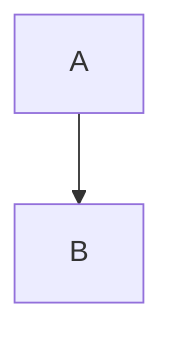

# AI Coding Agent Instructions

## Project Overview
This is a Jekyll-based technical blog (iOS/macOS development focus) using the [Chirpy theme](https://github.com/cotes2020/chirpy-starter). Deployed via GitHub Pages with custom domain (rbbtsn0w.me) and Cloudflare SSL/TLS.

## Critical Development Workflows

### Local Development
```bash
# Install dependencies (run once or when Gemfile changes)
bundle install

# Add Linux platform for GitHub Actions compatibility (if on non-Linux)
bundle lock --add-platform x86_64-linux

# Start local server (auto-refresh on changes)
bundle exec jekyll serve

# Build site for production
bundle exec jekyll build
```

### Deployment
- **Automated**: Pushes to `main` or `master` trigger `.github/workflows/pages-deploy.yml`
- **Build**: Jekyll site built in Ubuntu runner with Ruby 3
- **Testing**: `htmlproofer` validates internal links before deployment
- **Deploy**: Artifacts uploaded and deployed to GitHub Pages

## Post Creation Conventions

### Front Matter Structure (Strict)
```yaml
---
layout: post
title: "Your Post Title"
date: YYYY-MM-DD
categories: [Category1, Category2]  # Can be single or array
tags: [tag1, tag2, tag3]            # Use array format for multiple tags
mermaid: true                        # Optional: enables Mermaid diagrams
---
```

### File Naming
- **Required format**: `YYYY-MM-DD-TitleWithoutSpaces.md`
- **Location**: `_posts/` directory
- **Example**: `2024-03-18-GithubFreeTLS.md`

### Post Metadata Automation
- `_plugins/posts-lastmod-hook.rb` automatically sets `last_modified_at` for posts with 2+ git commits
- Uses git history: `git log -1 --pretty="%ad" --date=iso "#{post.path}"`

### Content Patterns

**Images**: Use post-specific directories
```markdown

```
Example: `/assets/img/post/2020-07-24-DC/Class_Diagram.png`

**Mermaid Diagrams**: Enable in front matter, embed directly
```markdown
---
mermaid: true
---


```

**Prompts** (Chirpy theme feature):
```markdown
{: .prompt-tip }
{: .prompt-info }
{: .prompt-warning }
{: .prompt-danger }
```

## Configuration Files

### `_config.yml` Key Settings
- **Line 17**: `theme: jekyll-theme-chirpy` (must not change)
- **Line 23**: `timezone: Asia/Shanghai`
- **Line 26-28**: Site title and tagline
- **Line 43**: `url: "https://rbbtsn0w.me"`
- **Line 50-51**: GitHub/Twitter usernames
- **Line 93**: `avatar: /assets/img/avatar.png`
- **Line 130**: `paginate: 10`

### Special Files
- `CNAME`: Custom domain configuration (contains `rbbtsn0w.me`)
- `_data/contact.yml`: Social media links for site footer
- `_data/share.yml`: Share button configuration
- `_tabs/*.md`: Site navigation pages (About, Archives, Categories, Tags)

## Technical Constraints

1. **Ruby Version**: Ruby 3 (specified in `.ruby-version` and GitHub Actions)
2. **Theme Version**: `jekyll-theme-chirpy ~> 6.2, >= 6.2.3`
3. **Permalink Structure**: `/posts/:title/` (from _config.yml defaults)
4. **Comments**: Disabled globally (no active comment system)
5. **Analytics**: Google Analytics not configured

## Common Task Patterns

### Adding a New Post
1. Create `_posts/YYYY-MM-DD-title.md` with proper front matter
2. Add images to `/assets/img/post/YYYY-MM-DD-title/` if needed
3. Verify categories/tags match existing taxonomy conventions
4. Test locally with `bundle exec jekyll serve`
5. Commit - GitHub Actions handles deployment

### Updating Site Configuration
- Edit `_config.yml` (requires server restart for local preview)
- Social links: modify `_data/contact.yml`
- Navigation tabs: edit files in `_tabs/`

### Troubleshooting
- **Build failures**: Check `.github/workflows/pages-deploy.yml` run logs
- **Local serve issues**: Ensure `bundle lock --add-platform x86_64-linux` ran
- **Link validation errors**: Review `htmlproofer` output in Actions logs

## Project-Specific Quirks
- Posts written in **Chinese and English** (bilingual content)
- Heavy use of **Mermaid diagrams** for technical explanations
- Focus on iOS/macOS development topics (CocoaPods, Xcode, memory, crashes)
- Custom domain uses Cloudflare DNS (nameservers switched from GoDaddy)
