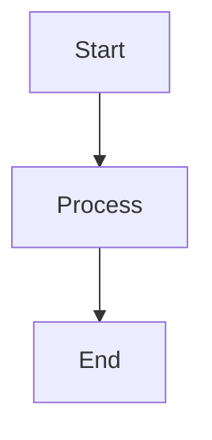

# AI Coding Agent Instructions

## Project Overview
Jekyll-based technical blog focused on iOS/macOS development using the [Chirpy theme v6.2+](https://github.com/cotes2020/chirpy-starter). Deployed automatically via GitHub Pages to `rbbtsn0w.me` with Cloudflare-provided SSL/TLS. Content is bilingual (Chinese/English) with heavy use of Mermaid diagrams for technical explanations.

**Stack**: Jekyll 4.x + Ruby 3.2.2 + Chirpy theme + GitHub Actions

## Critical Development Workflows

### Local Development
```bash
# First-time setup or after Gemfile changes
bundle install
bundle lock --add-platform x86_64-linux  # Required for GitHub Actions compatibility

# Development server (auto-reloads on file changes)
bundle exec jekyll serve
# → Browse http://localhost:4000 or http://127.0.0.1:4000

# Production build (outputs to _site/)
JEKYLL_ENV=production bundle exec jekyll build
```

**Important**: Changes to `_config.yml` require server restart. Other changes auto-refresh.

### Deployment Pipeline
1. **Trigger**: Push to `main` or `master` (ignores `.gitignore`, `README.md`, `LICENSE`)
2. **Build** (`.github/workflows/pages-deploy.yml`):
   - Runs on Ubuntu with Ruby 3
   - Checks out with full git history (`fetch-depth: 0`) for plugin support
   - Builds site: `bundle exec jekyll b -d "_site${{ steps.pages.outputs.base_path }}"`
3. **Test**: `htmlproofer` validates internal links (external links disabled)
4. **Deploy**: Artifacts uploaded to GitHub Pages automatically

**Debugging Failures**: Check Actions tab → Build logs → `htmlproofer` output for broken links

## Post Creation Conventions

### File Naming & Location
- **Format**: `_posts/YYYY-MM-DD-TitleWithoutSpaces.md` (hyphens only, no underscores)
- **Example**: `_posts/2024-03-18-GithubFreeTLS.md`

### Front Matter (Required Structure)
```yaml
---
layout: post              # Always 'post'
title: "Your Post Title"  # Quoted if contains special characters
date: YYYY-MM-DD          # Must match filename date
categories: [iOS, Xcode]  # Array format (single or multiple)
tags: [swift, debugging, crash]  # Array format required
mermaid: true             # Optional: enable Mermaid diagrams
---
```

**Tag Pattern**: lowercase, hyphenated technical terms; keep 3–8 concise tags per post (e.g., `[ios, cocoapods, staticlib, framework]`)

### SEO Taxonomy Guidelines

- Categories: choose 1–2 from the common set above; avoid mixed strings like `macOS&iOS`.
- Tags: all lowercase; use hyphens for multi-word terms (e.g., `code-signing`, `state-management`).
- Date must match filename; example: file `2024-03-18-YourPost.md` uses `date: 2024-03-18`.
- Add a `description:` for high-traffic posts to improve search snippets.

### Automatic Metadata
The `_plugins/posts-lastmod-hook.rb` hook automatically adds `last_modified_at` timestamp to posts with 2+ git commits by querying git history. No manual intervention needed.

### Content Patterns

**Images** - Use post-specific directories:
```markdown

```
Create directory matching post slug: `/assets/img/post/YYYY-MM-DD-Slug/`

**Mermaid Diagrams** - Set `mermaid: true` in front matter, then embed:
````markdown

````
See [2023-11-16-DeepMemory.md](_posts/2023-11-16-DeepMemory.md) for complex multi-diagram examples.

**Chirpy Prompts** - Add tip/info/warning/danger callouts:
```markdown
This is helpful context.
{: .prompt-tip }

Critical warning here.
{: .prompt-danger }
```

## Configuration & File Structure

### `_config.yml` - Critical Settings
**DO NOT MODIFY**:
- Line 17: `theme: jekyll-theme-chirpy` (required by theme)
- Line 130: `paginate: 10` (pagination count)

**Site Identity** (Lines 23-43):
- `timezone: Asia/Shanghai`
- `title: RbBtSn0w` / `tagline: Code/MTB`
- `url: "https://rbbtsn0w.me"` (must match CNAME file)

**Social Links** (Lines 50-51):
- `github.username: rbbtsn0w`
- `twitter.username: rbbtsn0w`

**Assets**:
- Line 93: `avatar: /assets/img/avatar.png`

**Note**: Server restart required after editing `_config.yml`. Other file changes hot-reload.

### Key Files
- `CNAME`: Custom domain (`rbbtsn0w.me`) - matches Cloudflare DNS setup
- `_data/contact.yml`: Footer social icons (GitHub, Twitter, Email, RSS)
- `_data/share.yml`: Share button configuration
- `_tabs/*.md`: Site navigation (About, Archives, Categories, Tags)
- `.ruby-version`: Ruby 3.2.2 (matches GitHub Actions)

### Directory Structure
```
_posts/              # Blog posts (YYYY-MM-DD-Title.md)
assets/img/post/     # Post-specific images (YYYY-MM-DD-Slug/)
_plugins/            # Ruby hooks (e.g., posts-lastmod-hook.rb)
_tabs/               # Top navigation pages
_data/               # YAML configuration files
.github/workflows/   # CI/CD (pages-deploy.yml)
```

## Technical Constraints

1. **Ruby Version**: Ruby 3.2.2 (`.ruby-version`, GitHub Actions)
2. **Theme Version**: `jekyll-theme-chirpy ~> 6.2, >= 6.2.3` (Gemfile)
3. **Permalink Structure**: `/posts/:title/` (from `_config.yml` defaults)
4. **Comments**: Disabled globally (`_config.yml` line 103)
5. **Analytics**: Google Analytics not configured
6. **PWA**: Enabled (`_config.yml` line 128)

## Common Task Patterns

### Adding a New Post
1. Create `_posts/YYYY-MM-DD-title.md` with proper front matter
2. Add images to `/assets/img/post/YYYY-MM-DD-title/` if needed
3. Verify categories/tags match existing taxonomy conventions
4. Test locally with `bundle exec jekyll serve`
5. Commit - GitHub Actions handles deployment

### Updating Site Configuration
- Edit `_config.yml` (requires server restart for local preview)
- Social links: modify `_data/contact.yml`
- Navigation tabs: edit files in `_tabs/`

### Troubleshooting
- **Build failures**: Check Actions tab → Build logs → `htmlproofer` output
- **Local serve issues**: Ensure `bundle lock --add-platform x86_64-linux` ran
- **Link validation errors**: Review `htmlproofer` output in Actions logs
- **404 errors**: Verify `url` in `_config.yml` matches CNAME domain

## Project-Specific Quirks
- Posts written in **Chinese and English** (bilingual content)
- Heavy use of **Mermaid diagrams** for technical explanations
- Focus on iOS/macOS development topics (CocoaPods, Xcode, memory, crashes)
- Custom domain uses Cloudflare DNS (nameservers switched from GoDaddy)
