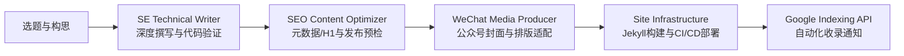
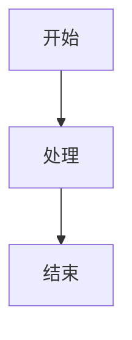
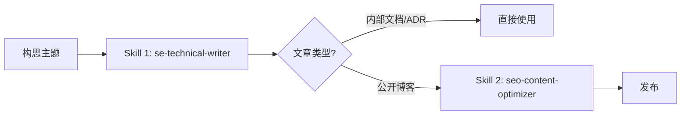

# RbBtSn0w's Technical Blog

> 技术博客 - 记录 iOS/macOS 开发、编程学习和 MTB 骑行生活

[](https://jekyllrb.com/)
[](https://github.com/cotes2020/chirpy-starter)
[](https://www.ruby-lang.org/)

## 🤖 AI Agent Workflow

本项目遵循 [AGENTS.md](AGENTS.md) 确立的 **Agent Constitution**，采用专职角色化的多 Agent 协作工作流。通过“深度撰写 → SEO 优化 → 公众号适配 → 平台构建”的分层管线，确保每一处改动都具备真实工程证据与高质量规范。

### 🔄 协作流水线 (Multi-Role Pipeline)


```mermaid
graph LR
  A[选题与构思] --> B["SE Technical Writer<br/>深度撰写与代码验证"]
  B --> C["SEO Content Optimizer<br/>元数据/H1与发布预检"]
  C --> D["WeChat Media Producer<br/>公众号封面与排版适配"]
  D --> E["Site Infrastructure<br/>Jekyll构建与CI/CD部署"]
  E --> F["Google Indexing API<br/>自动化收录通知"]
```

#### 专职角色分工 (Separation of Concerns)：

1. **SE Technical Writer** (`.agents/skills/se-technical-writer`)：
   - **核心职责**：深挖技术实现、系统架构与排障原理，保证代码示例可在目标环境编译运行。
   - **交付工件**：完成的技术草稿（遵循渐进式揭示原则，正文严禁出现一级标题 `# H1`，Mermaid 图表声明 `mermaid: true`）。

2. **SEO Content Optimizer** (`.agents/skills/seo-content-optimizer`)：
   - **核心职责**：优化 Jekyll/Chirpy Frontmatter 元数据、单 H1 语义层级、站内深层双向链接网络与摘要。
   - **发布门禁**：执行自动化预发布检查：
     ```bash
     bundle exec jekyll build --future
     python3 .agents/skills/seo-content-optimizer/scripts/prepublish_check.py _posts/YYYY-MM-DD-<slug>.md
     ```

3. **WeChat Media Producer** (`wechat-publisher`)：
   - **核心职责**：微信公众号下游衍生适配，包括 2.35:1 磨砂玻璃风格封面、外链转脚注卡片与 Kroki 高清图表栅格化。

4. **Site Infrastructure Maintainer**：
   - **核心职责**：维护 Jekyll 主题配置、Git LFS 多媒体托管、GitHub Actions (`pages-deploy.yml`) 以及部署后的 Google Indexing API 自动通知。

---

### ⚠️ 核心准则 (Guiding Principles)
- **宪法单一事实源**：以 [AGENTS.md](AGENTS.md) 为唯一最高准绳，绝不凭借虚假证据或未经验证的命令做推断。
- **Git LFS 资产不变量**：`assets/img/post/**` 与 `assets/translations/**` 均通过 Git LFS 托管，禁止绕过 LFS 提交大体积裸二进制。
- **远端同步卫生**：开始本地开发前，执行 `git status` 检查未暂存文件，并使用 `git pull --ff-only` 同步 CI 自动提交的多语言翻译增量 (`chore(translate)`)。
- **严格发布门禁**：文章发布前必须通过本地 `bundle exec jekyll build --future` 及 `prepublish_check.py` 退出码 0 校验。

---

## 🚀 技术栈


- **静态站点生成器**: Jekyll 4.x
- **主题**: Chirpy 7.6+ (现代化响应式主题)
- **测试**: HTMLProofer (链接验证)
- **部署**: GitHub Pages + GitHub Actions
- **内容**: Markdown + Mermaid 图表
- **托管**: Cloudflare 为自定义域提供免费 SSL/TLS

## 📁 项目结构

```
├── _posts/              # 博客文章 (YYYY-MM-DD-title.md)
├── _tabs/               # 导航页面
├── assets/              # 静态资源
│   ├── img/            # 图片资源
│   └── css/            # 自定义样式
├── _data/              # 站点数据 (YAML)
├── _plugins/           # 自定义插件
├── .github/workflows/  # CI/CD 配置
├── _config.yml         # 站点配置
├── Gemfile             # Ruby 依赖
└── README.md           # 项目文档
```

## 🛠 本地开发环境

### 环境要求

- Ruby 3.2+ (推荐使用 rbenv 或 asdf)
- Bundler 2.4+
- Git

### 首次设置

```bash
# 1. 克隆项目
git clone https://github.com/rbbtsn0w/rbbtsn0w.github.io.git
cd rbbtsn0w.github.io

# 2. 安装依赖
bundle install

# 3. 启动开发服务器
bundle exec jekyll serve
```

访问 `http://localhost:4000` 查看站点。

### Bundle 镜像配置

项目已配置 Ruby China 镜像以加速 gem 安装：

```bash
# 查看当前配置
bundle config list

# 如需修改全局镜像
bundle config --global mirror.https://rubygems.org https://gems.ruby-china.com
```

## 🧪 测试和构建

### 可用命令

```bash
# 生产环境构建
JEKYLL_ENV=production bundle exec jekyll build

# 开发预览
bundle exec jekyll serve

# 清理构建文件
bundle exec jekyll clean

# 增量构建（可选）
bundle exec jekyll build --incremental
```

### 自动化测试

项目配置了以下自动化检查：

- **环境标准化**: 通过 Jekyll 插件自动同步仓库 Git Hooks，确保所有 IDE 和终端提交体验一致。
- **预提交检查**: 本地提交前自动运行 `jekyll build` 和 `htmlproofer` 校验。
- **GitHub Actions**: 部署前对全站链接进行最终生产环境审计。

## 📝 内容创作

### 文章格式

```yaml
---
layout: post
title: "文章标题"
date: YYYY-MM-DD
categories: [iOS, Swift]
tags: [swift, debugging, uikit]
description: "文章摘要，用于 SEO 和分享卡片"
mermaid: true  # 可选：启用 Mermaid 图表
---
```

### 分类与标签规范

**常用分类**：`iOS`, `macOS`, `Xcode`, `CocoaPods`, `Flutter`, `Project`, `Jekyll`, `Crash`, `AI`

**标签规范**：
- 全部小写，使用连字符分隔多词术语（如 `code-signing`, `state-management`）
- 每篇文章保持 3–8 个精准标签
- 避免与分类重复，专注技术细节

**重要约定**：
- `date` 必须与文件名日期一致（如 `2024-03-18-Title.md` 对应 `date: 2024-03-18`）
- 高流量文章建议添加 `description` 字段，改善搜索引擎摘要
- 避免混合格式如 `macOS&iOS`，使用数组 `[iOS, macOS]`

### 图片管理

```markdown
# 文章专用图片


# 通用图片

```

### Mermaid 图表



```mermaid
graph TD
  A[开始] --> B[处理]
  B --> C[结束]
```


## ✍️ AI 辅助写作 Skills

项目配置了两个协作式 AI Skills，形成 **"内容生产 → SEO 优化"** 的流水线工作流：

| Skill | 定位 | 使用场景 |
|-------|------|---------|
| `se-technical-writer` | 技术写作专家 — 专注内容质量、准确性与读者体验 | 所有文档和博客的初稿撰写 |
| `seo-content-optimizer` | SEO 优化专家 — 专注搜索引擎友好度与流量获取 | 公开发布的博客文章发布前优化 |

### 📋 日常使用流程


```mermaid
graph LR
  A[构思主题] --> B["Skill 1: se-technical-writer"]
  B --> C{文章类型?}
  C -->|内部文档/ADR| D[直接使用]
  C -->|公开博客| E["Skill 2: seo-content-optimizer"]
  E --> F[发布]
```

#### 第一步：使用技术写作 Skill 撰写初稿

适用于**所有**技术内容（博客、文档、ADR、教程）。

**Prompt 示例**：
> 使用 `se-technical-writer` skill，帮我写一篇关于 SwiftData 迁移实战的技术博客。目标读者是有 Core Data 经验的 iOS 开发者。要求包含代码示例和 Mermaid 架构图。

此 Skill 会自动：
- 按五阶段流程（Planning → Drafting → Review → Editing → Polish）创作
- 维护术语一致性，遵循 [Style Guide](.agent/skills/se-technical-writer/references/style-guide.md) 中的写作规范
- 选用合适的 [模板](.agent/skills/se-technical-writer/references/templates.md)（博客/系列文章/故障排查指南）
- 若缺少封面图或插图，使用 AI 工具（如 Gemini）自动生成

#### 第二步：使用 SEO Skill 优化后发布

仅适用于**公开发布的博客文章**（内部 ADR 不需要）。

**Prompt 示例**：
> 使用 `seo-content-optimizer` skill，优化这篇文章的 SEO。主关键词是 "SwiftData migration"。请检查 Frontmatter、标题层级、内部链接和图片 alt 文本。

此 Skill 会自动：
- 审查并补全 Frontmatter (title ≤ 60 字符, description 120-160 字符)，参见 [Frontmatter 规范](.agent/skills/seo-content-optimizer/references/frontmatter-spec.md)
- 优化标题层级、添加 Featured Snippet 段落
- 基于 [链接策略](.agent/skills/seo-content-optimizer/references/linking-strategy.md) 添加内部链接
- 按 [SEO 核查清单](.agent/skills/seo-content-optimizer/references/seo-checklist.md) 进行发布前检查

#### 快速参考

```bash
# Skills 所在路径
.agent/skills/
├── se-technical-writer/       # 技术写作
└── seo-content-optimizer/     # SEO 优化
```

---

## 🚀 部署

### 自动部署

推送到 `main` 或 `master` 分支时自动触发：

1. **构建**: 使用 Ubuntu + Ruby 3.2 环境
2. **测试**: HTMLProofer 验证链接和内容
3. **部署**: 自动发布到 GitHub Pages

### 触发条件

- **推送**: `main`/`master` 分支代码变更（排除文档文件）
- **PR**: 自动运行测试，不执行部署
- **手动**: 可从 Actions 标签页手动触发

### CI/CD 特性

- **并发控制**: 避免同时部署冲突
- **缓存优化**: Bundle 和 Ruby 缓存加速构建
- **链接验证**: HTMLProofer 检查内部链接有效性
- **自动部署**: 推送后自动构建并发布到 GitHub Pages

### 工作流文件

- [`.github/workflows/pages-deploy.yml`](.github/workflows/pages-deploy.yml) - 主部署流程

## 🔧 维护指南

### 依赖更新

依赖更新由 GitHub Dependabot 自动执行：

- 配置文件： [`.github/dependabot.yml`](.github/dependabot.yml)
- 更新范围：Ruby gems（Bundler）和 GitHub Actions
- 更新频率：每周定时创建依赖升级 PR

自动修复与合并策略：

- 工作流： [`.github/workflows/dependabot-auto-merge.yml`](.github/workflows/dependabot-auto-merge.yml)
- 对象：所有与 CI 成功提交关联的 open PR（含 Dependabot 依赖 PR）
- 流程：Dependabot PR 自动审批 → CI（Build and Deploy）通过后启用 auto-merge → 分支保护通过后自动合并

如需手动处理依赖，可继续使用：

```bash
# 更新所有依赖
bundle update

# 更新特定 gem
bundle update jekyll-theme-chirpy

# 修改 Gemfile 后添加 Linux 平台支持（GitHub Actions 兼容性）
bundle lock --add-platform x86_64-linux
```

### 主题定制

- 修改 `_config.yml` 自定义站点设置
- 覆盖样式：创建 `assets/css/style.scss`
- 自定义页面：在 `_tabs/` 中添加 Markdown 文件

### 性能优化

- 使用 `--incremental` 标志启用增量构建
- 定期清理未使用的依赖
- 优化图片大小和格式

## 🐛 故障排除

### 常见问题

**Q: 预提交钩子失败**
```bash
# 检查 Ruby 版本
ruby -v

# 重新安装依赖
bundle install
```

**Q: Sass 警告**
- 确保使用 Chirpy 6.2+
- 警告不影响功能，仅为弃用提醒

**Q: 构建失败**
```bash
# 清理缓存
bundle exec jekyll clean

# 详细错误信息
bundle exec jekyll build --trace
```

**Q: 端口冲突**
```bash
# 杀死现有进程
pkill -f jekyll

# 或使用不同端口
bundle exec jekyll serve --port 4001
```

### 日志查看

```bash
# 查看 GitHub Actions 日志
# 访问: https://github.com/rbbtsn0w/rbbtsn0w.github.io/actions

# 本地调试
bundle exec jekyll serve --verbose
```

## 📊 统计信息

- **文章数量**: `ls _posts/ | wc -l` 篇
- **最后更新**: `git log -1 --format=%cd`
- **构建状态**: 查看 Actions 标签页

## ☕ 支持项目

<p align="left">
  <a href="https://www.buymeacoffee.com/rbbtsn0w" target="_blank" rel="noopener" aria-label="Buy me a coffee" style="display:inline-flex;align-items:center;gap:.5rem;padding:.45rem .7rem;background:#FFD400;color:#1a1a1a;text-decoration:none;border-radius:8px;font-weight:600;box-shadow:0 1px 2px rgba(0,0,0,.08);">
    <i class="fas fa-coffee" aria-hidden="true" style="font-size:1rem;"></i>
    <span>Buy me a coffee</span>
  </a>
</p>

## 📄 许可证

本项目采用 MIT 许可证 - 查看 [LICENSE](LICENSE) 文件了解详情。

---

**维护者**: [RbBtSn0w](https://github.com/rbbtsn0w)  
**主题**: [Chirpy](https://github.com/cotes2020/jekyll-theme-chirpy)  
**部署**: [rbbtsn0w.me](https://rbbtsn0w.me)
