```mermaid
graph TD
  A[开始] --> B[处ç†]
  B --> C[结æŸ]
```

# RbBtSn0w's Technical Blog

> 技术博客 - 记录 iOS/macOS 开发、编程学习和 MTB 骑行生活

[](https://jekyllrb.com/)
[](https://github.com/cotes2020/chirpy-starter)
[](https://www.ruby-lang.org/)

## 🚀 技术栈

- **静态站点生成器**: Jekyll 4.x
- **主题**: Chirpy 6.2+ (现代化响应式主题)
- **测试**: HTMLProofer (链接验证)
- **部署**: GitHub Pages + GitHub Actions
- **内容**: Markdown + Mermaid 图表
- **托管**: Cloudflare 为自定义域提供免费 SSL/TLS

## 📁 项目结构

```
├── _posts/              # 博客文章 (YYYY-MM-DD-title.md)
├── _tabs/               # 导航页面
├── assets/              # 静态资源
│   ├── img/            # 图片资源
│   └── css/            # 自定义样式
├── _data/              # 站点数据 (YAML)
├── _plugins/           # 自定义插件
├── .github/workflows/  # CI/CD 配置
├── _config.yml         # 站点配置
├── Gemfile             # Ruby 依赖
└── README.md           # 项目文档
```

## 🛠 本地开发环境

### 环境要求

- Ruby 3.2+ (推荐使用 rbenv 或 asdf)
- Bundler 2.4+
- Git

### 首次设置

```bash
# 1. 克隆项目
git clone https://github.com/rbbtsn0w/rbbtsn0w.github.io.git
cd rbbtsn0w.github.io

# 2. 安装依赖
bundle install

# 3. 启动开发服务器
bundle exec jekyll serve
```

访问 `http://localhost:4000` 查看站点。

### Bundle 镜像配置

项目已配置 Ruby China 镜像以加速 gem 安装：

```bash
# 查看当前配置
bundle config list

# 如需修改全局镜像
bundle config --global mirror.https://rubygems.org https://gems.ruby-china.com
```

## 🧪 测试和构建

### 可用命令

```bash
# 生产环境构建
JEKYLL_ENV=production bundle exec jekyll build

# 开发预览
bundle exec jekyll serve

# 清理构建文件
bundle exec jekyll clean

# 增量构建（可选）
bundle exec jekyll build --incremental
```

### 自动化测试

项目配置了以下自动化检查：

- **预提交钩子**: 提交前自动构建和测试
- **HTML 验证**: 使用 HTMLProofer 检查链接有效性
- **GitHub Actions**: 部署时自动运行完整测试套件

## 📝 内容创作

### 文章格式

```yaml
---
layout: post
title: "文章标题"
date: YYYY-MM-DD
categories: [iOS, Swift]
tags: [swift, debugging, uikit]
description: "文章摘要，用于 SEO 和分享卡片"
mermaid: true  # 可选：启用 Mermaid 图表
---
```

### 分类与标签规范

**常用分类**：`iOS`, `macOS`, `Xcode`, `CocoaPods`, `Flutter`, `Project`, `Jekyll`, `Crash`, `AI`

**标签规范**：
- 全部小写，使用连字符分隔多词术语（如 `code-signing`, `state-management`）
- 每篇文章保持 3–8 个精准标签
- 避免与分类重复，专注技术细节

**重要约定**：
- `date` 必须与文件名日期一致（如 `2024-03-18-Title.md` 对应 `date: 2024-03-18`）
- 高流量文章建议添加 `description` 字段，改善搜索引擎摘要
- 避免混合格式如 `macOS&iOS`，使用数组 `[iOS, macOS]`

### 图片管理

```markdown
# 文章专用图片


# 通用图片

```

### Mermaid 图表

```markdown

```

## 🚀 部署

### 自动部署

推送到 `main` 或 `master` 分支时自动触发：

1. **构建**: 使用 Ubuntu + Ruby 3.2 环境
2. **测试**: HTMLProofer 验证链接和内容
3. **部署**: 自动发布到 GitHub Pages

### 触发条件

- **推送**: `main`/`master` 分支代码变更（排除文档文件）
- **PR**: 自动运行测试，不执行部署
- **手动**: 可从 Actions 标签页手动触发

### CI/CD 特性

- **并发控制**: 避免同时部署冲突
- **缓存优化**: Bundle 和 Ruby 缓存加速构建
- **链接验证**: HTMLProofer 检查内部链接有效性
- **自动部署**: 推送后自动构建并发布到 GitHub Pages

### 工作流文件

- [`.github/workflows/pages-deploy.yml`](.github/workflows/pages-deploy.yml) - 主部署流程

## 🔧 维护指南

### 依赖更新

```bash
# 更新所有依赖
bundle update

# 更新特定 gem
bundle update jekyll-theme-chirpy

# 检查过时依赖
bundle outdated

# 修改 Gemfile 后添加 Linux 平台支持（GitHub Actions 兼容性）
bundle lock --add-platform x86_64-linux
```

### 主题定制

- 修改 `_config.yml` 自定义站点设置
- 覆盖样式：创建 `assets/css/style.scss`
- 自定义页面：在 `_tabs/` 中添加 Markdown 文件

### 性能优化

- 使用 `--incremental` 标志启用增量构建
- 定期清理未使用的依赖
- 优化图片大小和格式

## 🐛 故障排除

### 常见问题

**Q: 预提交钩子失败**
```bash
# 检查 Ruby 版本
ruby -v

# 重新安装依赖
bundle install
```

**Q: Sass 警告**
- 确保使用 Chirpy 6.2+
- 警告不影响功能，仅为弃用提醒

**Q: 构建失败**
```bash
# 清理缓存
bundle exec jekyll clean

# 详细错误信息
bundle exec jekyll build --trace
```

**Q: 端口冲突**
```bash
# 杀死现有进程
pkill -f jekyll

# 或使用不同端口
bundle exec jekyll serve --port 4001
```

### 日志查看

```bash
# 查看 GitHub Actions 日志
# 访问: https://github.com/rbbtsn0w/rbbtsn0w.github.io/actions

# 本地调试
bundle exec jekyll serve --verbose
```

## 📊 统计信息

- **文章数量**: `ls _posts/ | wc -l` 篇
- **最后更新**: `git log -1 --format=%cd`
- **构建状态**: 查看 Actions 标签页

## ☕ 支持项目

<p align="left">
  <a href="https://www.buymeacoffee.com/rbbtsn0w" target="_blank" rel="noopener" aria-label="Buy me a coffee" style="display:inline-flex;align-items:center;gap:.5rem;padding:.45rem .7rem;background:#FFD400;color:#1a1a1a;text-decoration:none;border-radius:8px;font-weight:600;box-shadow:0 1px 2px rgba(0,0,0,.08);">
    <i class="fas fa-coffee" aria-hidden="true" style="font-size:1rem;"></i>
    <span>Buy me a coffee</span>
  </a>
</p>

## 📄 许可证

本项目采用 MIT 许可证 - 查看 [LICENSE](LICENSE) 文件了解详情。

---

**维护者**: [RbBtSn0w](https://github.com/rbbtsn0w)  
**主题**: [Chirpy](https://github.com/cotes2020/jekyll-theme-chirpy)  
**部署**: [rbbtsn0w.me](https://rbbtsn0w.me)
