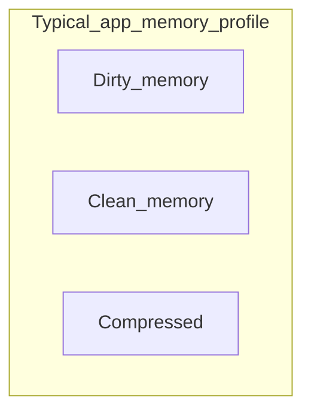
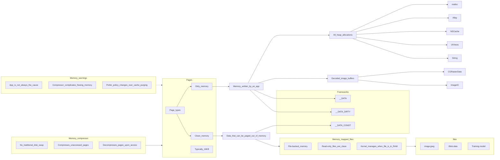
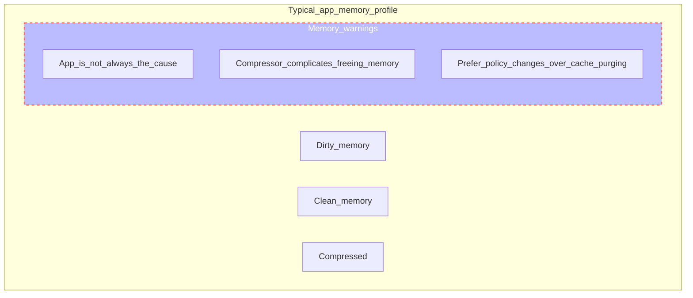

## Memory Footprint

  

### Pages

是有多个Page组成, 每个Page占16KB, 如果不够就会申请更多.

`Memory is use` = `Number of Pages` X `Page size`

### Clean & dirty pages

Clean Memory
:   内存映射文件（Memory-mapped files）：指那些从磁盘加载到内存中但没有被应用程序写入或修改的文件，如图片、数据块、训练模型等。
只读数据：包括应用程序中的常量数据或只读的全局变量，如字符串、常量数组等。

一句话, Data that can be paged out of memory 可以被操作系统从内存中分页出去，以便回收内存空间。被分页出去的数据通常被存储在磁盘的其他区域，如分页文件（page file）或交换分区（swap partition 在iOS 中不存在）中，以便在需要时重新加载到内存中.

Dirty Memory
:   动态分配的对象：通过malloc、calloc等方法动态创建的对象，如动态分配的字符串、数组等。
对象属性的修改：对已经创建的对象进行修改或更新操作，包括属性的赋值、数组元素的修改等。
图像缓冲区的解码：对图像进行解码操作，将压缩格式转换为内存中的原始像素数据。
缓存数据：由应用程序自己实现的缓存机制，用于存储经常访问的数据，如网络请求的结果、计算结果等。

一句话, Memory written by an app 主要来自app创建的数据.

### Frameworks

A good practice is to use the singletons and the global initializers of the frameworks to alleviate the amount of dirty memory generated by their usage.

使用框架的单例模式和全局初始化器是一个不错的实践，可以减少它们使用过程中产生的脏内存量。
单例模式是一种设计模式，它确保一个类只有一个实例，并提供一个全局访问点。当框架中的对象以单例模式创建时，它们会在内存中一直存在，减少了频繁的内存分配和释放操作，从而减少了脏内存的生成。
全局初始化器是指在框架被链接或类被加载时运行的初始化器。通过在全局初始化器中执行一些必要的操作和初始化步骤，可以减少框架使用过程中产生的脏内存。

一句话, 要达到这个效果, 就类似静态变量被定义为const (const 编译时被确定)不可修改的设计范式.

如果只是设计了单例, 而里面的属性方法都是动态创建和修改, 最终也是落在dirty memory中了.

### Compressed

iOS 7 开始提供这个能力

在操作系统中，内存是有限的资源。为了最大限度地利用可用内存空间，内存压缩技术被引入。内存压缩器会监视系统的内存使用情况，并根据需要对内存中的页面进行压缩。未使用的页面通常会占用较多的内存空间，通过将这些未使用的页面进行压缩，可以减少内存的占用。

当应用程序需要访问被压缩的页面时，内存压缩器会在访问前对页面进行解压缩。这个过程是透明的，应用程序无需感知页面是否被压缩。通过在访问时进行解压缩，内存压缩器确保应用程序能够正常地访问所需的数据。

内存压缩技术对于具有大量未使用页面的系统或应用程序特别有效。它可以减少内存占用，延长可用内存空间的寿命，并提高系统的整体性能。然而，需要注意的是，内存压缩和解压缩过程会增加CPU的负担，并可能导致轻微的访问延迟。

一句话，被压缩的内存可能在使用的时候突然暴增, CPU暴涨都可能会发生.

### Memory warnings

当app的内存紧张的时候, 应该如何处理? 那为什么会出现内存紧张的情况呢?

