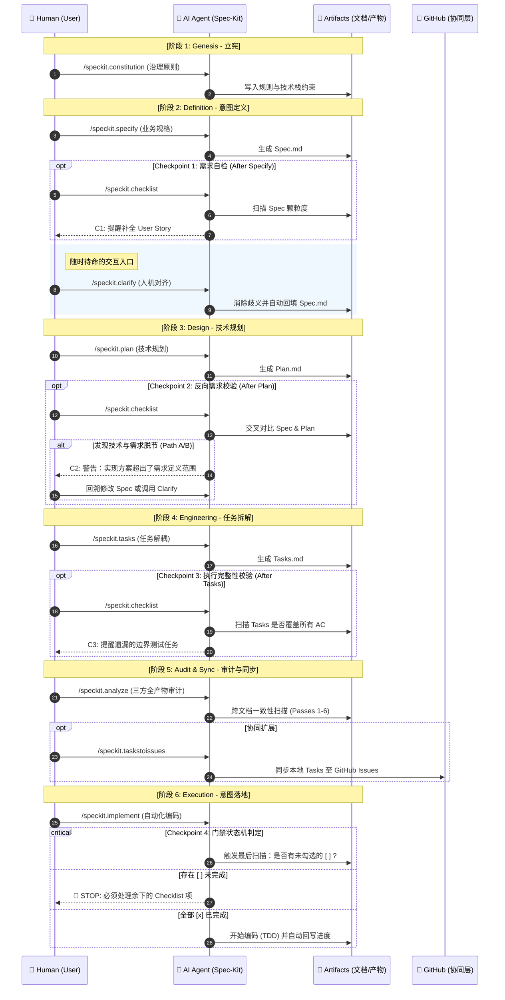

# Spec-Driven Development 深度指南 — Part 2: GitHub Spec Kit 实战指南

> **TL;DR**: GitHub 推出的开源项目 Spec Kit，通过强制推行 **9 个标准周期** 的命令行节点（`/speckit.*`）约束大型语言模型在工程中的行为。本文逐步拆解 Spec Kit 的闭环原则以及每个模块对应职责，帮你将理念完全转变为具体实测产出。

**Series Navigation:**
- [Part 1: 软件设计的演进与 SDD 的本质](/posts/sdd-series-part-1-evolution/)
- **Part 2 (This Post): GitHub Spec Kit 实战指南**
- [Part 3: 意图层基础设施与 SDD 的未来](/posts/sdd-series-part-3-future/)
- [Part 4: 使用 GitHub Issues 构建简单的 SDD 工作流](/posts/sdd-series-part-4-github-issues/)

*Illustration: GitHub Spec Kit — 将意图规范封装为高度体系化的命令行基础设施*

## 1. 什么是 Spec Kit？

GitHub Spec Kit 是 GitHub 于 2025 年 9 月开源的规范驱动开发（Spec-Driven Development, SDD）工具包。它并非替代了 AI 编码助手，而是一个管理约束组件架构的套件（搭配脚手架与结构化模板），支持集成 GitHub Copilot、Claude Code、Cursor 等核心工具进行规范对接。

### 核心理念：变迁真理唯一来源

在传统工作流里，一旦业务开发完成，文档立刻生锈（即规范漂移，Spec Drift）。团队倾向于把代码作为绝对裁定的事实孤岛（Source of Truth）。

但在 Spec Kit 赋能下，**规范直接等同于代码构建配方**。当你改变主意，只需修改规范文档，AI 直接依图纸重新编译修改产物代码，而不是让开发者痛苦修改屎山。这种理念与利用强大的 [Model Context Protocol (MCP)](/posts/mcp-apps-guide/) 打破工具孤岛的思维拥有异曲同工之妙。

**主要适合场景：**
- 零起步的 Greenfield 绿地项目
- 对复杂意图具有高度定制化约束要求的现代化迭代工程
- 具有刚性多人协同并避免跨终端系统偏差的大型复杂生态群

| 术语 (Term) | 定义 |
| :--- | :--- |
| **Spec Kit** | GitHub 开源的 SDD 工具包，包含一套 Slash Commands 和标准模板。 |
| **Spec Drift** | 规范漂移。代码实现与业务文档随时间产生的不一致现象。 |
| **Artifacts** | 工件。指生命周期中生成的 `spec.md`、`plan.md`、`tasks.md` 等事实依据。 |

## 2. 核心架构：5 核心 + 4 扩展

在 Spec Kit 的设计中，指令被严谨地划分为 **核心执行主线 (Essential Commands)** 与 **增强质量/协同 (Optional Commands)**。理解这种分层是高效应用 SDD 的前提。

### 🚀 核心执行主线 (Essential Commands)
这是 SDD 流程的“骨架”，负责产物的物理生成与阶段性交付。

1. **`/speckit.constitution`**：立宪。定义项目元规则（如技术栈、代码规范、质量门禁）。
2. **`/speckit.specify`**：规格定义。捕捉业务意念的信号（Focus on What）。
3. **`/speckit.plan`**：技术规划。构建技术逻辑的“数字孪生”（Focus on How）。
4. **`/speckit.tasks`**：任务拆解。将规划解耦为原子化的执行步骤。
5. **`/speckit.implement`**：实现。根据任务单进行自动编码。

### 🛡️ 辅助质量与协同 (Optional Commands)
这是 SDD 的“神经系统”，确保意图在流转中不发生漂移。

- **`/speckit.clarify`**：需求澄清。**人机协作的独立入口**。开发者可随时运行它来对 `specify` 进行追问与补充，不一定依赖 Checklist 触发。
- **`/speckit.analyze`**：一致性审计。在 `/tasks` 之后运行，扫描全链路文档的冲突。
- **`/speckit.checklist`**：质量清单。作为“英语需求的单元测试”，执行全相位质量门禁。
- **`/speckit.taskstoissues`**：协同扩展。主要用于 GitHub 场景下的任务同步（非核心路径）。

---

### 🎨 专家级全相位螺旋时序图

理解 SDD 的核心在于理解 **Workflow Loop（工作流循环）**。流程不再是单向的，而是由 **Checklist (Quality Gate)** 驱动的螺旋上升模式。

## 3. 深度解析：螺旋路径 A/B/C 的决策逻辑

作为整个系统的 **“质量门禁（Quality Gate）”**，运行 `checklist` 后的结果将决定项目的物理走向：

### 🔄 螺旋路径 A：回溯规格 (Discovery → Clarify → Backtrack)
**场景**：AI 在 `plan` 阶段提取到技术信号（如：缓存机制），但发现 `spec.md` 漏写了具体的业务失效策略。
- **决策**：回溯至 `specify`。利用 **`/speckit.clarify`** 作为入口进行回溯。
- **动作**：AI 通过澄清交互提问 → 用户回答并自动回填 `spec.md` → 重运行 `/speckit.plan` 刷新方案。
- **哲学**：`clarify` 并不从属于 `checklist`，它是一个随时待命的对话窗口，用于保持意图的生命力。

### 🔄 螺旋路径 B：重构执行 (Risk → Refine)
**场景**：AI 在 `tasks` 阶段发现任务描述包含“大约”、“可能”等弱信号词，或任务颗粒度过大，无法独立验证。
- **决策**：停留在 `tasks` 阶段进行重构。
- **动作**：AI 根据 Checklist 重新分解原子任务，直到每一个任务项都能满足“独立测试、无依赖执行”的标准。

### 🔄 螺旋路径 C：质量放行 (Validated → Proceed)
**场景**：Checklist 显示所有验收标准已量化、边界定义清晰、任务无死角覆盖。
- **动作**：向前推进至 **`/speckit.analyze`** 进行三方审计（Spec/Plan/Tasks 一致性检测）→ 无误后进入真正的物理编码阶段。

---

> [!IMPORTANT]
> **硬核约束：为何 `/implement` 会“强行停止”？**
> 这是 Spec Kit 最硬核的 **状态机 (State Machine)** 约束。在 `implement` 的源码逻辑中，AI 会扫描 `checklists/` 目录下所有 Markdown 文件的 `[ ]` 状态。如果尚未全部勾选为 `[x]`，或者 AI 判定某个关键路径未经过 Clarify，底层脚本会**强行锁死**代码生成。这迫使每一行生产代码必须有对应的“意图存根”。

## 4. 最佳实践：专家建议技巧

### A. 验收标准必须强制“可度量化与可触发”
- ❌ **错误做法**：“系统保证流畅稳定，不要出错。”
- ✅ **正确做法**：“AC2：API QPS 阈值需应对大于 200，且在超时 1.5s 后触发主动缓存切流。”

### B. Bug 出现后的处置逻辑分流
如果代码实施中跑出了错误。该修改代码还是修改文档？
1. **执行层失败**：如果代码逻辑符合 Spec 但因环境或语法微瑕出错，让 Agent 直接提供 Patch。
2. **逻辑遗漏**：**坚决拒绝直接修改源码**。必须回到顶层，先将遗漏规则写入 `spec.md` 或 `plan.md`，从顶部向下重新流转生成，确保 Spec Drift 发生率为零。

## What's Next

GitHub Spec Kit 提供了一套成熟的企业级意图控制台，通过精密的 9 大指令工作流，真正实现了软件工程由“代码为核心”向“规格为核心”的跨越。

而在下一篇文章中，我们将探讨随着 LLM 自管记忆能力的迅猛攀升，SDD 将在不远的未来变成何种完全自主迭代的新型“自治控制面”。

---
**Series Navigation:**
- ← Previous: [Part 1: 软件设计的演进与 SDD 的本质](/posts/sdd-series-part-1-evolution/)
- → Next: [Part 3: 意图层基础设施与 SDD 的未来](/posts/sdd-series-part-3-future/)
