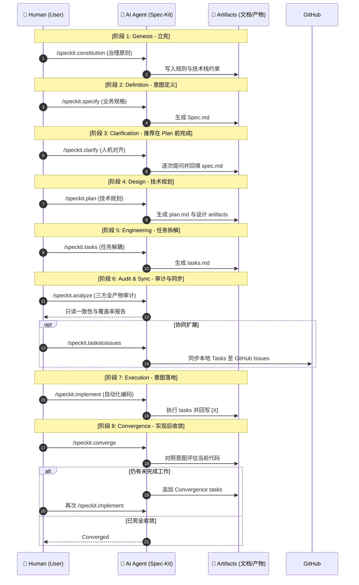

> **更新说明（2026-07-03）**：本文已按 GitHub Spec Kit `v0.12.4` 的官方命令表与 command templates 重新核验。当前版本包含 10 个内置命令，其中 `/speckit.converge` 是相较初稿新增的重要收敛阶段。

**GitHub Spec Kit** 是一套由 GitHub 推出的开源工具包，通过 10 个内置命令（如 `/speckit.specify`、`/speckit.plan` 和 `/speckit.converge`）组织规范驱动开发（SDD）。它以持久化 artifacts 约束大型语言模型（LLM）的工作过程，降低代码实现与业务意图之间发生“规范漂移（Spec Drift）”的概率。

**Series Navigation:**
- [Part 1: 软件设计的演进与 SDD 的本质](/posts/sdd-series-part-1-evolution/)
- **Part 2 (This Post): GitHub Spec Kit 实战指南**
- [Part 3: 意图层基础设施与 SDD 的未来](/posts/sdd-series-part-3-future/)
- [Part 4: 使用 GitHub Issues 构建简单的 SDD 工作流](/posts/sdd-series-part-4-github-issues/)

*Illustration: GitHub Spec Kit — 将意图规范封装为高度体系化的命令行基础设施*

## 1. 什么是 Spec Kit？

GitHub Spec Kit 是 GitHub 于 2025 年 8 月开源的规范驱动开发（Spec-Driven Development, SDD）工具包。它并非替代 AI 编码助手，而是通过 CLI、结构化模板与 agent commands 管理开发 artifacts，并适配多种 AI coding agents。

### 核心理念：变迁真理唯一来源

在传统工作流里，一旦业务开发完成，文档立刻生锈（即规范漂移，Spec Drift）。团队倾向于把代码作为绝对裁定的事实孤岛（Source of Truth）。

但在 Spec Kit 赋能下，**规范直接等同于代码构建配方**。当你改变主意，只需修改规范文档，AI 直接依图纸重新编译修改产物代码，而不是让开发者痛苦修改屎山。这种理念与利用强大的 [Model Context Protocol (MCP)](/posts/mcp-apps-guide/) 打破工具孤岛的思维拥有异曲同工之妙。

**主要适合场景：**
- 零起步的 Greenfield 绿地项目
- 对复杂意图具有高度定制化约束要求的现代化迭代工程
- 具有刚性多人协同并避免跨终端系统偏差的大型复杂生态群

| 术语 (Term) | 定义 |
| :--- | :--- |
| **Spec Kit** | GitHub 开源的 SDD 工具包，包含一套 Slash Commands 和标准模板。 |
| **Spec Drift** | 规范漂移。代码实现与业务文档随时间产生的不一致现象。 |
| **Artifacts** | 工件。指生命周期中生成的 `spec.md`、`plan.md`、`tasks.md` 等事实依据。 |

## 2. GitHub Spec Kit v0.12.4：7 个 Core + 3 个 Optional

官方 README 将 10 个内置命令分为 **Core Commands** 与 **Optional Commands**。这里的 Optional 表示它们不是最短 happy path 的必经步骤，并不代表价值较低。

### Core Commands

| Command | 作用 | 主要产物或效果 |
| --- | --- | --- |
| `/speckit.constitution` | 创建或更新项目治理原则，并同步检查相关模板 | `.specify/memory/constitution.md` |
| `/speckit.specify` | 从自然语言描述创建或更新 feature specification | `spec.md` 与 requirements checklist |
| `/speckit.plan` | 根据技术栈和架构决策生成实现计划 | `plan.md`、`research.md` 等设计 artifacts |
| `/speckit.tasks` | 生成按 user story 与依赖排序的可执行任务 | `tasks.md` |
| `/speckit.taskstoissues` | 将 task 转换为去重、依赖有序的 GitHub Issues | GitHub Issues |
| `/speckit.implement` | 按 `tasks.md` 执行实现并回写完成状态 | 代码、测试与 `[X]` task state |
| `/speckit.converge` | 对照 spec/plan/tasks 评估当前代码，将剩余工作追加为新任务 | append-only Convergence phase |

### Optional Commands

- **`/speckit.clarify`**：识别 specification 中定义不足的区域，逐次提出最多 5 个高影响问题，并把答案写回 spec。官方建议在 `/speckit.plan` 前完成。
- **`/speckit.analyze`**：在 `/speckit.tasks` 之后、`/speckit.implement` 之前，对 spec、plan 与 tasks 做只读的一致性和覆盖率分析。
- **`/speckit.checklist`**：围绕指定主题生成“requirements 的单元测试”，检查需求是否完整、清晰且一致；它检查的是需求文本，不是运行中的代码行为。

---

### 当前推荐生命周期

最短主线仍然是 constitution → specify → plan → tasks → implement。面向复杂或长期演进的 feature，更完整的生命周期会加入 clarify、analyze 与 converge：

## 3. 四种不同的质量反馈机制

旧版本文章容易把 clarify、checklist、analyze 与 converge 都概括成“质量门禁”，但它们的写入边界与使用时机不同：

| Command | 主要问题 | 是否修改 artifact | 建议时机 |
| --- | --- | --- | --- |
| `/speckit.clarify` | specification 还有哪些高影响歧义？ | 是，写回 `spec.md` | specify 之后、plan 之前 |
| `/speckit.checklist` | requirements 本身是否完整、清晰、一致？ | 是，创建或追加 checklist | 需要专项需求审查时 |
| `/speckit.analyze` | spec、plan、tasks 之间是否冲突或覆盖不足？ | 否，只读分析 | tasks 之后、implement 之前 |
| `/speckit.converge` | 当前代码距离既定 artifacts 还差什么？ | 是，只向 `tasks.md` 追加任务 | implement 之后 |

`/speckit.implement` 启动时会统计 `checklists/` 中的完成状态。若发现未完成项，它会停止并询问用户是否仍要继续；用户可以明确选择继续。因此，这是一道显式决策门，而不是底层脚本无条件锁死代码生成，也不会因为没有运行 clarify 自动拒绝实现。

`/speckit.converge` 则补上了旧流程中缺失的实现后反馈环。它不改写 spec 或 plan，也不直接修代码；唯一允许的写入是把 `missing`、`partial`、`contradicts` 或 `unrequested` 等发现追加为新的 Convergence tasks，再交回 `/speckit.implement` 完成。

## 4. 最佳实践：专家建议技巧

### A. 验收标准必须强制“可度量化与可触发”
- ❌ **错误做法**：“系统保证流畅稳定，不要出错。”
- ✅ **正确做法**：“AC2：API QPS 阈值需应对大于 200，且在超时 1.5s 后触发主动缓存切流。”

### B. Bug 出现后的处置逻辑分流
如果代码实施中跑出了错误。该修改代码还是修改文档？
1. **执行层失败**：如果代码逻辑符合 Spec 但因环境或语法微瑕出错，让 Agent 直接提供 Patch。
2. **逻辑遗漏**：不要只修源码。先把遗漏规则写回 `spec.md` 或 `plan.md`，再重新运行受影响的下游阶段，让 artifacts 与实现重新对齐并降低 Spec Drift 风险。

## References

- [GitHub Spec Kit v0.12.4 README：Available Slash Commands](https://github.com/github/spec-kit/blob/v0.12.4/README.md#available-slash-commands){:target="_blank" rel="noopener"}
- [`/speckit.converge` command template](https://github.com/github/spec-kit/blob/v0.12.4/templates/commands/converge.md){:target="_blank" rel="noopener"}
- [`/speckit.implement` command template](https://github.com/github/spec-kit/blob/v0.12.4/templates/commands/implement.md){:target="_blank" rel="noopener"}

## What's Next：SDD 的未来演进

**GitHub Spec Kit** 通过 10 个内置命令，把需求定义、技术规划、任务执行与实现后收敛连接成可追踪的 artifact lifecycle。这种转变为 [AI 代理 (AI Agents)](/posts/sdd-series-part-1-evolution/) 的深度协作提供了比一次性 prompt 更稳定的意图基础设施。

而在下一篇文章 [Part 3: 意图层基础设施与 SDD 的未来](/posts/sdd-series-part-3-future/) 中，我们将探讨随着 LLM 自管记忆能力的迅猛攀升，SDD 将如何演变为完全自主迭代的新型“自治控制面”。

---
**Series Navigation:**
- ← Previous: [Part 1: 软件设计的演进与 SDD 的本质](/posts/sdd-series-part-1-evolution/)
- → Next: [Part 3: 意图层基础设施与 SDD 的未来](/posts/sdd-series-part-3-future/)
