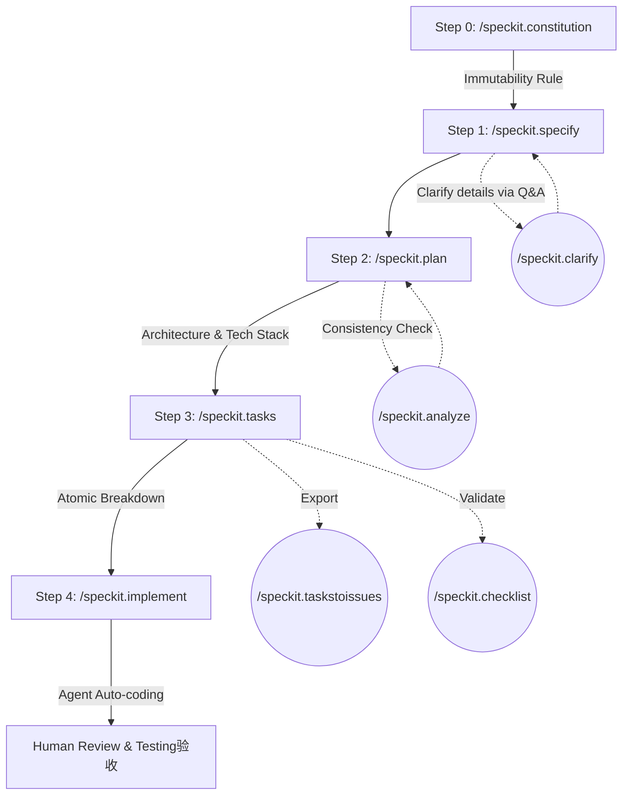

# Spec-Driven Development 深度指南 — Part 2: GitHub Spec Kit 实战指南

**GitHub Spec Kit 的核心工作流是什么？** GitHub Spec Kit 是一套用于实现 Spec-Driven Development (SDD) 的开源工具包。最新版本的 Spec Kit 提供了涵盖全生命周期的 **9 个阶段性命令行节点**（从 `/speckit.constitution` 立宪、`/speckit.specify` 规格定义，到 `/speckit.implement` 落地实现等），强制大型语言模型（LLM）按照既定标准流程进行代码生成和架构演变，确保项目始终符合初始业务意图。

> **TL;DR**: GitHub 推出的开源项目 Spec Kit，通过强制推行 **9 个标准周期**的命令行节点（`/speckit.*`）约束大型语言模型在工程中的行为。本文逐步拆解 Spec Kit 的闭环原则以及每个模块对应职责，帮你将理念完全转变为具体实测产出。

**Series Navigation:**
- [Part 1: 软件设计的演进与 SDD 的本质](/posts/sdd-series-part-1-evolution/)
- **Part 2 (This Post): GitHub Spec Kit 实战指南**
- [Part 3: 意图层基础设施与 SDD 的未来](/posts/sdd-series-part-3-future/)
- [Part 4: 使用 GitHub Issues 构建简单的 SDD 工作流](/posts/sdd-series-part-4-github-issues/)

*Illustration: GitHub Spec Kit — 将意图规范封装为高度体系化的命令行基础设施*

## 1. 什么是 Spec Kit？

GitHub Spec Kit 是 GitHub 于 2025 年 9 月开源的规范驱动开发（Spec-Driven Development, SDD）工具包。它并非替代了 AI 编码助手，而是一个管理约束组件架构的套件（搭配脚手架与结构化模板），支持集成 GitHub Copilot、Claude Code、Cursor 等核心工具进行规范对接。

### 核心理念：变迁真理唯一来源

在传统工作流里，一旦业务开发完成，文档立刻生锈（即规范漂移，Spec Drift）。团队把代码作为绝对裁定的事实孤岛（Source of Truth）。
但在 Spec Kit 赋能下，**规范直接等同于代码构建配方**。当你改变主意，只需修改规范文档，AI 直接依图纸重新编译修改产物代码，而不是让开发者痛苦修改屎山。这种理念与利用强大的 [MCP (Model Context Protocol)](/posts/mcp-apps-guide/) 打破工具孤岛的思维拥有异曲同工之妙。

**主要适合场景：**
- 零起步的 Greenfield 绿地项目
- 对复杂意图具有高度定制化约束要求的现代化迭代工程
- 具有刚性多人协同并避免跨终端系统偏差的大型复杂生态群

## 2. 核心九大指令工作流

整个 Spec Kit 奉行不达标不进行的阶段锁死法则，并且每一个前置工具命令符都严丝合缝匹配后置节点需要的数据标准。最新版本包含 9 个核心指令，其运行机理和组件关系，可参考以下标准化处理闭环模型：

### 主线流程 (Mainline Workflow)

#### Step 0. `/speckit.constitution` — 铭刻不变的项目立宪

此命令通过交互或既定原则输入，创建并更新项目的核心公约（Constitution），并确保所有依赖的模板保持同步。Agent 在全部的活动范围中，这本法律是基操常识。
- 你可以规定：强制只允许使用 React + Vite 的 Hooks，不可用 Class 组件；或者强制所有响应体封装为统一的格式。
- **一旦生成即被永久固定化。**建议在项目初期打磨完善，不要随时更改立宪法则。

#### Step 1. `/speckit.specify` — 从 What 开始，非 How

要求将自然语言的功能描述转化为标准化的规格说明书（Specification）。
**禁忌**：在该层次探讨具体的技术细节（如使用何种数据库、路由模型等）。该层只有产品视角的 Acceptance Criteria（AC 验收条款）以及用户故事映射。

#### Step 2. `/speckit.plan` — 技术执行的总体图纸

进入工程师层级。通过该指令执行实现规划工作流，基于功能规格书（Spec）并结合项目立宪（Constitution）合并推演生成设计资产（Design Artifacts）。
- **输出**：数据模型设计 Schema、网络接口契约、安全数据脱敏鉴权流以及架构方案（写入 `plan.md` 等设计文档）。
如果在此时产生过于重度或存在偏差的设计，需直接在此退回对谈并修订。

#### Step 3. `/speckit.tasks` — 基于原则派发流水线

原子化重放工作流水线，基于现有的设计资产（Design Artifacts）生成具备高度可操作性、具有依赖关系排序的 `tasks.md` 表格。一切并行执行或者耦合任务统统拥有详细标号（例如 Task 1.1 依赖 Task 1.0）。在这个阶段即便更换底层大语言模型，也能做到高精度地完美实施。

#### Step 4. `/speckit.implement` — Agent 全开动工

通过读取并执行 `tasks.md` 中定义的所有任务节点，智能体按部就班落实每个 API 方法、SQL 配置表、UI Router 的开发，并最终输出可运行的源码工程。此时开发者再从容出场，完成最后的 Review 及测试签收闭环验证。

### 辅助校验与增强指令 (Validation & Enhancement)

除了上述 5 个支撑主线的核心指令，Spec Kit 提供了强有力的辅助校验工具：

#### `/speckit.clarify` — 需求澄清探测

在规格定义阶段（Specify），如果需求描述存在漏洞或未说明的边界，此命令会自动向用户提出**最多 5 个高度针对性的澄清问题**，并将回复的答案反向编码、补充到特征规格说明书中。

#### `/speckit.analyze` — 跨文档无损分析

在任务拆解后，执行一次安全（无破坏性）的交叉一致性和质量分析。它会同时比对 `spec.md`（规格）、`plan.md`（计划）与 `tasks.md`（任务），确保上下游没有任何信息丢失和自相矛盾。

#### `/speckit.taskstoissues` — GitOps 协同集成

将 `tasks.md` 中已经规划好的任务列表直接转化为具有依赖顺序的 GitHub Issues。极大地提高了团队分工协作与项目进度可视化的效率。

#### `/speckit.checklist` — 验收防御准备

根据当期用户需求与功能规格，自动生成针对该 Feature 的专属检查单（Checklist），为后续的验收测试和边界回归提供直接弹药。

## 3. Best Practices & 专家建议技巧

当你向团队内部普及此框架时需要高度注意的防雷陷阱。

### A. 验收标准必须强制“可度量化与可触发”

- ❌ 错误做法："系统保证流畅稳定，不要出错。"
- ✅ 正确做法："AC2：API QPS 阈值需应对大于每秒 200 并在超时 1.5s 后触发主动缓存切流。"

### B. Bug 出现后的处置逻辑分流

如果代码实施中跑出了错误。该修改代码还是修改文档？
- 代码业务本身就是按照规则产出写偏错的执行层失败：让 Agent 直接追加提供小补丁修复源码。
- 如果是根本的逻辑遗漏：**坚决拒绝马上热改源码**。回到顶层，必须先将规范写入 `spec.md` 或者 `plan.md`，从顶部下流同步生成，保证 Spec Drift（规范漂移）发生率为零。

## What's Next

GitHub Spec Kit 提供了一套成熟的企业级意图控制台，通过精密的 9 大指令工作流，真正实现了软件工程由“代码为核心”向“规格为核心”的跨越。而在下一篇文章中，我们将继续放眼大局，探讨随着 LLM 自管记忆能力的迅猛攀升，SDD 将在不远的未来变成何种完全自主迭代的新型“自治控制面”。

---
**Series Navigation:**
- ← Previous: [Part 1: 软件设计的演进与 SDD 的本质](/posts/sdd-series-part-1-evolution/)
- → Next: [Part 3: 意图层基础设施与 SDD 的未来](/posts/sdd-series-part-3-future/)
