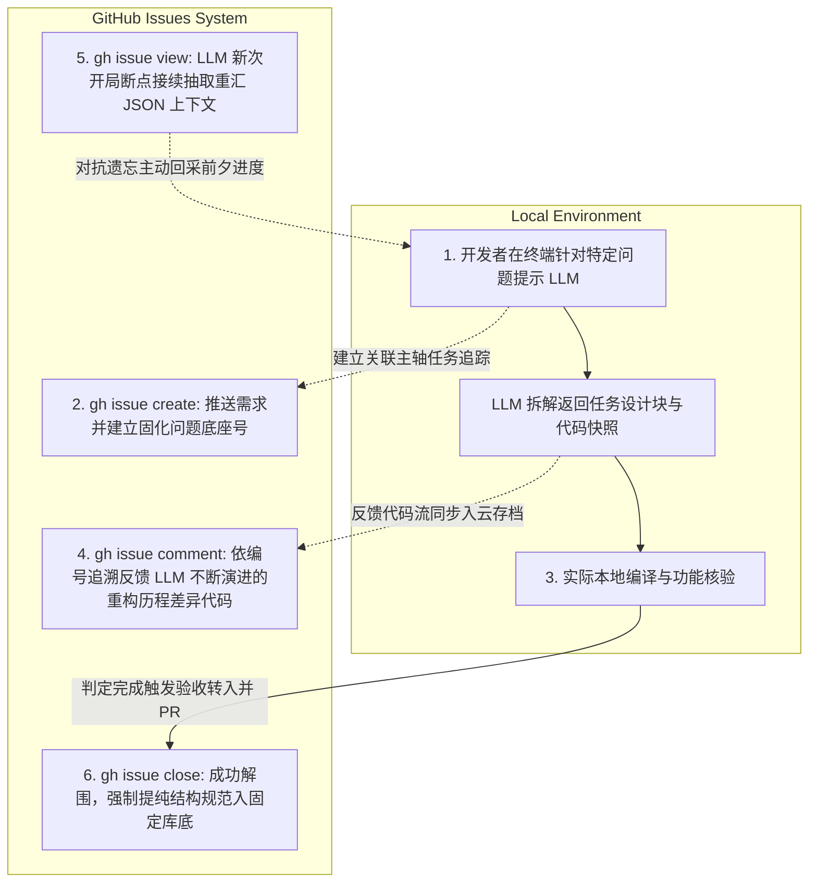

# Spec-Driven Development 深度指南 — Part 4: 使用 GitHub Issues 构建简单的 SDD 工作流

**如何利用 GitHub Issues 实现轻量级 SDD 工作流？** 你可以直接利用项目中原生的 GitHub Issues 作为大型语言模型的持久化外置记忆池（Memory Pool）。通过结合 GitHub CLI (`gh`)，团队能够在不引入沉重框架的前提下，有效对抗 LLM 跨会话的上下文遗忘（Context Decay），实现零门槛的规范驱动开发闭环体验。

> **TL;DR**: 小团队因为太忙没时间去搭建和学习繁重的 Spec Kit 等企业级架构？你其实可以通过利用项目中天然配套的 GitHub Issues 控制台和 GitHub CLI (`gh`) ，几乎在一分钟内搭建出一个高韧性的 SDD 记忆环境，彻底驯服冗杂漫长引发灾难遗忘风险的大型 LLM 会话工作流。

**Series Navigation:**
- [Part 1: SDD 的本质与挑战](/posts/sdd-series-part-1-evolution/)
- [Part 2: GitHub Spec Kit 实战指南](/posts/sdd-series-part-2-spec-kit/)
- [Part 3: 意图层基础设施与 SDD 的未来](/posts/sdd-series-part-3-future/)
- **Part 4 (This Post): 使用 GitHub Issues 构建简单的 SDD 工作流**


*Illustration: 借力现有的天然工单生态——将 Issue 系统转变成 Agent 最稳定无暇的持久记忆缓存流区*

## 为什么选择 GitHub Issues 作为 LLM 的“外接大脑”？

我们经常会面临这样的处境：在使用类似 Gemini、Claude Code 或 ChatGPT 进行大规模功能分析时，随着会话逐步加深，不可避免地会遭遇剧烈的**内存腐烂（Context Decay）**症状。缺乏体系化梳理导致大语言模型不断丢失重要的基础环境参数或工程结构假设，让本来高效的开发体验急转直下成机械地重复。

既然你正用着一套包含了现成的缺陷修复体系和追踪功能源工具的仓库，那么顺势把 GitHub Issues 引进来作为 Agent 对齐意图与约束事实的持久化外接锚点则成为了全链路中最自然无损的选择方案。这种方式对于原本就已经在执行 [CI/CD 自动化构建](/posts/ci-cd-best-practices/) 的代码库而言，集成成本为零。

**这种极简化轻量级架构的核心优势在于：**
- **原生项目内聚**：你所有的需求背景材料和经智能体调整后得到的成果数据紧密和代码留存在一家；拒绝到处将知识孤岛洒落到第三方杂乱的对话 Web 服务平台。
- **完备的版控能力**：为日常的系统维护直接加塞了 Agent 特殊定位 Label、指派明确节点里程碑、可叠加可折叠甚至有权限锁死的跟进历史树追踪流。
- **命令行高扩展友好生态**：天然支持原生的 `gh` （GitHub CLI 工具）做高度可编程介入，这为任何写上十几行自动批处理挂钩拦截大模型获取上下文开启极其广袤的神操作。

## 基于 GitHub CLI 的五段式零压闭环流

试想你正在处理一个命名为 `key` 的项目模块，并且你在本机环境里顺利登陆关联了仓库。那么现在开始引入 Agent 解决一个中型复杂任务时的逻辑体系如下：



### 1. 本地启动带目标意图交互提取需求
一切可以像平时一样自然地打开如 Gemini 的界面窗口或者是 IDE 侧边栏进行提示发话：“当前我们必须深入清理出项目 `src/main.py` 的死锁问题进行溯源。”当得到核心梳理框架和问题定界报告回复时，勿急着执行。将其快速缓存并转化为一份本地的 Markdown 文件日志备品（例如：`session-log.md`）。

### 2. 在项目流体系内“刻录记忆锚定基日”
拒绝让关键初始方案白白随记忆消褪！直接走一行命令强制利用刚刚沉淀的报告拉进 GitHub 工单跟踪内域：

```bash
gh issue create \
  --title "LLM-Assisted Bug Fix in src/main.py" \
  --body-file session-log.md \
  --label "llm-task,bug" \
  --assignee "@me"
```
*💡技巧贴士：永远牢记规范性带上专用标签如 `llm-task`，这对于隔离出由 AI 承担试错包袱和由纯人工提交处理的功能面板时会起着决定团队观感清爽度的关键区别作用。随后你拿到了系统分配的固定序列号 `#123`。*

### 3. 微步推进执行流与轨迹追随
在漫漫几日的任务交火中，每当前进出一个可用的重构版本突破点之后或者发现了之前设定被推翻的结论时，果断采用该命令追加叠加：

```bash
gh issue comment #123 --body "LLM 更新方案变轨指正：发现并非单纯的等待死锁，由于早期遗留引用的挂载顺序存在冲突而导致。[核心补丁说明] "
```
使用这类流失形式的好处将原本混沌的大段模型车轱辘交流变成了严格具有时间递推印记以及对冲反查机制的透明操作核查带。极其精准地模拟成了企业级 SDD 在 `tasks.md` 表格里的层层销账勾选态。

### 4. 助力下一次断点重启秒速唤醒特技
下班回家或是长达一个月后再需要重拾相关的代码，直接终端甩出聚合语句：

```bash
gh issue view #123 --json title,body,comments > issue-context.json
```
在拉满全新一轮的聊天任务前，强行将这包高密度的 `issue-context.json` 投喂要求 Agent 先行扫阅读取补课。这其实是零阻抗赋予大模型极其平滑并且连贯的跨日期的无偏差长效持久记录恢复能力。

### 5. Issue 合约结算及高级经验深网提纯
当真正排除完困难顺利递交 Pull Request 处理终成正果。彻底销结它之前抽出那些最高纯度防沉降设计价值以做最后升华：

```bash
gh issue close #123 --comment "Resolved via PR #456. LLM 核心探坑启示录：关于旧资源生命周期的统一监管强制要求。"
```
这样的举动实质是在默默丰满系统大库对于经验级历史决策规范的高纯度提炼整合收集。

## 在现有库中整合 Agent 架构的三大进阶忠告

熟悉基本操作后，完全可以使用一些自动化高级脚本来做极客级的改造组合体验，使效率暴增：

| 进阶门径 | 配置说明与极客方案落地点 | 显著的效能斩获 |
|---------|---------------|---------|
| **规范化记忆阶级划分** | 短期计算（挂载于前端当前窗）；中台工作缓储记忆段（存入对应专属 Issue 尾端）；永久宗主长效记忆域（必须摘录提炼放入项目目录下的特殊准则档案库中用于规范大范围共识底线）。 | 最快时间内压缩与截停无营养的废话提示吞吐；彻底摒除 Agent 开头经常患有的盲自信发散与乱搭车架构等“神游脱线（Hallucinations）”表现。 |
| **高度防滑拦截流水自动化集成** | 设置针对本机的 Git Hook 挂载事件或是专属预处理 `Makefile` ，只要进入提交通道强制打断先向特定的底座 Issue 投递关键修正片段更新数据反馈端流转。 | 重塑人手高频介入步骤产生的乏味疲惫时间成本。极其适合中大型的并行协同修改体系。 |
| **圈定红线审问底线范畴限制** | 不要在贪图畅快时随意全盘丢库给 Agent 进行无限的咀嚼反馈分析。在得出最终决策代码前设置硬核限定确认询问动作：“依据工单编号#XXX内设定的准入边界限制判定，此刻该决策符合范围吗？” | 使得一切天花乱坠的提议死死被收束锁定聚焦向了当下的刚性技术任务不偏向。 |

### 系列最终写在结尾：

在此 SDD 深度指南系列探索旅途里，无论你是要从零构筑一座庞然大厦选择以重型规范驱动神器 GitHub Spec Kit 开山，或者是想要在拥挤破旧的历史房梁上轻快利用天然项目配套 Issue 工具进行随走随查的极简化规范约束试水；其实它们不过是殊途同归的大逻辑闭环体系。

我们的终极初衷永远没变：为不可理喻捉摸不定的“机器智能意愿思维体”提前铸构一条永远不能轻飘偏轨下穿失事的意向高架跑道规范流。即使未来系统重构的代码有朝一日彻底不再需要人的双手指点江山直接全部包揽，但是牢牢驾驭方向、裁定意图核心落地点以及设定所有安全边界限速规则的“高阶领航思维指印”职责，永远专属于坐在键盘这头真正负责这广袤数字化宏大世界运行的人类顶层架构造物主。

---
**Series Navigation:**
- ← Previous: [Part 3: 意图层基础设施与 SDD 的未来](/posts/sdd-series-part-3-future/)
