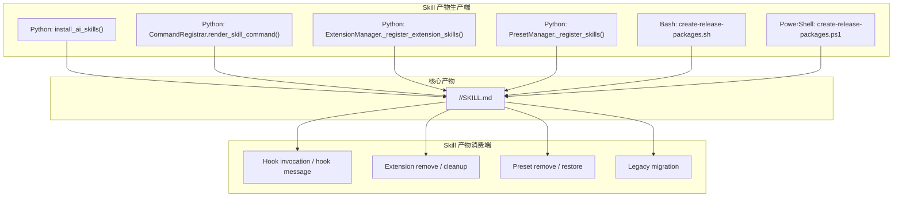
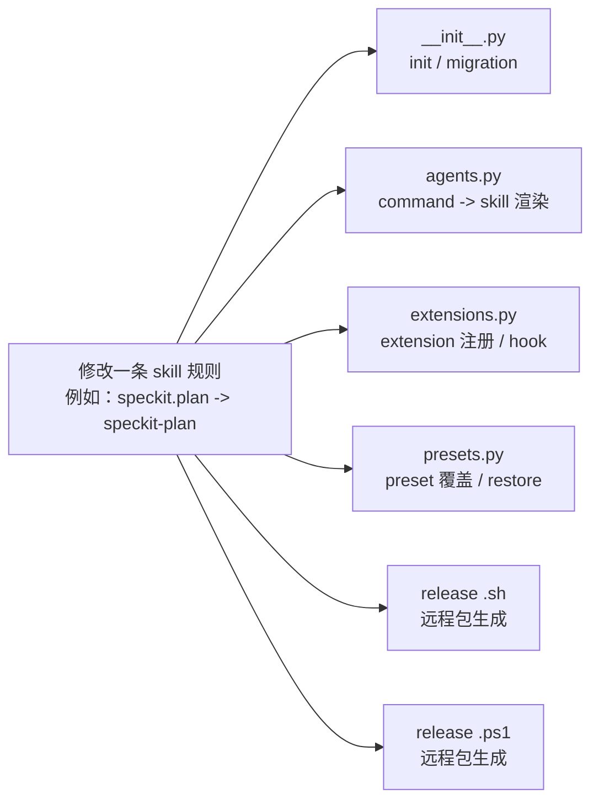
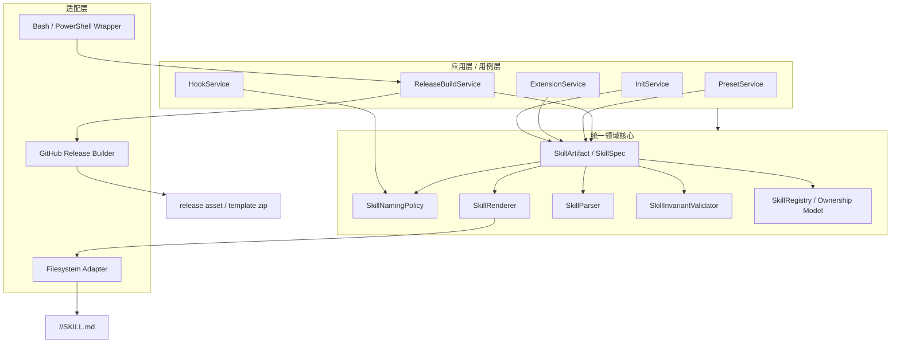
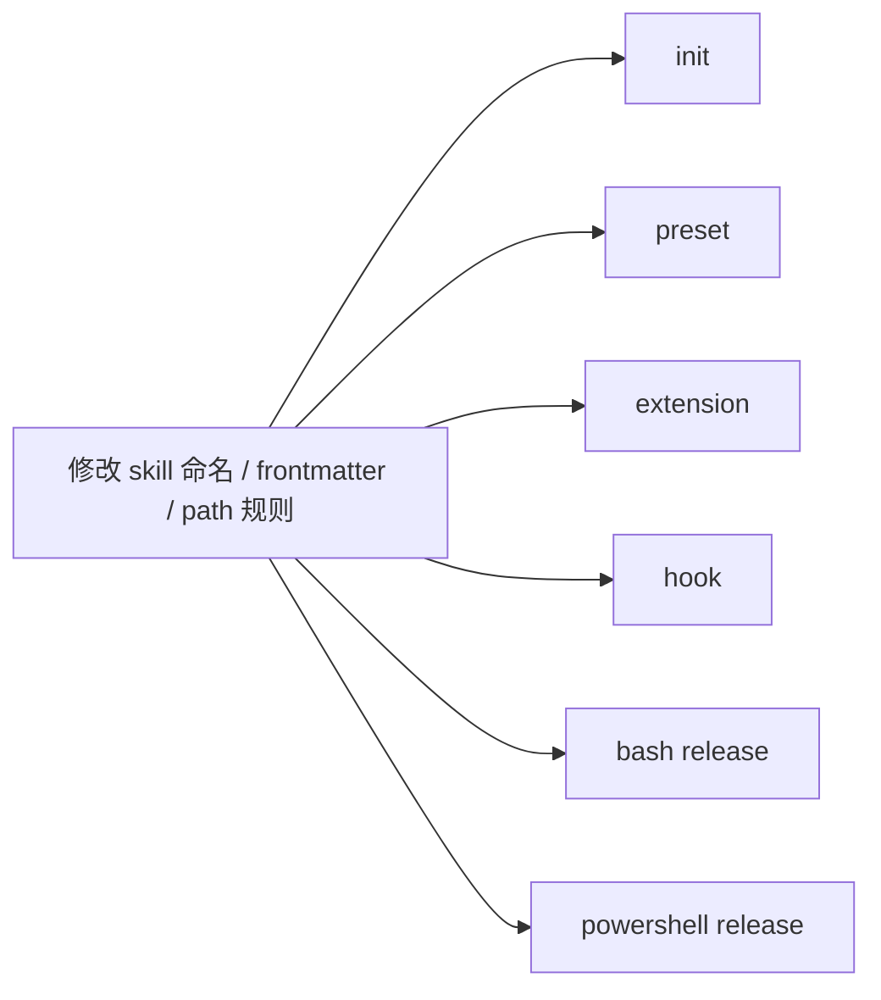
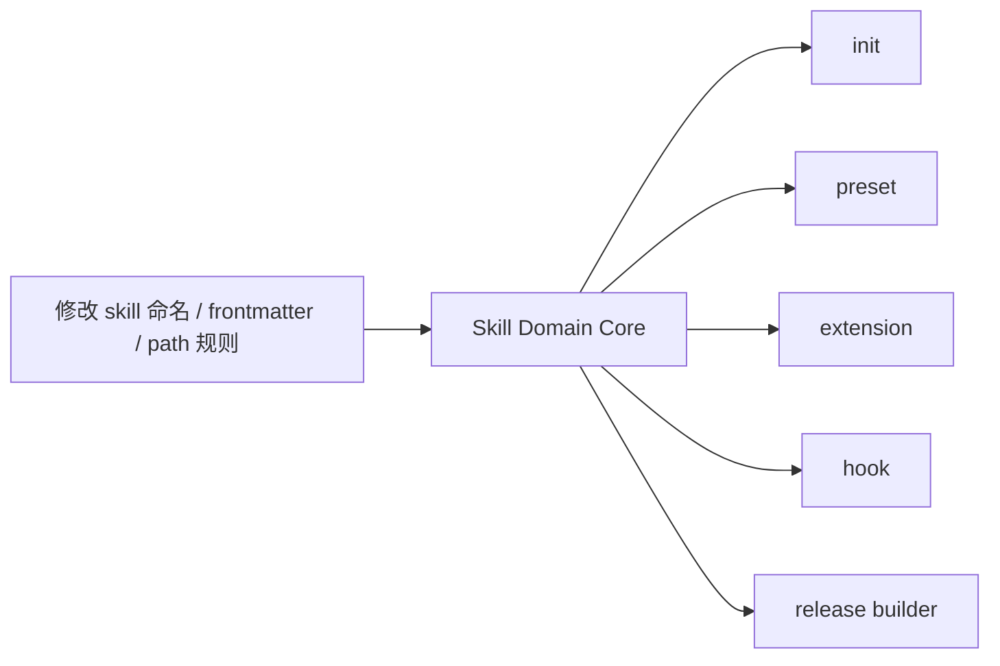

> **TL;DR**: 在修复 SpecKit（原 Codex CLI）命令调用失败的 Bug 时，我遭遇了 Copilot 连续不断的 CR。复盘发现，这并非单纯的代码错误，而是系统缺乏“单一真源”导致的架构隐式耦合。虽然当前 PR 仅在于填平不一致的坑点，但以此为契机，我也推演了未来应当演进的“统一领域核心”架构设计，并分享一些个人设计理念看法。

最近花了不少时间处理一个看起来并不大的问题：在 SpecKit（原 Codex CLI）上，用户没法像其他 agent 一样顺畅地调用命令，唤起一套固定的快捷工作流。

一开始我对这个问题的判断其实很朴素：这应该是个局部修复。把命名、生成逻辑、调用方式调一调，补一些测试，差不多就结束了。

结果完全不是这样。

修的过程中，Copilot Review 持续给出新的 CR。一个修完，又冒出一个；一个看似只影响本地的改动，最后牵出 preset、extension、hook、release packaging、Kimi 兼容迁移等一整串链路。压力很大，也非常消耗精力。

最后问题是解决掉了，PR 也收敛了。但这段时间最有价值的，其实不是“把 bug 修掉”，而是借这个过程，看清楚了这套代码在架构上的一些真实问题。

这篇文章想分享的，就是这次修复背后的复盘。

---

## 起点：一个看起来很小的问题

最初的问题很具体：

SpecKit 终端上关于命令唤起快捷工作流的体验不对。
用户预期是通过类似 skill 的方式，快速进入一条标准化工作流；但现有实现里，命名、生成、调用方式并没有完全对齐，导致体验不一致，甚至有些情况下根本无法正确命中实际产物。

如果只从“功能点”看，这像是一个命名或生成逻辑的小修。

但只要开始往下挖，就会发现这个问题根本不只属于某一个功能。

因为这套能力本身已经不是“一个文件生成器”那么简单了。它背后连着：

- agent 配置
- command 到 skill 的映射
- preset 安装和卸载
- extension 自动注册
- hook 的调用提示
- GitHub release 的打包脚本
- 本地 `uv run specify` 和远程 release 包的差异
- Kimi 的历史兼容和迁移逻辑

也就是说，你以为你在修一个按钮，实际上你是在碰一个分散的协议系统。

---

## 为什么 Copilot 会不断 CR

这个过程里，最让人有压迫感的，不是代码难写，而是 Copilot 会不断提出新的 CR。

刚开始会有一种很自然的反应：是不是自己漏得太多了？是不是 review bot 比自己更“聪明”？

后来我自己的判断变成了另一种表述：

不是它更聪明，而是它站在“整份 PR 的一致性”角度看问题，而我一开始更多是在“按当前 thread 修问题”。

这两种视角差异非常大。

我当时做的很多事情，本质上是：

- 修一个已有评论指出的问题
- 让当前测试通过
- 确保行为在这个局部成立

但 Copilot 在看的，是另外一套东西：

- 这个改动和别的模块约定一致吗
- 生成和消费是对称的吗
- 命名规则是不是在所有入口都统一了
- 删除、恢复、迁移是不是完整闭环
- 本地逻辑和 release 产物是不是一致

也正因为如此，很多问题会表现成这样：

- 代码本身看起来没错
- 测试也能通过
- 但放到整条链路里，就是会漂

这次我真正感受到的一点是：

**很多 CR 并不是“实现错误”，而是“系统不变量没有被统一表达”。**

---

## 压力的根源，不只是 CR 多

说实话，这一轮 review 的压力很大。

因为它不是那种“你写错了一个 if”然后改掉就结束的压力，而是：

- 你修掉一个问题
- review 再从另一个入口指出另一个不一致
- 你会开始怀疑自己对全局的理解是不是不够完整
- 每次 push 都可能再引出新 thread

这种感觉和单纯修 bug 很不一样。它更像在一个并没有清晰中心的系统里，一边摸黑，一边补洞。

回头看，真正让我有压力的，不是评论数量本身，而是这背后暴露出来的一件事：

**我最初低估了这套业务逻辑的离散程度。**

我以为自己在修一个 feature，实际上我是在面对一套散落在多个模块、多个脚本、多个产物链路里的规则网络。

---

## 用一张图看清当前的 skill 架构

这次最让我有体感的一点，是：
问题并不是出在某一个函数里，而是出在整条 skill 链路的“生产-消费-恢复-迁移”都比较分散。

这张图最重要的不是“线多”，而是它说明了一个事实：

**同一个 `SKILL.md`，有很多生产者，也有很多消费者。**

这意味着：

- 只改一个生成逻辑，不代表别的生成逻辑也跟着改了
- 只改一个消费逻辑，不代表别的恢复/删除逻辑也理解同样的规则
- 本地 Python 修好了，不代表 GitHub release 包也已经正确
- Kimi / Codex / extension / preset / hook 之间，任何一处没同步，都会造成漂移

这也是为什么这次 PR 里会不断冒出 CR。
你以为你在修一个点，实际上你在碰一张网。

---

## 为什么一个小改动会引发一串 CR

如果把这次问题抽象成一句话，其实就是：

**一个规则，没有单一真源（Single Source of Truth）。**

比如“skill 的命名规则”这件事，在当前架构里并不是一个统一接口，而是散落在很多地方。

这个结构带来的直观感受就是：

- 改动面比看起来大很多
- 很容易漏改
- 漏掉一处，系统表面还能运行，但 review 很快会把它揪出来
- 测试如果不是按“不变量”写，也很难一次性发现

这次 Copilot 不断给 CR，其实不是因为它总在“挑刺”，而是因为这类架构天然会持续暴露“不一致”。

---

## 这次暴露出来的几个核心问题

### 1. skill 不是一等对象，而是一堆字符串约定

这次最明显的问题就是，skill 的概念并没有被建模成一个稳定的领域对象。

它更像是一组散落在各处的约定：

- 目录名怎么命名
- frontmatter 里的 `name` 怎么写
- hook 提示时怎么渲染 invocation
- preset remove 时怎么恢复
- extension install 时怎么生成
- release 脚本里怎么打包

这些规则很多都不是通过统一接口表达的，而是通过字符串拼接、路径约定、YAML 拼装分别实现。

结果就是：

只要你改了 skill 的命名规则，就几乎一定会影响整条链路。

### 2. 生产端和消费端不是单一来源

这次我后来专门去核对了一遍，才彻底看清问题：

- Python 代码本地会生成 skill
- shell / PowerShell 的 release 脚本也会生成 skill
- 默认 `specify init` 优先又是走 GitHub release 包

这意味着什么？

意味着你“本地代码修对了”，不代表用户“默认拿到的是对的”。

这是这次一个特别典型的坑：
本地 `--offline` 生成的内容是对的，但远程 release 包里的 Kimi skill 元数据还是旧的，结果用户默认初始化出来就是不一致的。

这种问题如果系统没有单一真源，真的很难靠直觉发现。

### 3. 生命周期逻辑是分散的

如果一个系统只负责“生成”，那很多问题都还没那么明显。

但 skill 这里不是只生成一次就完了，它还涉及完整生命周期：

- init 时生成
- extension 安装时注册
- preset 安装时覆盖
- hook 消费时提示调用
- remove 时恢复或删除
- 兼容历史命名时迁移

这些动作分别散落在不同文件里，彼此之间靠隐式约定配合。

一旦没有统一模型，就很容易出现这种问题：

- create 的逻辑改了
- remove 没跟着改
- restore 仍然按旧规则理解
- hook 还在提示旧名字

这种 bug 很顽固，因为单看每个函数都“有道理”，但系统拼起来就不对。

### 4. migration 只是“挪目录”，不是“语义迁移”

这次一个非常典型的例子，是 Kimi 的历史 skill 迁移。

目录名已经从旧格式迁到了新格式，但 `SKILL.md` 里的 `frontmatter.name` 没改。于是出现一种非常别扭的状态：

- 目录是新的
- 元数据还是旧的

这类问题说明 migration 只做了文件系统层面的移动，没有做 artifact 语义层面的规范化。

这在早期可能是一个够用的折中，但在系统逐渐复杂之后，就会变成长期负债。

---

## 这次修复最终解决了什么

虽然过程很折腾，但最终还是把主要问题都收敛掉了。

包括：

- Codex 和 Kimi 的 skill naming 对齐
- hook invocation 和真实 skill 目录对齐
- extension 自动注册 skill 的 placeholder/path 解析补齐
- preset remove 时的 restore / cleanup 对称性修复
- Kimi 在 native skill 模式下和 `ai_skills` 开关语义对齐
- 一批围绕 malformed config、非 dict init-options、缺失 `SKILL.md` 的边界行为补强

从结果上看，这些问题都不是“单点报错修复”，而是在逐步把整条 skill 链路拉回一致状态。

---

## 更重要的收获：以后不能只按 thread 修

这次之后，我一个非常明确的想法是：

**以后处理这种 PR，不能再只按 review thread 被动修。**

必须先做一轮完整的本地审计，先回答下面这些问题：

- 同一个概念是不是有多套命名规则
- create / restore / unregister / remove 是否对称
- hook 渲染和真实产物是否一致
- 本地生成逻辑和 release 产物是否一致
- Python、bash、PowerShell 是否各自维护了一套业务规则
- 测试是在验证新行为，还是还在锁旧行为

如果不先这样审，而是直接跟着已有评论改，很容易陷入一种局部最优、全局继续漂移的状态。

---

## 探讨：如果做一次架构整改，目标应该是什么

既然现在的系统存在这么多隐式耦合，如果未来往更合理的方向收敛，我认为 skill 这套逻辑（个人观点）理想的形态应该长成下面这样：

这张图背后的核心思想只有一句话：

**skill 应该先是一个领域对象，然后才是一个文件。**

也就是说：

- 命名规则归 `SkillNamingPolicy`
- frontmatter/body 渲染归 `SkillRenderer`
- 解析和校验归 `SkillParser` / `SkillInvariantValidator`
- ownership 和 source-of-truth 归 `Registry`
- shell / PowerShell 不再自己实现业务规则，只做 adapter

这样做之后，`SKILL.md` 不再是控制平面本身，而只是领域对象的一个落盘结果。

---

## 假想的改造对比：修改一条规则时的感受差别

### 当前状态

直观感受是：

**改一条规则，像在同时拆六个炸弹。**

### 理想中的整改后状态

直观感受会变成：

**改一条规则，先改中心，再让外围复用。**

这两种感觉差别非常大。

前者是“处处可能漏”；
后者是真正想要达到的目标——“默认不会漂”。

---

## 为什么这对 extension 模式特别重要

这次复盘之后，我一个很强的判断是：

SpecKit 已经不只是一个脚手架 CLI 了，它正在长成一个带扩展生态的平台。

而一旦平台化，extension 模式就会不断放大以下问题：

- skill naming 是否全局统一
- release 产物和本地逻辑是否一致
- hook invocation 是否稳定命中真实产物
- preset / extension 的覆盖和恢复是否对称
- catalog / priority / ownership 是否可解释、可审计、可回滚

如果这些规则继续分散在：

- Python 模块
- Bash 脚本
- PowerShell 脚本
- 文件系统约定
- frontmatter 元数据

那么每增加一个 agent、每增加一种 extension 玩法，复杂度都会继续上升。

反过来，如果先把这套领域层收拢好，后面的扩展能力就会更健康。

---

## 这次最真实的感受

如果要用一句更主观的话总结这次经历，我会这么说：

**当前架构下，改 skill 相关代码像是在一张旧地图上修路；**
**如果某天完成了上述的领域建模整改，才会更像是在真正的交通系统上加规则。**

前者靠经验、靠补丁、靠小心；
后者才是我心目中能真正支撑 extension 生态健康发展的正确形态。

---

## 写在最后

这次修复让我挺直观地感受到一件事：

**很多让人有压力的 review，并不是因为你不会修 bug，而是因为系统本身没有把规则收拢好。**

当业务逻辑足够离散，任何改动都会天然带着放大器。
这时 review 不再只是“找错”，而更像是在提醒你：这个系统里还有太多隐式耦合。

从结果看，这次问题最后都填平了。
但对我来说，更有价值的是借这个复盘过程，看见了真正该补的东西，其实不仅仅是眼前的 bug，更是下一步架构设计中需要具备的表达能力。

如果这篇文章关于“理想架构”的个人探讨能给同样在维护复杂 CLI、插件系统、工作流系统的人一点参考，那这段折腾也算值了。

---

## 推荐阅读

如果你对 SpecKit 或系统重构演进感兴趣，推荐阅读本站的其他相关文章：
- [SpecKit 结构化文档驱动（SDD）设计与实践](/posts/sdd-series-part-2-spec-kit/)
- [复杂 CLI 的演进之路：基于前端重构底层基础设施](/posts/rust-core-npm-shell-cli-evolution/)