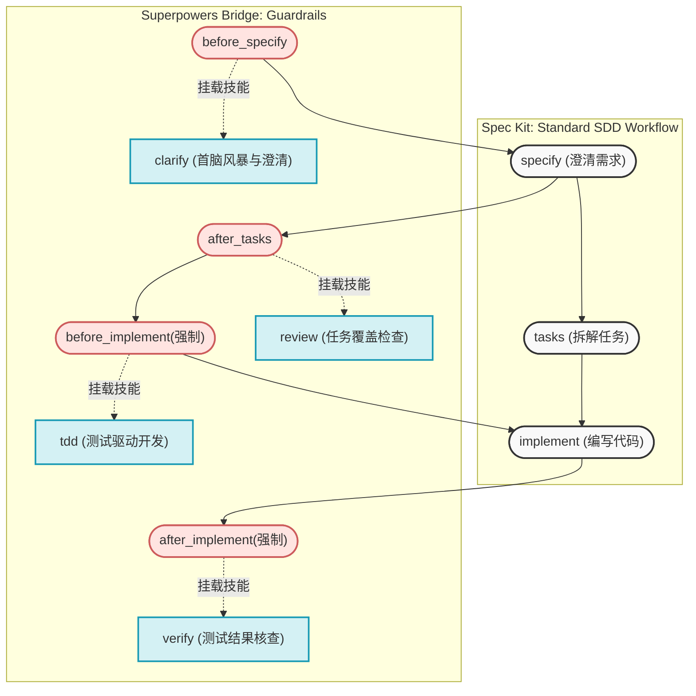

> **TL;DR**: 在 AI 辅助编程时代，代码质量可能由于生成过快而失控。将核心能力强大的 Superpowers AI 技能集无缝嵌入 Spec Kit 的 SDD 工作流，能够带来一套基于生命周期钩子的强制护栏。它将代码审查、TDD 测试驱动开发和系统性排障变为不可逾越的规则，彻底告别“面条代码”（Spaghetti code）。

在 AI 辅助编程的浪潮下，我们经常遇到这样的痛点：AI 生成代码速度极快，但如果没有明确的约束与规范，项目最终往往演变成一堆难以维护的“面条代码”。为了解决这个问题，许多团队开始采纳 **SDD（Spec-Driven Development，规范驱动开发）**。

今天，我们要介绍一个堪称“王炸”的开源扩展工具——**Superpowers Bridge**。本文将带你了解为何你需要这个桥接工具，以及它如何在开发的全生命周期中守护你的代码质量。

## 面临的挑战：失控的 AI 编码

目前的 AI 编码正处于一个两极分化的阶段：要么是用 IDE 的内联对话框进行不可靠的散弹枪式修改，要么是用重型编排代理进行难以插手干预的黑盒生成。我们在早期对于 [Agentic Coding 的实战探索](/posts/agentic-coding-xcode-gemini-01-overview/)中发现，传统的 AI 辅助编程虽然高效，但在缺乏[流程中硬性约束条件](/posts/mastering-antigravity-agents/)的情况下，很容易掉入以下陷阱：

- **需求模糊**：在没有想清楚具体细节前就开始盲目生成代码。
- **测试缺失**：AI 信誓旦旦地宣称任务完成，但在流水线上却因为缺少测试或边界用例而崩溃。
- **排障碰运气**：遇到顽固错误往往只是让 AI “再试一次”，而不是系统性地深挖根因。

## 解决思路：流程与能力的结晶

要真正驯服 AI，我们需要将“规范”与“能力”结合。这就是 Superpowers Bridge 诞生的背景，它主要由两个基石生态组成：

- **Spec Kit**：定义了极其严格的开发流程工作流，将生命周期科学地切分为 `specify` (澄清需求) -> `tasks` (拆解任务) -> `implement` (编写代码)。它强迫我们在写下第一行代码前想清楚要做什么。
- **Superpowers**：这是一套由专家凝练的 Agent 技能合集（[obra/superpowers](https://github.com/obra/superpowers)），它赋予 AI 诸如“测试驱动开发”、“结构化 Debug”以及“专业级 Code Review”等超越普通对话模型的能力单元。

通过将经过实战检验的 Superpowers 无缝嵌入到 Spec Kit 严格的工作流之中，Superpowers Bridge 相当于给它打了基因强化剂。原本需要主动唤起的超级能力，统统变成了工作流中不可逾越的**强制护栏（Guardrails）**。


*图：Superpowers Bridge 连接 AI 编码能力与严苛规范工作流*

## 核心实现：化“能力”为“护栏”

最能体现该桥接扩展威力的，是其基于 Spec Kit Hook 机制深度集成的四个生命周期拦截器。它不仅能帮助生成代码，还能死死把控代码落地的最终质量：

### 1. 写需求前拦截 (`before_specify` ➡️ `clarify`)

开发中最怕的就是“伪需求”。通过挂载 `clarify` 工具，系统会在你正式开始编写需求规格说明 (Spec) 之前主动与你进行深度的意图澄清头脑风暴，提前将模糊的想法挤干水分。

### 2. 拆解任务后拦截 (`after_tasks` ➡️ `review`)

流程会自动执行 `review` 检查，对比你产出的任务清单 (`tasks.md`) 是否百分之百覆盖了原始 `spec.md` 中的所有业务要求。在这个环节它强制寻找遗漏的边界场景，杜绝开发后期的尴尬。

### 3. 写代码前拦截【强制】 (`before_implement` ➡️ `tdd`)

**这是整个桥接方案中最硬核的设定。** 此扩展强制开启 TDD（测试驱动开发）护栏。在真正修改生产代码之前，必须先先写出对应的测试用例！其强制让整个实现流程进入稳定的 **RED-GREEN-REFACTOR** (红-绿-重构) 模式，彻底告别面向运气的黑盒编程。

### 4. 主代码完成后拦截【强制】 (`after_implement` ➡️ `verify`)

AI 经常信誓旦旦地说任务已搞定，结果一跑流水线就挂。这里的 `verify` 钩子成为了一道铁门，严禁任何人或大模型盲目地“宣称”完成。开发者必须拿出测试通过的实质检验证据（如 `npm test` 的通过标识），否则严禁进入后续的合并环节。

## 进阶战术板：应对复杂场景

除了隐式挂载的自动化生命周期 Hook 外，Superpowers Bridge 还公开了一系列独立指令形式的高级工具技能，专门用于对付开发中后期那些难啃的骨头：

- **深度排障 (`/speckit.superb.debug`)**：遇到顽固 BUG，结合上下文引入系统性根因分析（Root-cause Debugging），抽丝剥茧直至定位到真正的病灶。
- **专业审视 (`/speckit.superb.critique`)**：站在高级架构师的视角，脱离细碎代码实现重新对照原始 Spec 和更改集合，进行一次完全无死角的多重独立代码审查。
- **意见回应 (`/speckit.superb.respond`)**：专为落实“审查反馈 (CR)”而设计，在团队协作中实现从反馈解释、自动化编码修改到一键补充用例的修复闭环。
- **优雅收尾 (`/speckit.superb.finish`)**：在全面通过 `verify` 查验后，智能整理相关代码并生成语义化的 Changelog，最后以标准化的极简格式安全提交代码。

## 获得的结果

将这套由强约束与高性能组成的工具链落地后，效果极其显著。工程进度与质量由无法干预的黑盒状态变为了 100% 可见、可控。更重要的是，通过前置测试（TDD）护栏，大大减少了代码反复修改和回退的时间；每一次通过校验审查的提交都变得踏实且安心。团队工程师不仅摆脱了被错乱代码困扰的烦恼，也真切地重拾了对于 AI 辅助编码的信任与掌控感。

## 经验与总结

在推行这套实践的过程中，我们发现最大的阻力其实来自于开发人员过往急于“写代码”的路径依赖。突然转向要求先写 Spec，甚至强制先在 TDD 环节写失败用例，在头几天势必会带来阵痛期。不过一旦团队在这个“红绿重构”机制的确定性体验中受益，就会彻底对散弹式的随机修改嗤之以鼻。下一步，我们计划为该扩展注入更智能的上下文边界判定策略。

## 下一步

如果你也是强调规范自律的开发拥趸，又或者你的团队已经开始尝试实战化 Spec Kit 工程，只需一行简单的命令即可将该扩展注册到当前的工作流中。请确保在 Node.js 环境下已前置安装了 `spec-kit` 核心（`>= 0.4.3` 版本）& Superpowers （`>= 5.0.0` 版本）：

```bash
specify extension add superpowers-bridge --from https://github.com/RbBtSn0w/spec-kit-extensions/releases/download/superpowers-bridge-v1.0.0/superpowers-bridge.zip
```

在这套硬核护栏工具的加持下，你会发现写出无懈可击的高质量代码从未如此让人安心。快去试试，体验为 AI 添加工程紧箍咒的独特魅力吧！

**相关推荐与深入阅读：**

- [如何在 Xcode 中配置 Agentic Coding 基础工作流](/posts/agentic-coding-xcode-gemini-01-overview/)
- [探索 Antigravity Agents：构建团队的自动化帮手](/posts/mastering-antigravity-agents/)
- [Superpowers (obra/superpowers) 官方资源库](https://github.com/obra/superpowers){:target="_blank" rel="noopener"}
- [Spec Kit 核心框架以及规范指南](https://github.com/github/spec-kit){:target="_blank" rel="noopener"}