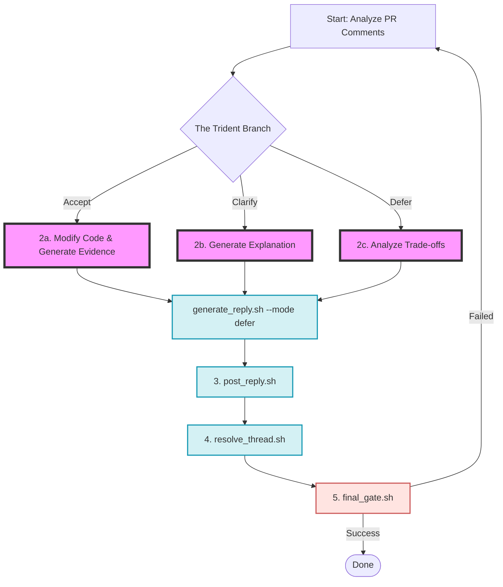

> **TL;DR**: 在 AI 辅助编程领域，大多数工具的默认逻辑是极其线性的。本文复盘了我们如何通过引入 **“决策分叉”** 和 **“方差隔离 (Variance Isolation)”** 原则，将一个脆弱的 Code Review 脚本重构成一个具有极高鲁棒性的生产级 Agent 系统。

在最近重构 `gh-address-cr`（一个用于自动化处理 GitHub PR Review 评论的 Agent Skill）时，我们发现简单的线性逻辑——“发现错误 -> 让 LLM 修改代码 -> 提交”——在真实的高级软件工程场景中，不仅天真，而且极其危险。

## 什么是方差隔离 (Variance Isolation)？

> **方差隔离**是构建鲁棒 AI Agent 的核心设计原则。它要求开发者将“非确定性”的 LLM 推理（概率机）与“确定性”的业务逻辑执行（状态机）进行物理与逻辑层面的彻底解耦。通过将所有格式化、协议解析和副作用操作封装在确定性的脚本中，只允许 LLM 进行高维逻辑决策，从而消除 AI 的随机“幻觉”对系统稳定性的影响。

## 痛点：被“消除报错”绑架的 Agent

在重构前，Agent 的核心循环非常简单：
`抓取未解决的评论 -> 理解并修改代码 -> 跑测试 -> 回复证据 -> 标为已解决`

这种“盲目服从”的设计隐藏着三个致命缺陷：

1. **篡夺审查权**：Agent 把所有 CR 建议当成 Bug 来修，直接切断了与审查者深入探讨技术方案的可能性。
2. **架构腐化**：为了迎合细碎的“代码品味”，Agent 往往以破坏局部架构的一致性为代价由 AI 盲目修补。
3. **无限循环**：当 Agent 无法完美修改代码，它会陷入反复尝试的“幻觉黑洞”，造成 Token 的极大浪费。

真正的 Code Review 并非简单的“消除报错”，而是一个**达成技术共识**的过程。Agent 必须具备**技术决策权**，而非仅仅是代码搬运工。

## 破局：引入“大脑”与决策矩阵

为了解决上述问题，我们在 AI Agent 设计中强制切入了一个核心步骤：**Analysis & Decision Matrix（分析与决策矩阵）**。

在动任何一行代码之前，Agent 必须先进行自我拷问：这真的需要改吗？我们将其设计为 **“三叉戟路径” (The Trident Branch)**：

- **[ Accept ]**：确认改进意见合理。-> **执行修改，附带测试通过证据。**
- **[ Clarify ]**：审查者产生误解或提出疑问。-> **提供严谨的技术解释，拒绝修改。**
- **[ Defer ]**：高成本重构。-> **提供后续计划和 Trade-off 分析，推迟执行。**

这一步的核心在于：**赋能 Agent 在 Prompt 层面学会拒绝。**

## 架构升级：AI Agent 设计从“概率机”到“状态机”

赋予 Agent 决策权后，我们面临一个经典的工程争议：**如何为不同路径提供执行工具？**

按照传统的单一职责原则 (SRP)，开发者习惯提供细粒度工具。但实践证明，**将高度正交的原子工具直接丢给 LLM，是生产环境的梦魇。**

### 第一性原理与方差隔离实现

回到第一性原理审视：
- **LLM 是一台“概率机”**：擅长模糊推理，但天生缺乏生成确定性格式（如 JSON/Markdown）的能力。
- **脚本程序是一台“状态机”**：输出具有绝对的确定性，擅长处理规整的逻辑。

**设计 Agent 系统的核心逻辑不是代码解耦，而是方差隔离。** 我们绝不能让“概率机”去处理“拼接字符串、控制复杂文件路径”这类必须 100% 准确的任务。

### 工具收敛：构建“漏斗型”分发器

最终，我们构建了一个参数化的多模态脚本：
`generate_reply.sh --mode <fix | clarify | defer> --rationale "<...text...>" `

LLM 的角色从“流水线装配员”转变为“高阶决策者”。它只负责逻辑判断和语义生成，底层琐碎的格式校验全部被密封在 Bash 脚本的确定性黑箱中。

## 终极状态机架构图

重构后的系统架构通过一个强力的“漏斗”收束了所有的不确定性：

*图：Code Review Agent 的最终架构图，展示了从决策到执行的方差收束。*

## 总结

在开发工业级 AI Agent 时，不要试图让它包揽一切：

1. **认知增强**：必须在 Prompt 层面强制切入决策分析。赋能 Agent “拒绝”的权利。
2. **工具降维**：使用带有强类型参数的聚合型“大工具”，将控制流从概率机中抽离，才是收束系统熵增的唯一正途。

---

**延伸阅读：**
- [如何构建团队专属的自动化 AI 帮手：Antigravity Agent 深度指南](/posts/mastering-antigravity-agents/)
- [SDD 系列 (1)：从 Spec 到任务拆解的演进之路](/posts/sdd-series-part-1-evolution/)
糊推理和语义生成，但天生缺乏确定性。
- **脚本/程序是一台“状态机”**：只要输入固定，输出具有绝对的确定性。

**设计 Agent 系统的核心逻辑，不是代码解耦，而是“方差隔离”。** 我们绝不能让“概率机”去处理“拼接字符串、对齐 Markdown、控制复杂文件路径”这类必须 100% 准确的任务。

### 工具收敛：构建“漏斗型”分发器

最终，我们放弃了细碎的工具链，构建了一个参数化的多模态脚本：
`generate_reply.sh --mode <fix | clarify | defer> --rationale "<...text...>" `

LLM 的角色从“流水线装配员”转变为“高阶决策者”。它只负责最高维度的逻辑判断（推断 Mode）和核心语义生成（撰写理由），而底层繁琐的格式校验、模板填充和文件写入，全部被密封在 Bash 脚本的确定性黑箱中。

## 终极状态机架构

经过重构后的系统架构，通过一个强力的“漏斗”收束了所有的不确定性：

*图：Code Review Agent 的最终架构图，展示了从决策到执行的方差收束。*

## 总结

开发大模型应用（Agent）时，我们经常会被其强大的对话能力迷惑，试图让它包揽一切。但实战告诉我们：

1. **认知增强**：必须在 Prompt 层面强制切入决策分析。赋能 Agent “拒绝”的权利，是保持系统完整性的基石。
2. **工具降维**：抛弃迷信细粒度解耦。使用带有强类型参数（Enums）的聚合型“大工具”，将控制流从概率机中抽离，才是收束系统熵增、打造生产级 Agent 的唯一正途。

---

**延伸阅读：**
- [如何构建团队专属的自动化 AI 帮手](/posts/mastering-antigravity-agents/)
- [SDD 系列：规范驱动开发的进化之路](/posts/sdd-series-part-1-evolution/)
