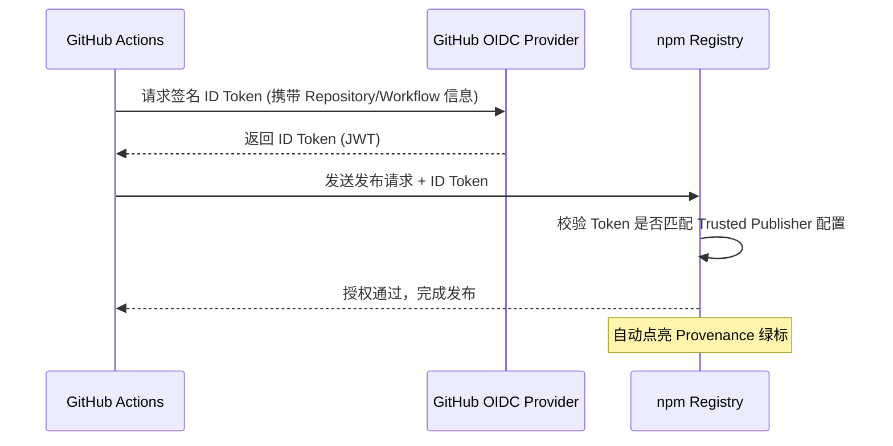

> **TL;DR**: **npm Trusted Publishing** (可信发布) 是一种基于 OIDC 协议的安全发包架构。它允许 GitHub Actions 在无需存储长效 `NPM_TOKEN` 的情况下，动态获取、临时鉴权，并自动点亮 npm 官网的 **Provenance** (来源证明) 绿标，完美规避 2FA 限制。

---

## 🌟 为什么 npm Trusted Publishing 是最佳实践？

在传统的 CI/CD 流程中，我们习惯在 GitHub Secrets 中存储长效 `NPM_TOKEN`。这种做法存在三个核心痛点：

1.  **凭证泄露风险**：长效 Token 一旦泄露，攻击者可以滥用权限。
2.  **2FA 维护成本**：开启 2FA 的账号无法直接配合传统 CI 鉴权。
3.  **缺乏来源透明度**：用户无法确认代码确实源自特定 GitHub Workflow。

**npm Trusted Publishing** 解决了上述所有难题：实现“按需生成、瞬时失效”，不仅提升了安全性，还让你的包附带了 npm 社区最推崇的 **Provenance** 徽章。

---

## 🏗️ OIDC 配置流程概览



---

## 🛠️ 黄金配置 (The Golden Config)

要走通 **npm Trusted Publishing** 流程，请严格校对以下三个文件：

### 1. `package.json`：必须的斜杠
这是最隐蔽的坑点。`semantic-release` 会严格校验 registry 地址。

```json
{
  "publishConfig": {
    "access": "public",
    "registry": "https://registry.npmjs.org/" 
  }
}
```
> [!IMPORTANT]
> **SEO 关键细节**：注意 `registry` 结尾的斜杠 `/`。如果是使用 `semantic-release`，缺少这个斜杠会导致 OIDC 鉴权逻辑失效，系统会回退去索要不存在的 `NPM_TOKEN`。

### 2. `.releaserc.json`：开启 Provenance
在插件配置中显式声明开启来源证明：

```json
{
  "plugins": [
    "@semantic-release/commit-analyzer",
    "@semantic-release/release-notes-generator",
    [
      "@semantic-release/npm",
      {
        "npmPublish": true,
        "provenance": true
      }
    ],
    "@semantic-release/github"
  ]
}
```

### 3. `.github/workflows/release.yml`：CI 权限分配
必须显式赋予 `id-token` 写入权限，这是触发 **OIDC** 的核心。

```yaml
jobs:
  release:
    runs-on: ubuntu-latest
    permissions:
      contents: write
      issues: write
      pull-requests: write
      id-token: write # ⚠️ 核心：允许 Job 向 GitHub 请求 OIDC Token
    steps:
      - uses: actions/checkout@v4
      - uses: actions/setup-node@v4
        with:
          node-version: "lts/*" 
      
      - run: npm ci
      - run: npm run build
      
      - name: Semantic Release
        env:
          GITHUB_TOKEN: ${{ secrets.GITHUB_TOKEN }}
          # ⚠️ 绝对不要在这里传入 NPM_TOKEN！
        run: npx semantic-release@25 # ⚠️ 版本要求：必须 v25+ 才原生支持 OIDC
```

---

## 🚦 场景分叉：新包 vs 老包迁移

### 场景 A：发布一个全新的 npm 包

> [!NOTE]
> 由于未发布的包在 npm 上还不存在，你无法提前配置 Trusted Publisher。因此，新包必须先进行一次本地手动发布（冷启动）。

1. **本地手动冷启动**
   * **Step 1: 登录并确认身份**
     ```bash
     npm login          # 浏览器完成 2FA 登录
     npm whoami         # 必须输出你的 npm 账号 (例如 rbbtsn0w)
     ```
   * **Step 2: 发布前 Dry-run 自检**  
     在不真正上传的前提下，预检打包内容与编译流程：
     ```bash
     npm publish --dry-run --access public --tag alpha
     ```
     > [!TIP]
     > `prepare` 生命周期钩子会在此阶段触发 `npm run typecheck`，作为发布前的编译与类型检查门禁。
   * **Step 3: 正式手动发布**
     ```bash
     npm publish --access public --tag alpha
     ```
     * `--access public`：Scoped 包默认是私有的（Private），必须显式指定为公开（Public）。
     * `--tag alpha`：关键步骤，避免将首个处于测试或开发阶段的版本设为 `latest`。
   * **Step 4: 补齐 Git Tag**  
     手动标记版本并推送，为后续 `semantic-release` 的自动化接管打下基础：
     ```bash
     git tag v0.1.0-alpha.1
     git push origin v0.1.0-alpha.1
     ```

2. **配置可信发布者 (Trusted Publisher)**  
   首次手动发布成功后，登录 npmjs.com，进入该包的 **Settings** -> **Trusted Publishers** -> **Add Publisher**。

3. **绑定 GitHub 仓库**  
   仅需填写你的 GitHub 组织/用户、仓库名，以及触发发布的工作流文件名（例如 `release.yml`）。

### 场景 B：旧包迁移 (彻底移除 NPM_TOKEN)

若该包在 npm 上已存在，可以直接通过以下顺序平滑迁移至免密钥发布，确保 CI/CD 流程不中断：

1. **绑定 Trusted Publisher**：在 npm 侧对应包的后台完成 GitHub 仓库绑定。
2. **清理 CI 配置**：从 GitHub Actions 的 `.yml` 文件或项目 Secrets 中，彻底移除 `NPM_TOKEN` 环境变量。
3. **销毁历史密钥**：确认 CI 自动发布成功后，登录 npm 官网，撤销之前生成的所有长效发布 Token，实现安全闭环。

---

## 💣 常见报错排查手册

| 报错日志 | 根本原因 | 解决方案 |
| :--- | :--- | :--- |
| `EINVALIDNPMTOKEN` | `setup-node` 配置了干扰鉴权的 `registry-url`。 | **删除** `setup-node` 中的该配置。 |
| `ENONPMTOKEN` | 多为 `semantic-release` 版本过低或 registry 漏了斜杠。 | 使用 `@25` 版本，并确保 `registry` 末尾带 `/`。 |
| `EBADENGINE` | Node.js 版本太低。 | 使用 `node-version: "lts/*"` (推荐 22+)。 |
| `EOTP` | 仍在走旧的鉴权模式，或 Publisher 绑定失效。 | 重新检查 `id-token: write` 权限和 npm 侧绑定信息。 |

---

## 💡 结语

配置 **npm Trusted Publishing** 是对软件供应链负责的体现。一旦配置成功，你将享受到免密钥运维的安全性，同时获得社区公认的 **Provenance** 绿标。

---

**内链推荐：**
- [CI/CD 最佳实践：打造鲁棒的自动化发布管线](/posts/ci-cd-best-practices/)
- [语义化版本管理 (SemVer) 深度解析](/posts/SemanticVersioning/)
- [GitHub 免费 TLS 证书配置指南](/posts/GithubFreeTLS/)
