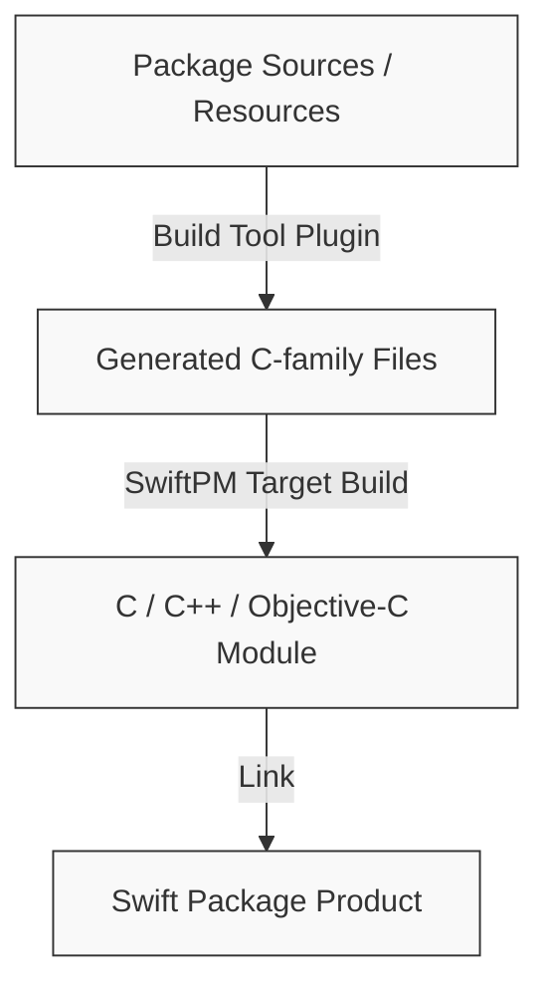

> **TL;DR**: Swift 6.3 引入了 `experimentalCGen` 特性，允许 Swift Package Manager 的 Build Tool Plugin 生成 C-family 源码并直接参与 C 模块的编译。这消除了混合语言项目中对外部脚本的依赖，使完整的构建图谱得以在 SwiftPM 内闭环。

Swift Package Manager (SwiftPM) 很早就能管理 Swift、C、C++、Objective-C 等不同语言的源码，也能通过 Build Tool Plugin 在构建过程中运行生成器。但在 Swift 6.3 之前，这两件事之间一直有一个缺口：插件生成出来的 C-family 产物，很难自然地进入 C 模块的编译流程。

Swift 6.3 的 `experimentalCGen` 正是在补这个缺口。它让 SwiftPM 的 Build Tool Plugin 可以为 C module target 生成 C source files，并支持生成 module maps、header files 和 API notes。对混合语言 package 来说，这不是一个小功能，而是 SwiftPM 能否承载真实原生构建流程的关键一步。

## The Challenge: 过去生成代码游离于 SwiftPM 之外

很多原生库的构建过程都不是简单地“把源码编译一下”。在真正进入 C、C++ 或 Objective-C 编译前，它们通常还需要先跑一段生成流程。

常见例子包括：
- 把 Shader、Kernel 或字节码资源转成 C 数组。
- 把 Schema、IDL、协议描述文件转成 `.c` 和 `.h`。
- 生成 module map、桥接 header 或 API notes。
- 把平台相关的静态数据转换成可以被链接器处理的源码。

这些步骤本来就属于构建图的一部分。但过去 SwiftPM 很难完整表达它们。插件可以运行，C-family target 也可以存在，可是插件产出的 C 源码和头文件并不能稳定地被当作该 target 的正式输入。

于是很多项目只能选择绕路：
- 提前生成代码并提交到仓库。
- 在 `swift build` 前额外执行 Shell 脚本。
- 保留一套 CMake、Xcode project 或自定义打包流程。
- 把真实构建逻辑藏在 CI 或 release 任务里。

这些做法都能解决眼前问题，但代价很明确：SwiftPM 不再是完整的构建入口，而只是消费某个中间结果。本地、CI、Xcode、发布流程之间也更容易出现行为差异。

## The Approach: experimentalCGen 改变了什么

启用这个能力的方式是在 `Package.swift` 的 tools version 中加入实验标记：

```swift
// swift-tools-version: 6.3;(experimentalCGen)
```

开启后，SwiftPM 可以把 Build Tool Plugin 生成的 C-family 文件纳入 C module target 的正常构建流程。也就是说，生成器不再只是一个外部预处理步骤，而是 package build graph 的一部分。

我们可以用数据流来更直观地理解这个变化：


_图 1：Swift 6.3 experimentalCGen 构建流程示意图（由 AI 辅助生成）_




这个变化看起来很朴素，但它解决的是构建系统里最重要的问题之一：依赖关系能不能被工具准确理解。

当生成输入、生成工具、生成输出和最终 target 都处在 SwiftPM 的描述范围内，构建系统才知道什么时候该重新生成，什么时候该重新编译，哪些文件属于哪个 target，Xcode 和命令行是否在构建同一件东西。

## Implementation Deep Dive: 图像处理库的迁移案例

考虑一个图像处理类 Swift package。它对外提供 Swift/Objective-C 可调用的 API，内部依赖 C++ 实现，还需要在构建时把若干计算资源编译成 C 数据，再链接进最终库。

在旧方案里，这个项目通常会拆成几层：
- 底层原生代码由外部构建系统处理。
- 生成资源由脚本提前产出。
- Swift package 只包装已经准备好的结果。
- 示例 App、CI、发布脚本各自维护一部分构建知识。

这种结构最大的问题不是“复杂”，而是信息分散。真正决定构建结果的规则没有集中在 `Package.swift` 和 target graph 里。新成员要理解构建链，需要同时看脚本、CI、Xcode 设置和发布文档；任何一个地方漏掉一步，都可能得到不同的产物。

迁移到 Swift 6.3 的 `experimentalCGen` 后，这类项目可以换一种组织方式：
- 真实源码继续保留在 package target 中。
- 需要生成的输入文件作为 package source 或 resource 管理。
- Build Tool Plugin 负责在构建时调用生成器。
- 生成出来的 C 源码进入同一个 C-family target。
- `swift build`、`swift test`、Xcode 消费 package 时走同一套构建关系。

这样做不需要公开底层算法、资源内容或内部目录结构。关键点只是：原来散落在外部脚本里的生成步骤，被放回了 SwiftPM 能理解的构建图中。

## Results and Metrics: 它解决了哪些实际问题

第一，**减少 Generated Source 污染。**
生成文件通常不适合人工 Review，也容易造成无意义冲突。把生成过程纳入 SwiftPM 后，仓库可以只保留源输入和生成器，把机器产物留在构建目录。

第二，**统一本地、CI 和 Xcode 构建。**
如果生成步骤在 SwiftPM 外部，不同环境很容易跑出不同结果。`experimentalCGen` 让生成步骤成为 target 构建的一部分，命令行和 Xcode 更容易使用同一套规则。

第三，**降低混合语言 Package 的发布成本。**
很多 Swift package 并不是纯 Swift。它们可能有 C++ core、[Objective-C bridge](/posts/Objective-CToSwift/)、二进制依赖、资源编译和平台差异。过去这些项目经常需要额外维护打包产物或外部构建系统。现在，至少对一部分生成 C 代码的场景，SwiftPM 可以直接承载更多真实构建逻辑。

第四，**让 Plugin 的价值延伸到 C-family target。**
SwiftPM Plugin 原本就适合做代码生成和构建前处理。`experimentalCGen` 让这套机制不再只适用于 Swift 源码或普通资源，而是可以进入 C/C++/Objective-C 模块的核心构建路径。

## Lessons Learned: 为什么这是一个里程碑，以及当前的限制

### 迈向真实工程复杂度

Swift 生态正在面对越来越多混合语言工程：图像处理、音视频、AI 推理、数据库、编译器工具、嵌入式、跨平台 SDK、系统库绑定。这些项目很少是纯 Swift，它们需要构建系统能够理解 C-family 源码、生成代码、二进制依赖和平台规则。

如果 SwiftPM 只能舒服地处理纯 Swift package，它就很难成为这类项目的主入口。`experimentalCGen` 的意义在于，它让 SwiftPM 朝真实工程复杂度迈进了一步。

这个里程碑主要体现在三点：
- **构建图更完整**：生成 C 产物不再只是外部脚本的副作用。
- **工具体验更一致**：同一套 package 描述可以服务命令行、CI 和 Xcode。
- **package 边界更大**：一些过去必须依赖预生成产物或额外打包流程的库，可以重新评估是否直接以 source package 形式分发。

Swift 6.3 同时还提供了 Swift Build 集成预览。SwiftPM release notes 明确提到，`experimentalCGen` 同时适用于当前 Native Build System 和 SwiftBuild。这一点很重要，因为它说明这不是只为旧构建系统补洞，而是在为 SwiftPM 未来的统一构建模型铺路。

### 实验边界与限制

`experimentalCGen` 仍然是实验特性。官方文档已经列出一些限制：
- 同一个 target 只能有**一个**生成的 module map。
- module map 引用的 header 必须和 module map 位于**同一目录**。
- 如果生成了 module map，就不能再从 public headers path 提供另一个 module map。

因此，它更适合边界清楚、输入稳定、输出明确的生成流程。比如：
- 固定资源转 C 源码。
- Schema 或协议描述转 C/header。
- 小规模 module map/header 生成。
- 服务单一 target 的构建期代码生成。

它还不适合被当成万能构建系统替代品。复杂原生工程仍然需要认真设计 target 边界、依赖关系、工具可发现性和 CI 验证。

## Next Steps: Package 作者该如何选择

如果你的 Swift package 现在仍然依赖外部脚本生成 C/C++/Objective-C 构建输入，可以用下面几个问题判断是否值得尝试 `experimentalCGen`：

- 生成输入是否能放在 package 内部管理？
- 生成输出是否只服务于明确的 target？
- 生成器是否能在 SwiftPM Build Tool Plugin 中稳定运行？
- 生成文件是否不值得提交到仓库？
- 本地、CI、Xcode 是否都需要同一套生成结果？

如果这些问题的答案大多是肯定的，那么 Swift 6.3 的 `experimentalCGen` 很可能能简化你的构建链。

它真正带来的不是“少写几行脚本”，而是把真实构建过程放回 SwiftPM 可以理解、调度和验证的位置。对 Swift package 生态来说，结合 [Semantic Versioning 语义化版本](/posts/SemanticVersioning/)，这是从轻量依赖管理走向复杂原生工程管理的重要一步。

## References

- [Swift 6.3 Released](https://www.swift.org/blog/swift-6.3-released/)
- [SwiftPM 6.3 Release Notes](https://github.com/swiftlang/swift-package-manager/blob/main/Documentation/ReleaseNotes/6.3.md)
- [Swift Build Preview](https://github.com/swiftlang/swift-package-manager/blob/main/Sources/PackageManagerDocs/Documentation.docc/SwiftBuildPreview.md)
