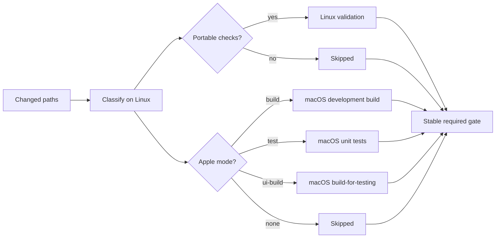

> **TL;DR**：Apple CI 的优化目标不是“让所有任务跑得更快”，而是让每类变更只消耗足以证明其正确性的资源。先在 Linux 上分类并执行可移植检查，再把真正依赖 Xcode 的 build、unit test 与 UI test compilation 路由到 macOS；用一个稳定的 required gate 汇总条件任务；对未知路径 fail closed；不要在没有等价性、并发安全和收益数据前缓存 DerivedData。

> [!TIP]
> **如何通过 Apple CI 优化实现 macOS Runner 的大幅降本？**  
> 核心策略包括：① 在便宜的 Linux 容器上执行可移植的前置代码检查与风险路由分类；② 将真正依赖 Xcode 的编译与单元测试限制在仅必要路径，并汇总为稳定的所需门禁；③ 采用 fail-closed 路径策略；④ 隔离并审慎配置 DerivedData 并发缓存。

## 问题不在于 macOS 慢，而在于我们让它做了太多事

Apple 平台项目天然依赖 Xcode、Simulator、签名工具链和 macOS runner。最直接的 CI 写法通常只有一个 job：每次 Pull Request 都生成工程、构建 App、运行全部单元测试，甚至顺手编译或执行 UI tests。

它很容易理解，也很容易浪费。

修改一篇文档、一个定价表或一段网站 JavaScript，并不需要启动 Xcode。反过来，修改 String Catalog、Tuist manifest 或 Swift 源码，仅靠 Linux lint 也无法证明资源处理和 Apple 编译链仍然成立。

真正的问题因此不是“怎样跳过测试”，而是：

> 怎样为每一种变更选择最便宜、但仍足够证明正确性的验证层级？

这是一道风险路由题，而不是简单的路径过滤题。

## 先建立证据阶梯

CI 配置能通过 YAML 解析，不代表它能在真实仓库中工作。我们需要区分五种证据：

1. **Candidate**：只有架构推理或官方文档支持。
2. **Locally proven**：分类器、脚本或 contract tests 已在本地通过。
3. **Portable smoke proven**：runner、workflow mechanics 和精确 action pin 已在一次性公开 smoke repository 中通过。
4. **Remote PR proven**：真实仓库 PR 已证明 secrets、私有依赖、条件 job、branch protection 和 required checks 可以协同工作。
5. **Release proven**：archive、签名、上传或安装产物已经沿授权发布路径验证。

这些证据不能互相替代。公开 smoke 可以证明 `ubuntu-latest` 上存在所需工具，却不能证明私有依赖认证；本地测试可以证明分类逻辑，却不能证明 GitHub 的 skipped-job 汇总；PR 全绿也不能证明签名和发布产物。

因此，“设计合理”“本地通过”和“已经采用”应当是三个不同的结论。

## 成本感知架构：基于 GitHub Actions 的 Apple CI 优化方案



整条流水线分为三层。

### 1. Linux 分类器

分类器读取真实的 Git diff，而不是只看最后一次 commit：

- Pull Request 使用 base SHA 到 head SHA。
- 已存在分支的 push 使用事件 payload 中的 `before` 到 `after`。
- 新分支、删除 ref、全零 SHA、浅克隆缺历史等情况必须显式处理。

分类结果应是机器可读输出，例如：

```json
{
  "linux_checks": ["metadata", "automation-contracts"],
  "apple_mode": "test",
  "coverage_required": false,
  "changed_file_count": 7,
  "fallback_count": 1
}
```

`fallback_count` 很重要。它让分类规则的盲区可见，同时不以漏跑验证为代价。

### 2. 条件验证任务

一个实用的默认路由可以是：

| 变更风险 | Linux | macOS |
|---|---|---|
| 文档、非可执行规范 | none | none |
| metadata、schema、脚本、Web 资源 | selected checks | none |
| resources、String Catalog、manifest、build settings | optional checks | development build |
| Product Swift 或 unit-test Swift | optional checks | development tests |
| UI-test source | none | `build-for-testing` |
| Unknown Swift | known checks | tests |
| 其他未知 executable/config | known checks | build |

这里有两个关键点。

第一，分类依据是风险而不是文件数量。一行 Tuist manifest 可能改变整个 build graph；一百行文档通常不需要产品测试。

第二，未知路径必须 **fail closed**。未知 Swift 默认进入测试，其他未知可执行或配置路径默认进入 build。分类器可以不完美，但不能因为不认识新目录就静默放行。

### 3. 稳定的 required gate

条件 job 会产生一个 branch protection 难题：今天只有 Linux job，明天只有 macOS job，required check 的名字不能跟着路径变化。

解决方法是提供一个名称稳定、始终执行的汇总 gate。它依赖分类器和所有可选 job，并使用 unconditional final evaluation：


```yaml
required-gate:
  if: ${{ always() }}
  needs:
    - classify
    - linux-validation
    - macos-validation
  runs-on: ubuntu-latest
  steps:
    - name: Verify selected jobs
      shell: bash
      env:
        CLASSIFY_RESULT: ${{ needs.classify.result }}
        LINUX_RESULT: ${{ needs.linux-validation.result }}
        MACOS_RESULT: ${{ needs.macos-validation.result }}
      run: |
        [[ "$CLASSIFY_RESULT" == "success" ]]
        [[ "$LINUX_RESULT" == "success" || "$LINUX_RESULT" == "skipped" ]]
        [[ "$MACOS_RESULT" == "success" || "$MACOS_RESULT" == "skipped" ]]
```


它只接受：

- 分类器为 `success`；
- 条件 job 为 `success` 或 `skipped`。

`failure`、`cancelled` 和缺失结果都必须失败。真正采用前，至少要验证“可选 job 跳过时 gate 通过”和“选中 job 故意失败时 gate 确实阻断”两个方向。

> [!WARNING]
> **实践避坑指南：**
> 1. **同文件依赖局限性**：GitHub Actions 的 `needs` 声明**无法跨 YAML 文件引用**。因此，以上示例中的 `classify`、`linux-validation`、`macos-validation` 与 `required-gate` 必须被定义在**同一个工作流（YAML）文件内**，否则会导致 Workflow 语法校验失败而无法启动。
> 2. **分类器不能带条件跳过**：`classify` 必须作为 Workflow 的最前置、无条件执行的 Job。如果为分类器本身配置了特殊的 `if` 条件导致它被 `skipped`，那么 `CLASSIFY_RESULT` 将解析为 `"skipped"`，从而直接导致门禁逻辑中的 `[[ "$CLASSIFY_RESULT" == "success" ]]` 判定失败并阻断。

GitHub 将 `ubuntu-latest` 定位为双 CPU（当前标准配置）、多工具集、短时限的轻量 runner，适合 checkout、分类、小型 summary 和 gate，不适合依赖密集型构建、Docker 或 Apple 编译。具体规格和限制应以 [GitHub-hosted runners reference](https://docs.github.com/en/actions/reference/runners/github-hosted-runners) 为准。

## PR、`main` 与 `release` 是三个不同边界

一个常见误区是：PR 做窄验证，代码一进 `main` 就自动执行最昂贵的完整 build、UI suite、archive 和上传。

`main` 不是天然的发布授权边界。它可以继续使用 change-scoped development routing，也可以根据仓库政策追加完整 integration，但 archive、distribution signing、notarization、TestFlight 与 App Store 操作应留在独立 release workflow 中。

推荐的分工是：

- **PR**：可移植检查 + 最窄的 Apple build/test。
- **`main`**：独立决定开发验证范围，不隐式发布。
- **nightly/manual**：完整 UI suite、性能基线、昂贵诊断矩阵。
- **`release`**：archive、签名、上传与产物检查，需要明确授权。

这种拆分既节省 minutes，也减少普通代码合并意外触发生产副作用的风险。

## 一次很有价值的假红：相同代码树，PR 通过而 `main` 失败

实践中遇到过一个典型现象：PR 的 macOS CI 通过，合并后的 `main` CI 却有两个单元测试失败。第一反应很容易是“merge commit 改坏了代码”。

更可靠的排查顺序是：

1. 比较 PR head 与 merge commit 的 Git `tree`，而不只是 commit `SHA`。
2. 确认失败发生在 build、test、coverage 还是 packaging。
3. 对失败测试做 `focused repetition`，再做 `test-class repetition`。
4. 检查测试是否依赖 `wall-clock sleep`、`RunLoop` 调度或共享状态。

当两个 commit 的 `tree` 完全一致时，“合并引入代码差异”就可以被排除。最后发现，测试用固定 `sleep` 等待 `Timer` 推进内部状态：机器负载较低时通过，调度稍慢时就失败。

正确修复不是把 `50 ms` 改成 `200 ms`，而是给状态机提供生产代码也使用的确定性边界：

```swift
@MainActor
final class PollingService {
  func pollNow() {
    processCurrentState()
  }

  private func startTimer() {
    timer = Timer.scheduledTimer(withTimeInterval: interval, repeats: true) {
      [weak self] _ in
      Task { @MainActor in
        self?.pollNow()
      }
    }
  }
}
```

单元测试直接调用 `pollNow()` 验证状态转换；只有少量真正测试 `Timer` 生命周期的 `integration test` 才等待异步事件。这样消除的是竞态本身，而不是降低它出现的概率。

这也提醒我们：压缩 macOS minutes 之前，先消灭 `flaky tests`。否则路由做得越精细，偶发失败带来的 `rerun` 和诊断成本越高。

## DerivedData 缓存：最诱人也最危险的 Apple CI 优化捷径

Apple CI 一慢，很多人会立刻缓存整个 DerivedData。问题是 DerivedData 不只是“下载好的依赖”，还包含会被 build graph、copy phase、framework embedding、签名和并发写入修改的产物。

更稳妥的默认策略是：

- production build、development tests、UI-test compilation 使用独立 DerivedData root；
- 不跨 scheme 或 job 共享可写 build products；
- 缓存不可变依赖前，先定义 Xcode、Swift、lockfile 和 build settings 的失效键；
- 对比 cold build 与 restored build 的结果等价性；
- 测量 restore time、hit rate、压缩体积、传输时间、存储 churn 与实际净收益。

缓存还存在信任边界。GitHub 明确提醒：cache 内容不带签名，能读 cache 的 workflow 会原样恢复内容；cache 路径不能包含 token、凭据或其他敏感信息，低信任触发还需要考虑 cache poisoning。详见 [Dependency caching reference](https://docs.github.com/en/actions/reference/workflows-and-actions/dependency-caching)。

如果没有上述证明，“缓存 DerivedData”应保持 Candidate，而不是默认优化项。

## 先取消过时工作：压缩 macOS Runner 计费分钟数

最便宜的 macOS minute 是根本没有执行的 minute。

对于同一个 PR 的连续 push，可以按 workflow 与 ref 建立 concurrency group，并启用 `cancel-in-progress`，让新提交取消旧提交仍在执行的 CI：


```yaml
concurrency:
  group: ${{ github.workflow }}-${{ github.event.pull_request.number || github.ref }}
  cancel-in-progress: true
```


group key 应包含 workflow 名称，避免不同 workflow 意外互相取消。GitHub 对 concurrency 的最新行为说明见 [Control workflow concurrency](https://docs.github.com/en/actions/how-tos/write-workflows/choose-when-workflows-run/control-workflow-concurrency)。

推荐按以下顺序优化：

1. 删除重复 workflow 和重复验证。
2. 将可移植检查迁到 Linux。
3. 增加 fail-closed 路径分类。
4. 把 Apple 工作缩到必要的 build、test 或 `build-for-testing`。
5. 把 UI、archive 和发布移到明确 gate。
6. 最后才评估缓存、替代 runner 或其他 provider。

这个顺序的好处是，每一步都能独立解释正确性收益和成本收益，不需要先引入复杂的缓存与基础设施。

## 隐私与供应链安全清单

技术博客和 CI 日志都可能在不经意间暴露私有信息。公开案例时建议统一替换：

- repository owner、私有仓库名和内部产品代号；
- workflow run、job、artifact、App Store 或构建标识；
- bundle identifier、Team ID、签名身份和私有依赖地址；
- 本机绝对路径、用户名、缓存目录和 worktree 名；
- secret/variable 的业务命名，即使没有公开具体值；
- 内部服务域名、账号邮箱、组织结构和未发布价格。

Workflow 本身还应遵循最小权限，并将第三方 actions 固定到审查过的精确 commit SHA。示例代码使用通用名称，不代表可以把真实认证步骤直接复制到公开文章。

## 一份可执行的落地检查表

### 本地证明

- 分类器覆盖 `docs`、`metadata`、`resources`、`Swift`、`UI-test` 和 `mixed paths`。
- `unknown` Swift 与 `unknown` config 均 `fail closed`。
- 输出稳定的 JSON/GitHub outputs，并暴露 `fallback_count`。
- Apple orchestration contract 证明 `build`、`test`、`UI-build` 使用正确 `scheme` 和独立 `DerivedData`。
- Linux orchestrator 拒绝未知 `check` 名称。

### Portable smoke

- 精确 `runner label`、工具版本和 action `SHA` 能执行。
- 条件 job `skipped` 时 `required gate` 通过。
- 选中 job 故意失败时 `required gate` 失败。
- `failure artifact` 不包含敏感数据，并设置短 `retention`。

### 真实仓库

- PR `base/head` 范围正确，私有依赖与 `read-only permissions` 正常。
- `branch protection` 只依赖稳定 `gate`。
- `main` 使用 `before..after` 覆盖 `multi-commit push`。
- 记录 `runner image`、`Xcode path/version`、工具版本和实际 `job duration`。
- 分别统计“正确性证据”和“消耗分钟”，不要用一次偶然快跑宣称已降本。

### 发布路径

- `archive`、签名、上传与普通 PR/`main` CI 隔离。
- 只有授权 `workflow` 可以读取发布 `secrets`。
- 最终以安装产物或分发平台状态作为 `release evidence`。

## 结语

成本感知 CI 的核心不是吝啬，而是让证据与风险匹配。

文档变更不必启动 Xcode，Swift 变更不能只过 lint，UI-test 源码通常先证明可编译，未知路径必须保守升级，发布权限不能由 `main` 分支名隐式授予。Linux 与 macOS 不是竞争关系：Linux 负责便宜、可移植、确定的验证，macOS 负责只有 Apple 工具链才能给出的证据。

最终我们追求的不是“每次都跑最多”，而是：

> 每一次昂贵执行，都能回答一个更便宜的 runner 无法回答的问题。

关于 GitHub Actions 的配额、计费和 runner 可用性，它们会随平台变化；实施前应重新核对 [Billing and usage](https://docs.github.com/en/actions/concepts/billing-and-usage) 与 runner 官方文档，而不是把某个时间点的数字写死在 CI 架构中。
