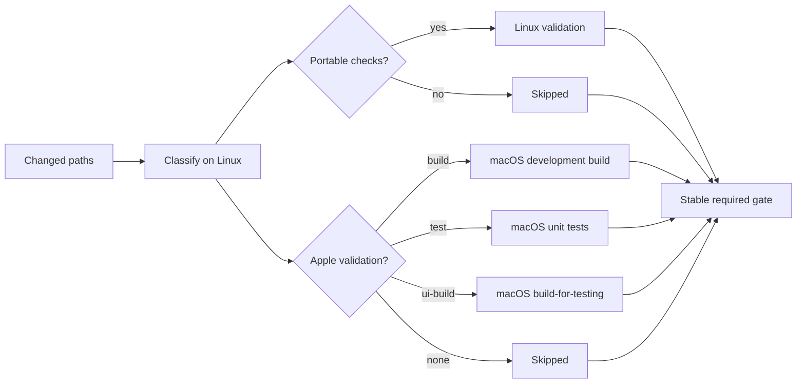

> **TL;DR**：这篇文章讨论的是私有仓库。标准 GitHub-hosted runner 在公开仓库中可以免费使用；私有仓库则先消耗账户每月包含的 minutes，超出后按 runner 类型计费。所谓“榨干 GitHub Actions”，就是让有限额度和每一笔付费执行都产生有效证据：消灭 flaky test，把可移植检查迁到 Linux，只把真正依赖 Xcode 的验证交给 macOS，并及时取消已经过时的任务。

## 先把账算清楚：公开仓库免费，私有仓库按月计量

如果项目是公开仓库，使用 standard GitHub-hosted runners 通常不需要为 minutes 付费。此时优化 workflow 仍能缩短反馈时间、减少排队和假红，但“榨干最后一点价值”确实不是一个强烈的成本命题。

私有仓库不同。GitHub 会根据账户计划提供一份每月重置的 minutes、artifact storage 和 cache storage 配额；工作流由谁触发并不重要，消耗和超额费用最终都记在仓库所有者名下。额度用完后，如果账户配置了有效付款方式且预算允许，后续 hosted-runner 时间会按实际 runner 类型计费；没有有效付款方式时，超额使用会被阻止。完整规则见 [GitHub Actions billing](https://docs.github.com/en/billing/concepts/product-billing/github-actions)。

截至本文发布时，GitHub 官方列出的 standard runner 基准价格是：

| Runner | Price per minute |
|---|---:|
| Linux 1-core (`ubuntu-slim`) | $0.002 |
| Linux 2-core (`ubuntu-latest`) | $0.006 |
| macOS 3-core/4-core | $0.062 |

也就是说，同样运行一分钟，standard macOS 的基准价格约为 Linux 2-core 的十倍、`ubuntu-slim` 的三十一倍。GitHub 还会把每个 job 的不足一分钟部分向上取整。因此，把一个几秒钟的分类任务放到 macOS、让旧 commit 继续运行、或者因为 flaky test 重跑完整测试，都不再只是“慢一点”，而是在直接消耗私有仓库的月度额度或产生账单。当前价格与取整规则见 [Actions runner pricing](https://docs.github.com/en/billing/reference/actions-runner-pricing)。

larger runners 是另一个边界：它们不使用计划内包含的 minutes，即使公开仓库也会按使用时间收费。本文后续讨论的重点，是私有仓库使用 standard GitHub-hosted runners 时，怎样把有限的月度额度优先留给只有 Apple 工具链才能完成的验证。

## “榨干”不是多跑，而是不让 CI 空转

这一天，我们几乎把 GitHub Actions 能提供的验证手段轮了一遍。真正有价值的收获却不是“又多跑了多少次 CI”，而是终于看清：不少私有仓库 minutes 并没有用于证明代码正确，只是在重复等待、执行错误层级的检查，或者为已经过时的 commit 善后。

事情起于一次很普通的合并。

Pull Request 上的 macOS CI 已经通过，代码合入 `main` 后，相同的单元测试却突然出现两个失败。构建、依赖解析和前置脚本都正常，失败只发生在两条与定时轮询有关的测试上。

第一反应很自然：是不是 merge commit 改变了代码？

我们先比较了 PR head 与 `main` merge commit 的 Git `tree`，而不只是比较两个 commit SHA。结果显示二者的 tree 完全相同，也就是参与构建的文件内容没有差异。

这一步很重要。它把排查方向从“合并引入回归”收缩为“相同代码为什么在两次运行中表现不同”。接下来，我们依次确认：

1. 失败发生在 test 阶段，而不是 build、coverage 或 packaging。
2. 两条测试单独重复运行可以通过。
3. 整个测试类重复运行也可以通过。
4. 两条测试都使用固定 `sleep` 等待主 RunLoop 上的 `Timer` 推进状态。

问题最终落在第四点：`sleep` 只能保证一段时间过去，不能保证另一个调度队列上的工作已经执行。runner 负载较低时，Timer 及时触发，测试通过；调度稍慢时，断言就会先于状态转换发生。

PR 和 `main` 的结果不同，并不是因为代码不同，而是测试把“通常会在这段时间内发生”误写成了“必然已经发生”。

## 第一笔浪费：假红制造的重复运行

最容易想到的修补方法，是把 `50 ms` 增加到 `200 ms`。这样或许能让下一次 CI 通过，但它没有消除竞态，只是扩大了幸运窗口。

更可靠的做法，是把“什么时候调度”和“执行一次状态推进”拆开。生产 Timer 与单元测试共享同一个确定性入口：

```swift
@MainActor
final class PollingService {
  func pollNow() {
    processCurrentState()
  }

  private func startTimer() {
    timer = Timer.scheduledTimer(withTimeInterval: interval, repeats: true) {
      [weak self] _ in
      Task { @MainActor in
        self?.pollNow()
      }
    }
  }
}
```

状态机测试直接调用 `pollNow()`，同步验证输入、状态转换和输出。只有真正关心 Timer 生命周期的少量 integration test，才需要等待异步事件。

这次修复带来的第一个价值判断是：

> 在压缩 macOS 执行时间之前，先消灭会制造 rerun 的 flaky test。

路径路由做得再精细，如果测试仍依赖调度运气，省下的 minutes 很快会被重跑和排障消耗掉。

## 第二笔浪费：让 macOS 做 Linux 能完成的工作

排查假红的同时，我们也重新看了一遍整条流水线。传统 Apple CI 往往把所有事情塞进同一个 macOS job：

- 校验文档、metadata 和 JSON；
- 运行 Python、Shell 或 Web 相关检查；
- 生成 Xcode 工程；
- 构建 App；
- 运行全部单元测试；
- 编译甚至执行 UI tests。

这套流程容易理解，但它默认每一种变更都需要完整 Apple 工具链。修改一篇文档、一段网站 JavaScript 或一个可移植脚本，并不需要启动 Xcode。反过来，String Catalog、Tuist manifest 和 Swift 源码也不能只靠 Linux lint 放行。

所以优化目标不是“尽可能跳过测试”，而是：

> 每一种变更，只运行足以覆盖其风险的最窄验证。

## 让每个 runner 只回答它擅长的问题

调整后的思路由三部分组成：Linux 先判断变更风险，可移植检查留在 Linux，真正依赖 Apple 工具链的部分再进入 macOS，最后由一个名称稳定的 required gate 汇总结果。



### 按风险分类，而不是按文件数量分类

一行 manifest 可能改变整个 build graph，一百行文档通常不会影响产品行为。分类器关心的是路径代表的风险：

| 变更类型 | Linux | macOS |
|---|---|---|
| 文档与非可执行规范 | none | none |
| metadata、schema、脚本、Web 资源 | selected checks | none |
| resources、String Catalog、manifest、build settings | optional checks | development build |
| Product Swift 或 unit-test Swift | optional checks | development tests |
| UI-test source | none | `build-for-testing` |
| 未识别的 Swift | known checks | tests |
| 其他未识别的 executable/config | known checks | build |

未知路径不能被当作“没有影响”。未知 Swift 默认升级到 tests，其他未知可执行或配置路径默认升级到 build。分类规则可以暂时不完整，但遗漏不能静默降低验证层级。

PR 应使用 base SHA 到 head SHA 的完整 diff；已有分支的 push 则使用事件中的 `before` 到 `after`。如果只检查最后一次 commit，多 commit push 很容易漏掉前面的变更。新分支、删除 ref、全零 SHA 和浅克隆缺历史也应显式处理，而不是返回一个看似安全的空集合。

### 用稳定门禁汇总条件任务

条件 job 会给 branch protection 带来一个问题：文档变更可能不需要 macOS，Swift 变更又可能不需要某些 Linux 检查，但 required check 的名称不能跟着路径变化。

解决方法是增加一个始终执行的汇总 gate。它只接受分类器成功，以及所有可选 job 为 `success` 或 `skipped`：

```yaml
jobs:
  required-gate:
    name: Required Gate
    if: ${{ always() }}
    needs:
      - classify
      - linux-validation
      - macos-validation
    runs-on: ubuntu-latest
    steps:
      - name: Verify selected jobs
        shell: bash
        env:
          CLASSIFY_RESULT: ${{ needs.classify.result }}
          LINUX_RESULT: ${{ needs.linux-validation.result }}
          MACOS_RESULT: ${{ needs.macos-validation.result }}
        run: |
          [[ "$CLASSIFY_RESULT" == "success" ]]
          [[ "$LINUX_RESULT" == "success" || "$LINUX_RESULT" == "skipped" ]]
          [[ "$MACOS_RESULT" == "success" || "$MACOS_RESULT" == "skipped" ]]
```


这里有两个容易忽略的细节：

- `needs` 只能引用同一个 workflow 中的 job；如果拆成多个独立 YAML，需要改用 reusable workflow 或其他跨 workflow 汇总机制。
- 在这套写法中，分类器必须无条件执行。分类器本身被跳过时，总门禁应当失败，而不是把缺失输出解释成“无需验证”。

上线这类门禁前，至少应构造两个相反场景：可选 job 合理跳过时 gate 通过；被选中的 job 故意失败时 gate 必须阻断。这样验证的是门禁语义，而不是 YAML 是否能被解析。

`ubuntu-latest` 是标准 GitHub-hosted Linux runner，适合承载一般 Linux 验证。对于仅包含 checkout、小型分类脚本和汇总逻辑的短任务，也可以评估 `ubuntu-slim`；它是单 CPU、精简工具集且有更短 job 时限的容器 runner，采用前应确认所需工具和 action 都能运行。runner 的规格与限制会变化，应以 [GitHub-hosted runners reference](https://docs.github.com/en/actions/reference/runners/github-hosted-runners) 为准。

## 第三笔浪费：把验证、集成和发布绑在一起

另一个常见浪费是：PR 做窄验证，代码一进 `main` 就自动执行完整 UI suite、archive、签名和上传。

分支名称不是发布授权。`main` 可以继续使用 change-scoped development validation，也可以按项目需要增加 integration test，但不应该仅因为代码进入默认分支，就隐式获得 archive、notarization、TestFlight 或 App Store 权限。

更清晰的分工是：

- **PR**：可移植检查，以及最窄的 Apple build/test。
- **`main`**：验证合并后的开发状态，不隐式发布。
- **nightly/manual**：完整 UI suite、性能基线和昂贵诊断矩阵。
- **release**：archive、签名、上传和产物检查，使用独立权限与明确授权。

普通 CI 保持 `contents: read` 等最小权限，发布 secrets 只进入发布路径。如果在配置独立发版空间或本地 Archive 阶段遇到证书链、私钥或描述文件不匹配的问题，可参阅 [Xcode 代码签名与自助修复指南](/posts/XcodewithCodeSigning/) 进行排查；关于跨技术栈如何利用自动化工具建设“提交即发布”的规范发版闭环，也可参考我们沉淀的 [打造 GitHub Actions + Semantic Release 的极致 CI/CD 工作流](/posts/ci-cd-best-practices/) 实践。第三方 actions 则固定到经过审查的精确 commit SHA，避免一个浮动 tag 在未审查的情况下改变执行内容。

## 最后的价值：取消过时任务，克制使用缓存

同一个 PR 连续 push 时，旧 commit 的完整测试即使最终通过，也已经失去合并价值。可以按 workflow 与 PR/ref 建立 concurrency group，让新提交取消仍在运行的旧验证：


```yaml
concurrency:
  group: ${{ github.workflow }}-${{ github.event.pull_request.number || github.ref }}
  cancel-in-progress: true
```


group key 应包含 workflow 名称，避免不同流水线意外互相取消。发布 workflow 是否允许取消，需要根据其副作用单独决定，不能照搬 PR CI 的策略。具体语义可参考 [GitHub Actions concurrency documentation](https://docs.github.com/en/actions/how-tos/write-workflows/choose-when-workflows-run/control-workflow-concurrency)。

相比之下，缓存整个 DerivedData 是一个更诱人、也更危险的捷径。

DerivedData 不只是下载好的依赖，还包含会被 build graph、framework embedding、copy phase、签名和并发写入修改的产物。简单地跨 scheme 或 job 共享，可能把权限污染、残留产品和并发写入一起带入下一次构建。

我们的默认边界是：

- production build、development tests 和 UI-test compilation 使用独立 DerivedData root；
- 不跨 job 共享可写 build products；
- 只有不可变依赖输入才进入缓存评估；
- 启用前比较 clean build 与 restored build 的结果等价性；
- 同时测量 restore time、hit rate、压缩体积、传输时间和真实净收益。

缓存还有安全边界。GitHub 明确提醒，cache 内容不带签名，恢复后的文件应视为不受信任输入；cache 中不能包含 token、凭据或其他敏感信息，低信任触发还要考虑 cache poisoning。详见 [Dependency caching reference](https://docs.github.com/en/actions/reference/workflows-and-actions/dependency-caching)。

在这些条件得到验证之前，我们选择隔离 DerivedData，而不是缓存或跨任务共享整个目录。

## 榨干之后，留下的是更可信的 CI

回头看，这次经历的重点不是某一条 YAML，也不是把所有 macOS job 换成更便宜的 runner，而是重新建立了验证与风险之间的关系：

1. 用确定性测试消除无意义的 rerun。
2. 删除重复验证，把可移植检查留给 Linux。
3. 按变更风险选择 build、test 或 `build-for-testing`。
4. 用 fail-closed fallback 处理分类器尚未认识的路径。
5. 用稳定 gate 承接 branch protection，而不是要求每个条件 job 永远存在。
6. 取消已经过时的 PR 运行。
7. 把 archive、签名和分发留在独立 release 边界。
8. 在数据证明收益之前，不用共享 DerivedData 换取表面上的速度。

我们没有一个足够可靠的前后基线，因此不打算用某个百分比宣称“CI 成本下降了多少”。但可以确定的是：文档和脚本不再天然占用 Xcode，旧提交不再继续消耗完整验证，偶发调度也不再决定测试成败。

GitHub Actions 的最后一点价值，并不藏在某个神奇的 cache key 或更激进的跳过规则里。它来自一条更朴素的约束：让每一次昂贵执行都回答一个更便宜的 runner 无法回答的问题，并让每一次失败都提供足以推动修复的信息。
