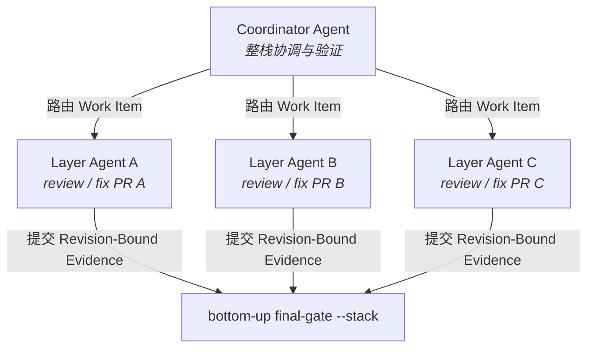
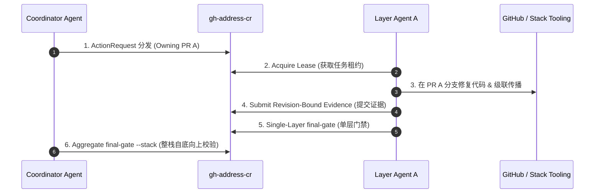
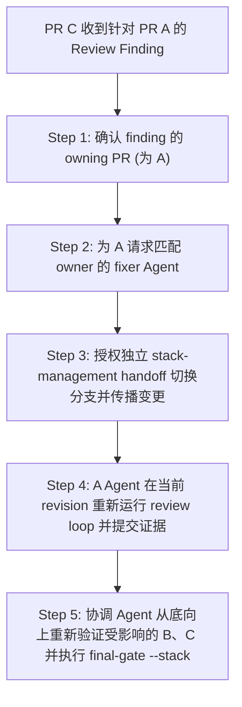

> **TL;DR**：Stacked PR 的真正价值，不只是把大 diff 拆小，而是为多个 Agent 提供清晰的协作边界：Agent A 处理底层模型，Agent B 处理服务层，Agent C 处理集成层，由一个协调者汇聚证据并从底向上验证。`gh-address-cr` 现在可以发现 stack、识别每个 Agent 的 owning layer、把 `ActionRequest` 和验证证据绑定到正确的 commit，并用 `final-gate --stack` 验证整条 stack。它负责 review、evidence、handoff 和 completion proof；创建、切换、rebase、push、queue、merge 和 unstack 仍由 GitHub 的 stack 管理流程负责。

如果你想直接查看实现和可执行契约，可以从 [gh-address-cr 仓库](https://github.com/RbBtSn0w/gh-address-cr){:target="_blank" rel="noopener"} 和 [stacked PR 支持 PR #220](https://github.com/RbBtSn0w/gh-address-cr/pull/220){:target="_blank" rel="noopener"} 开始。

## 为什么普通 PR 工作流不足以支撑多 Agent 协同

在一个规模较大的功能分支上，最常见的拆分方式是：

```mermaid
graph TD
    Main[main 目标主干] <-- base --- PR_A["PR A: 基础数据模型<br/><i>Layer Agent A 负责</i>"]
    PR_A <-- base --- PR_B["PR B: 服务层与 API<br/><i>Layer Agent B 负责</i>"]
    PR_B <-- base --- PR_C["PR C: UI 与集成测试<br/><i>Layer Agent C 负责</i>"]
```

在普通 PR 中，reviewer 通常只需要关心一个分支和一个 head commit。但在 stacked PR 中，每个 PR 的 diff 依赖它下面的层。`PR C` 的 diff 可能包含 `PR A` 和 `PR B` 的变更，`PR B` 的 base 又不是 `main`。这会带来三个容易被低估的问题：

1. **评审归属问题**：评论到底属于 PR A、PR B 还是 PR C？在当前 checkout 的分支上改代码，不代表改对了 owner 分支。
2. **证据新鲜度问题**：如果 PR A 被修复并重新 push，PR B 与 PR C 的 commit 都面临 rebase。之前“测试通过”的验证证据（Validation Evidence）不再有效证明当前 head OID。
3. **完成语义问题**：PR C 这一层通过，不等于 PR A、PR B、PR C 整条 stack 都可以合并。层级通过和整栈 ready 是两个不同命题。

因此，Stack 需要的不是一个更大的“review all”按钮，而是一套能让 Agent 互不越界的分层归属（Ownership）、租约（Lease）、修订版本绑定（Revision Binding）和自底向上门禁（Bottom-up Gate）。

## Stack 是 Agent 团队的协作拓扑

在探讨 [Agent 系统的方差隔离与边界设计](/posts/agent-design-variance-isolation/){:target="_blank" rel="noopener"} 时，我们强调确定性契约对 Agent 行为约束的关键作用。在 Stack 拓扑中，这种隔离表现为“每层一个执行 Agent，一个协调 Agent 汇聚结果”：



这不是要求团队必须启动三个进程，而是定义三个不可混淆的上下文：每个 Agent 只拥有一个 PR layer 的 session、lease、finding 和 validation evidence。只要这些上下文可以独立读取和验证，就可以并行处理；涉及底层变更传播、共享文件或 stack topology 的操作，则必须回到协调 Agent 的串行 handoff。

多 Agent 协同真正需要解决的是四个问题：

1. **谁负责哪一层**：避免 Agent C 在自己的 checkout 中修复属于 A 的 finding。
2. **谁可以声明一个 work item**：通过 lease 防止两个 Agent 同时回复同一条 thread。
3. **哪个 commit 的证据仍然有效**：head 或 topology 变化后，旧证据必须失效。
4. **什么时候可以汇聚**：单层 Agent 完成不等于整条 stack ready，必须由协调 Agent 执行 aggregate gate。

## gh-address-cr 的职责边界

`gh-address-cr` 把 GitHub 的 stack 管理和 review 引擎分成两个边界：

| 工作 | 负责方 |
| --- | --- |
| 创建 stack、建立 PR 依赖 | GitHub / `gh stack` |
| checkout、rebase、cascade push | GitHub stack 管理流程 |
| Agent ownership、`ActionRequest` 和 lease | `gh-address-cr` |
| review thread、回复和 resolve 证据 | `gh-address-cr` |
| 本地 finding、validation evidence 和 handoff | `gh-address-cr` |
| 单层 final gate | `gh-address-cr final-gate` |
| 整条 stack 的 bottom-up proof | `gh-address-cr final-gate --stack` |
| 最终 merge / queue | GitHub 的合并流程 |

这个边界很重要：review runtime 不会在收到一条评论后替 Agent 偷偷切换分支、rebase 其他成员或强推远程。这样既避免 Agent 误改上层分支，也让 stack topology 的变化保持可见、可审计、可恢复。Agent 可以编辑和验证已经匹配的 owning checkout，但改变 stack 拓扑必须经过独立授权的 management handoff。

GitHub 当前把 stacked pull requests 作为仍在演进的能力。使用前请先阅读官方的 [About stacked pull requests](https://docs.github.com/en/pull-requests/get-started/about-stacked-prs){:target="_blank" rel="noopener"}、[Creating stacked pull requests](https://docs.github.com/en/pull-requests/how-tos/create-pull-requests/creating-stacked-pull-requests){:target="_blank" rel="noopener"} 和 [Merging stacked pull requests](https://docs.github.com/en/pull-requests/how-tos/merge-and-close-pull-requests/merging-stacked-pull-requests){:target="_blank" rel="noopener"}。

## Agent 协同运行时究竟新增了什么

### 1. 先发现 Stack，再决定如何处理

普通 PR 仍然可以按原来的方式运行：

```bash
gh-address-cr review owner/repo 123
gh-address-cr address owner/repo 123 --lean
```

对于 stacked PR，返回的机器摘要会额外包含 `stack_context`。它描述当前 PR 的 stack identity、trunk、size、position、ordered members、base/head 和观察到的 revision。没有 stack、stack API 暂时不可用、数据格式异常，也被区分成不同状态，而不是全部当成“没有问题”。

这让原有的 unstacked PR 保持兼容，同时让 Agent 知道自己正在处理：

```text
unstacked PR
stack member at position 1
stack member at position 2
stack member at position 3
stack context unavailable
stack context invalid
```

### 2. 每层都有自己的 session、owner 和 lease

每一个 review item 只属于一个 PR。`ActionRequest` 中会携带 owning PR、head、stack position 和 member relationship；Agent 领取任务时还会获得有生命周期的 lease。处理评论时，先确认 owner branch，再决定是否需要一个单独授权的 stack-management handoff。lease 让协作者知道“谁正在处理”，也让 stale request 在恢复流程中可以被释放，而不是把 work item 永久锁住。

这条规则可以概括为：

```text
评论属于哪一层，就在那一层的分支修复。
当前 checkout 是哪一层，不改变评论的 owner。
```

### 3. Evidence 绑定当前 revision 和 topology

Stack 中最危险的错误不是漏掉一条评论，而是把旧 commit 上的成功证据当成新 commit 的成功证据。现在 stacked member 的 `ActionRequest` 和 validation evidence 会携带 `revision_binding.v1`，至少绑定：

- PR number
- head OID
- stack position
- stack topology fingerprint
- 观察到的 stack revision

只要 head 被更新，或者 stack 被重排，旧 evidence 就会在回复、resolve 或 publish 之前失效。运行时会要求 refresh 和 revalidate，而不是静默接受 stale evidence。

### 4. Handoff 不是口头约定，而是结构化协议

一个 Agent 完成局部工作后，不应该只回复“我改好了”。它需要把 commit、文件、原因、验证命令和结果提交给 runtime。下一个 Agent 或协调者消费的是结构化 `ActionResponse`，而不是一段无法审计的聊天记录：



这样可以把“实现完成”“回复已发布”和“整栈通过”区分开来，也能在 Agent 中断后安全地恢复或重新领取任务。

## A←B←C：当 A 收到新 CR 时应该怎么做

这是 stacked PR 最容易产生误解、也最能体现 Agent 协同价值的场景。假设协调 Agent 当前在 C，收到一条属于 A 的 finding：

```text
PR A <- PR B <- PR C
当前工作目录：C
新的 review finding：属于 PR A
```

正确流程不是让 C Agent 直接提交一个“看起来能修复 A”的 commit，也不是让某个 Agent 自己猜测应该切换到哪个分支。协调 Agent 应先路由 work item，再为 A 请求一个匹配 owner 的 fixer Agent。推荐流程如下：



### 第一步：确认 finding 的 owning PR

从评论上下文和 runtime `ActionRequest` 中确认 owner。如果评论针对 A 的数据模型或 A 的 diff，就把它视为 A 的 work item；如果它其实是 C 引入的集成行为，则应创建或路由到 C 的独立 finding。

### 第二步：为 A 请求正确的 fixer Agent

`gh-address-cr` 会把 owning PR、head 和 stack position 写入 `ActionRequest`。若当前 checkout 不是 A 的 owning branch，Agent 不应自行 stash、切换或强推；协调者需要启动一个单独的 stack-management handoff，把 A 的工作区准备好。

### 第三步：授权一次独立的 stack-management handoff

`gh-address-cr` 负责告诉你“应该在哪一层修复”，但不会替你执行 checkout、cascade rebase 或 push。由开发者或明确授权的 stack workflow：

1. 确认工作区干净且可恢复。
2. checkout 到 A 的 owning branch。
3. 在 A 上修复、测试并提交新的 commit。
4. 按 GitHub stack 工具的规则把变化传播到 B、C。
5. 推送受影响的 stack members。

如果这一步改变了 B、C 的 head，旧的 `ActionRequest` 和 validation evidence 都应视为过期。

### 第四步：A Agent 从当前 revision 重新开始 review loop

在 A 上完成修复后，重新获取当前上下文并提交证据：

```bash
gh-address-cr address owner/repo A --lean
gh-address-cr agent next owner/repo A --role fixer --agent-id <agent_id>
gh-address-cr agent resolve owner/repo A <item_id> \
  --commit <new-a-head> \
  --files path/to/fix.py \
  --summary "Fix the finding on the owning layer." \
  --why "The finding belongs to PR A's diff." \
  --validation "python3 -m unittest ...=passed@4200ms"
gh-address-cr agent publish owner/repo A
gh-address-cr final-gate owner/repo A
```

### 第五步：协调 Agent 重新验证受影响的上层

如果 A 的修复传播到了 B、C，就不能只看 A 的 gate。至少要重新验证所有 head 被改写的层，并最终从 C 执行整栈 gate：

```bash
gh-address-cr final-gate owner/repo B
gh-address-cr final-gate owner/repo C
gh-address-cr final-gate owner/repo C --stack \
  --require-required-checks \
  --no-auto-clean
```

这里的 `--stack` 是显式的整栈证明；普通 `final-gate` 仍然只证明选中的单层。最终结果会列出 covered members、first blocked member、check policy、telemetry 和 artifact 路径。

## 最佳实践：把 Stack 当成 Agent 的有依赖协作流水线

### 从底向上汇聚，而不是从当前 checkout 向外扩散

底层 PR 决定上层 diff 的基础。推荐顺序是：

```text
address A -> fix/validate/publish A -> final-gate A
address B -> fix/validate/publish B -> final-gate B
address C -> fix/validate/publish C -> final-gate C
                                      -> final-gate C --stack
```

一旦底层阻塞，整栈 gate 会选择第一个 blocked member，并返回针对该层的 recovery command。协调 Agent 不应跳过底层 blocker，也不应让上层 Agent 自己“猜测依赖已经没问题”后宣布 C ready。

### 可以并行什么，必须串行什么

推荐并行的是彼此独立的只读调查、不同 layer 的 review triage，以及不共享工作区的测试分析。推荐串行的是底层修复传播、cascade rebase、共享文件修改、stack topology 变更和最终 gate。一个简单判断标准是：

```text
不同 owner + 独立 checkout + 无顺序依赖  -> 可以并行调查
共享 head/topology 或需要传播 commit     -> 必须串行 handoff
```

并行减少的是 Agent 的等待时间，不会消除集成成本；`final-gate --stack` 就是 fan-in 阶段的确定性汇聚点。

### 把“通过”分成三种含义

1. **代码测试通过**：某个 commit 在本地或 CI 中通过测试。
2. **层级 gate 通过**：当前 PR 的 threads、reviews、evidence 和约束都满足。
3. **整栈 gate 通过**：从底层到当前选中 PR 的连续 segment 都满足要求，并且 opening/closing stack observation 一致。

只有第三种结果才能回答“这条 stack 现在是否具备合并准备度”。即便如此，GitHub 的 queue 和 merge 仍属于 GitHub 的合并流程，不会被 review runtime 越权执行。

### CI 要求要写进 gate policy

在定义 CI 门禁策略时，参考 [榨干 GitHub Actions 的最后一点价值](/posts/cost-aware-apple-ci/){:target="_blank" rel="noopener"} 中关于精准验证与消除空转的原则。Stack 中的检查策略可以通过 `--require-checks` 或 `--require-required-checks` 显式指定：

```bash
gh-address-cr final-gate owner/repo C --stack --require-checks
```

或只要求 GitHub 标记为 required 的 checks：

```bash
gh-address-cr final-gate owner/repo C --stack --require-required-checks
```

check policy 会进入机器摘要和审计 artifact，避免一个“通过”结果无法区分“没有检查”“所有检查通过”和“required checks 通过”。

此外，结合 [引入 ADG (Agentic Development Guide)](/posts/introducing-adg-cn/){:target="_blank" rel="noopener"} 中关于演进式 Agent 规范的沉淀，可以将 Stack 协作流程中的 Handoff 契约与 CI Gate 校验沉淀为可复用的规则文件。

### Stack API 暂时失败时，继续保留单层能力

Stack discovery 是增强能力，不应让普通 PR 的 review thread 处理整体瘫痪。对于临时 API 错误，layer workflow 会以 unavailable context 继续执行安全的 thread 查询；只有需要 stack freshness proof 的动作才会明确阻塞并要求 refresh。

这也是为什么接入 stacked PR 后，已有 unstacked workflow 不需要修改命令参数：能力是 additive 的，风险边界是显式的。

## 如何验证这套能力不是“只在文档里存在”

完整支持需要同时验证本地契约和真实 GitHub 行为。`gh-address-cr` 的 stacked PR 实现包含：

- unstacked、bottom、middle、top member fixtures；
- multi-page stack discovery 和 malformed context 保护；
- stale head、reordered stack、unbound evidence 拒绝；
- layer gate 与 aggregate `--stack` gate；
- required-check policy、auto-clean、telemetry 和审计 artifact；
- 一个带 manifest ownership 校验的 sandbox E2E 脚本。

在授权的 disposable repository 中，可以按以下方式运行沙盒流程：

```bash
python3 scripts/e2e_stacked_pr_sandbox.py provision \
  --manifest /var/tmp/gh-address-cr-stack-e2e.json
python3 scripts/e2e_stacked_pr_sandbox.py exercise \
  --manifest /var/tmp/gh-address-cr-stack-e2e.json
python3 scripts/e2e_stacked_pr_sandbox.py cleanup \
  --manifest /var/tmp/gh-address-cr-stack-e2e.json
```

这个脚本只允许操作 manifest 声明的 sandbox 资源；它不会把生产仓库、未知分支或任意 PR 当成测试目标。验证重点也不是“脚本返回 0”这么简单，而是检查：每个成员的 position、覆盖范围、第一 blocker、revision binding、check policy 和最终审计摘要是否一致。

## 结语：Stack 的价值是让 Agent 协同变得可验证

Stacked PR 让大型改动可以被拆成更容易理解的增量，也为 Agent 团队提供了天然的任务边界。但它同时把“当前分支”“评论 owner”“commit 新鲜度”“lease 生命周期”和“整体验证”变成了必须显式建模的事实。

`gh-address-cr` 的做法是保持职责清晰：

```text
GitHub stack tooling 负责拓扑和合并流程
gh-address-cr         负责 review、证据、回复、resolve 和完成证明
```

当 PR A 收到新问题时，由 A Agent 在 A 的 owner branch 修复；当修复传播到 B、C 时，由协调 Agent 丢弃旧 request、重新分发任务并重新验证；当所有层都通过后，再从最上层运行 `final-gate --stack`。这套流程比“让当前 Agent 在当前 checkout 上随便补一个 commit”多几步，却换来了可追踪、可恢复、不会误用 stale evidence 的多 Agent 协作闭环。

如果你的团队正在构建 Agent-native engineering workflow，欢迎从一个小型三层 stack 开始试用：先让不同 Agent 各自负责一个 layer，再让协调 Agent 用 `--stack` gate 完成最后的证据汇聚。

* 🔧 项目主页：[gh-address-cr](https://github.com/RbBtSn0w/gh-address-cr){:target="_blank" rel="noopener"}
* 🧪 实现与验证：[Stacked PR 支持 PR #220](https://github.com/RbBtSn0w/gh-address-cr/pull/220){:target="_blank" rel="noopener"}
* 📚 GitHub 官方文档：[Reviewing stacked pull requests](https://docs.github.com/en/pull-requests/how-tos/review-pull-requests/reviewing-stacked-pull-requests){:target="_blank" rel="noopener"}
