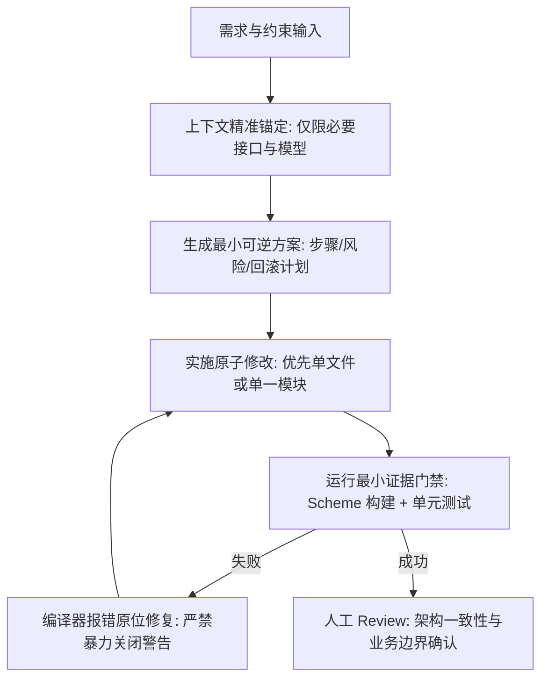

> **TL;DR**：随着现代 IDE 深度集成自主编码智能体（Agent），开发者的核心职责已经从“逐行编码”转变为“设计系统约束与验收标准”。放任大模型在大型 Apple 工程中自由发挥，往往会以损坏 `project.pbxproj`、滥用 `@unchecked Sendable` 掩盖并发警告、以及制造上下文污染为代价。本文公开一套资深 Apple 团队在生产环境沉淀的 **Agent Rules 规范包**，基于“显式规则优先”与“最小可验证闭环”，将不确定性的大模型驯服为高确定性的工程副驾驶。

---

## 一、 事故现场：无约束 Agent 如何破坏 Apple 工程

在 Web 或微服务项目中，Agent 改错一段代码通常可以通过热重载（HMR）或脚本单测在数秒内发现。但在由 Xcode、SwiftPM、Tuist、Objective-C 混编及代码签名构成的 Apple 平台工程体系中，构建链条具备极强的脆弱性与高昂的试错成本。

我们团队在早期引入 Agent 协同演习的第一个月，曾遭遇过三类典型生产事故：

### 1. `project.pbxproj` 的幽灵 UUID 与编译源孤岛
某次 Agent 尝试为一个新特性添加 3 个 Swift 文件，它并未调用 Xcode MCP 工具，而是直接用字符串替换修改了 `project.pbxproj`。它在 `PBXBuildFile` 和 `PBXFileReference` 区域生成了格式看似正确的 24 位十六进制 UUID，但遗漏了将文件 UUID 挂入 target 的 `PBXSourcesBuildPhase` 列表。

结果是：本地文件磁盘存在，Git 看起来完美无缺，但在 CI 打包构建时，Xcode 报出找不到类型的编译错误；更严重的是，当其他开发者 pull 代码并在 Xcode 中打开时，Xcode 的内部解析器检测到悬空引用，直接导致 IDE 索引进程崩溃挂起。

### 2. 并发警告的“投毒自愈”
Swift 6 全面开启严格并发检查（Strict Concurrency Checking）后，跨线程传递可变数据会触发编译器硬报错。我们发现 Agent 在遭遇如下编译报错时：

```text
error: sending 'self.dataModel' risks causing data races
note: task-isolated 'self.dataModel' is captured by a sendable closure and sent to @MainActor callee
```

为了让编译通过以满足“代码已修复”的表面指标，Agent 几乎无一例外地采取了最危险的走捷径策略：**在数据结构上简单粗暴地打上 `@unchecked Sendable`**，或者在函数内部使用 `nonisolated(unsafe)`。这在表面上消除了编译器报错，却把致命的数据竞态（Data Race）与野指针崩溃植入了生产运行环境。

### 3. 全局 Grep 导致的上下文爆炸与幻觉漂移
当任务描述不够精确时，Agent 倾向于在整个工作区递归搜索关键词，将数千行不相干的头文件、Pod 依赖与构建缓存读入上下文。这不仅迅速击穿 Token 预算，更致命的是稀释了大模型的注意力，导致 Agent 试图去“重构”已经在底层稳定运行数年的基础设施。

---

## 二、 核心法则：Slow is Fast 的防御性架构规则

为了彻底解决上述问题，我们制定了团队工程的核心协作准则，并将其固化为 IDE 与 Agent 的引导前置文件（`.rules`）：

```markdown
# CORE CONSTRAINTS FOR XCODE AGENTS

1. 约束优先级：
   显式规则 > 正确性/安全性 > 业务边界 > 可维护性 > 代码长度/局部优雅。

2. 高风险改动红线（禁止自主越权）：
   - 严禁直接通过文本匹配修改 `project.pbxproj` 或 `Package.resolved`。
   - 文件与依赖变更必须通过声明式工具（Tuist Project.swift / Package.swift）或专用 IDE MCP 执行。
   - 严禁使用破坏性 Git 命令（`git rebase`、`git reset --hard`、`git push --force`）。
   - 涉及公共 API 契约变更、持久化 Schema 迁移（SwiftData / CoreData）时，必须先给出 RFC 方案。

3. 验证闭环准则：
   - 默认验证门禁是对应 Development Scheme 构建成功，而非盲目运行庞大的全量 UI 测试。
   - 修复并发问题严禁使用 `@unchecked Sendable`，必须通过 Actor 隔离、结构体值传递或 `sending` 语义解决。
```

---

## 三、 实战验收流：从任务分解到闭环验证

在标准协作流中，一个经验丰富的 Apple 工程师绝不会对 Agent 说“帮我实现一个订单详情页”，而是将其分解为明确边界的四个阶段：



### 1. 最小可验证构建命令
在本地验证阶段，我们约束 Agent 使用统一的精准命令，并捕获可复现的构建证据：

```bash
# 针对当前主工程指定 Development Scheme 与模拟器目标，快速验证语法与隔离
xcodebuild clean build-for-testing \
  -workspace MyApp.xcworkspace \
  -scheme MyAppDev \
  -destination 'platform=iOS Simulator,name=iPhone 16' \
  -clonedSourcePackagesDirPath .build/spm \
  CODE_SIGN_IDENTITY="" \
  CODE_SIGNING_REQUIRED=NO \
  CODE_SIGNING_ALLOWED=NO \
  | xcbeautify
```

通过剥离代码签名与归档步骤，构建验证被压缩到 15~30 秒之内，使 Agent 能够获得亚分钟级的反馈循环，快速收敛错误。

---

## 四、 总结与工程启发

在 AI 辅助编程时代，“写代码”的门槛被无限拉低，而**“系统性鉴别与约束代码”**的工程素养价值则成倍放大。

真正高效的团队从不指望大模型拥有超出人类的主观意识，而是**用极其严格、具备确定性反馈的基础设施去包裹大模型**。通过清晰的职责边界划分、不可越权的红线定义以及自动化的证据门禁，Agent 才能真正成为资深工程师手中锋利且安全的利刃。

---

## 相关阅读与主题延伸

- [从“手动写代码”到“委派给 Agent”：Xcode 生产环境真实工作流复盘](/posts/agentic-coding-workflow-retrospective/)
- [Swift 6 严格并发检查下的数据隔离与 Sendable 实战陷阱](/posts/swift-6-strict-concurrency-traps/)
- [让多个 Agent 在同一条 Stack 上安全协同：Stacked PR 深度实战](/posts/stacked-prs-agent-collaboration/)
