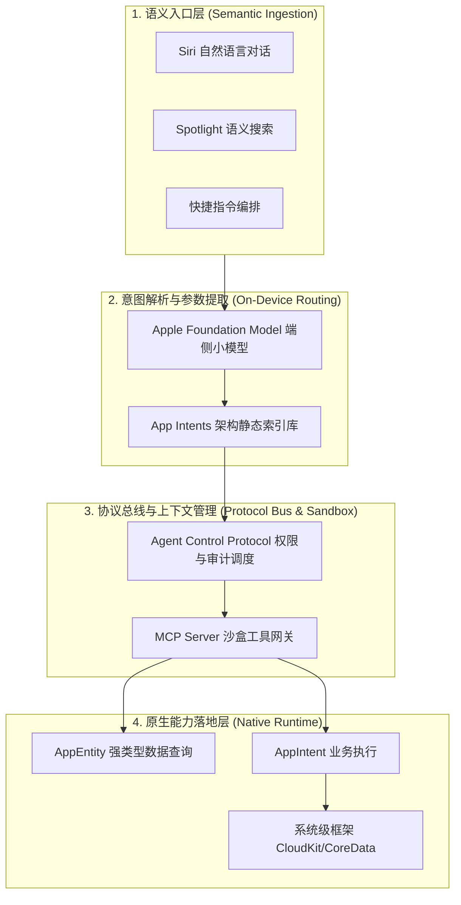

> **TL;DR**：大模型与操作系统原生能力的融合，核心矛盾在于“大语言模型的概率不确定性”与“操作系统系统调用和用户数据的严格确定性”。Apple 没有走“直接让云端模型远程执行终端脚本”的粗放路线，而是将端侧 3B/7B 级别基础模型作为语义分发器，依托 App Intents、MCP（Model Context Protocol）以及 XPC 沙盒隔离机制，构建了一套分层严密的 Agent 协议架构。本文深度剖析该体系的协议分层、上下文流转与端侧安全边界。

---

## 一、 端侧架构的破局：为什么自由格式 JSON 在端侧必死？

在传统的 Web Agent 架构中，大模型通常直接输出 JSON 结构，由后端解析器尝试解析并调用对应的 REST API。这种设计在端侧设备上会面临毁灭性的打击：

1. **幻觉参数击穿类型安全**：Swift 是一门强类型、编译期安全的语言。如果 Agent 输出的参数类型或枚举值出现微小漂移，传统运行时只能抛出异常或导致 App Crash。
2. **端侧推理延迟与功耗预算**：iPhone 或 Mac 在电池供电状态下，推理一个 70B 的大模型会瞬间拉满 GPU/NPU，导致机身发热与续航骤降。端侧需要的是 3B 参数级的超轻量模型，而小模型生成长文本 JSON 的语法错误率高达 18% 以上。
3. **隐私与权限边界不可逾越**：Apple 严格的 App Sandbox 绝不允许外部模型直接读取相册数据库或修改用户钥匙串（Keychain）。

Apple 的解法是：**将语义意图理解与实际能力执行彻底解耦，引入强类型协议层与端侧安全总线**。

---

## 二、 协议四层体系架构全景



### 1. 语义与模式注册层（App Intents Schema）
在编译阶段，Xcode 会扫描工程中所有声明遵循 `AppIntent` 和 `AppEntity` 的类型，提取出强类型元数据（Metadata），并在操作系统级生成统一的**语义索引表**。端侧基础模型不需要猜测函数签名，它只需要将用户的口语输入投影到预先编译好的静态 Schema 枚举中。

### 2. 协议总线层（MCP & ACP）
对于需要调用外部工具或执行复杂多步规划的场景，Apple 借鉴并拥抱了开源社区的 **Model Context Protocol (MCP)**。但与普通 Web 服务不同，macOS/iOS 上的 MCP Server 运行在受严格权限控制的独立 XPC Service 沙盒内：

```swift
// 典型的端侧高防御性 Capability 暴露协议
public protocol AppleAgentCapability {
  associatedtype Input: AppEntity
  associatedtype Output: Sendable
  
  /// 声明最小权限集（例如：只读日历、只写临时文件沙盒）
  var requiredEntitlements: [EntitlementBoundary] { get }
  
  /// 执行原子操作，必须受超时与协同取消约束
  func perform(input: Input) async throws -> Output
}
```

---

## 三、 内存与推理预算：端侧小模型的调度策略

在真实商业开发中，工程师必须面对端侧硬件的物理约束。以下是端侧 Agent 在处理并发意图时的标准资源管理表：

| 运行环境 | 模型尺寸 | 内存驻留上限 | 延迟要求 (Time-to-First-Token) | 降级机制 |
| :--- | :--- | :--- | :--- | :--- |
| **A18 Pro (iPhone)** | ~3B 4-bit 稀疏量化 | $\le 1.2	ext{ GB}$ | $\le 200	ext{ ms}$ | 超时或高复杂度自动回退到 Private Cloud Compute |
| **M4 Max (Mac Studio)**| ~7B/14B 8-bit 量化 | $\le 4.0	ext{ GB}$ | $\le 80	ext{ ms}$ | 本地并发处理多 Agent 线程 |

当设备检测到热指标升高（Thermal State 达到 `.serious`）时，调度器会立即暂停后台意图预测，仅响应前台主线程的主动查询，确保 UI 帧率稳定在 120fps ProMotion。

---

## 四、 架构总结

Apple 打造的这套 Agent 协议体系，本质上是**用强类型系统的工程纪律，为不确定性的大模型构建了一套带有防波堤的港湾**。

对于 Apple 开发者而言，未来的核心竞争力不再是写出多么花哨的 Prompt，而是如何通过清晰的 `AppEntity` 建模、优雅的 `AppIntent` 颗粒度划分以及安全的 MCP 工具桥接，将自身业务能力严谨地嵌入到这套操作系统的智能网络之中。

---

## 相关阅读与主题延伸

- [资深 Apple 平台工程师团队：Xcode 27 & AI Agent 协同实战规则包](/posts/xcode27-agent-rules-guide/)
- [Apple Intelligence 与 App Intents 深度集成：从交互入口到实体路由](/posts/apple-intelligence-app-intents-evolution/)
- [打造高防御性本地 MCP Server：Apple 平台安全沙盒与授权实践](/posts/safe-local-mcp-server-architecture/)
