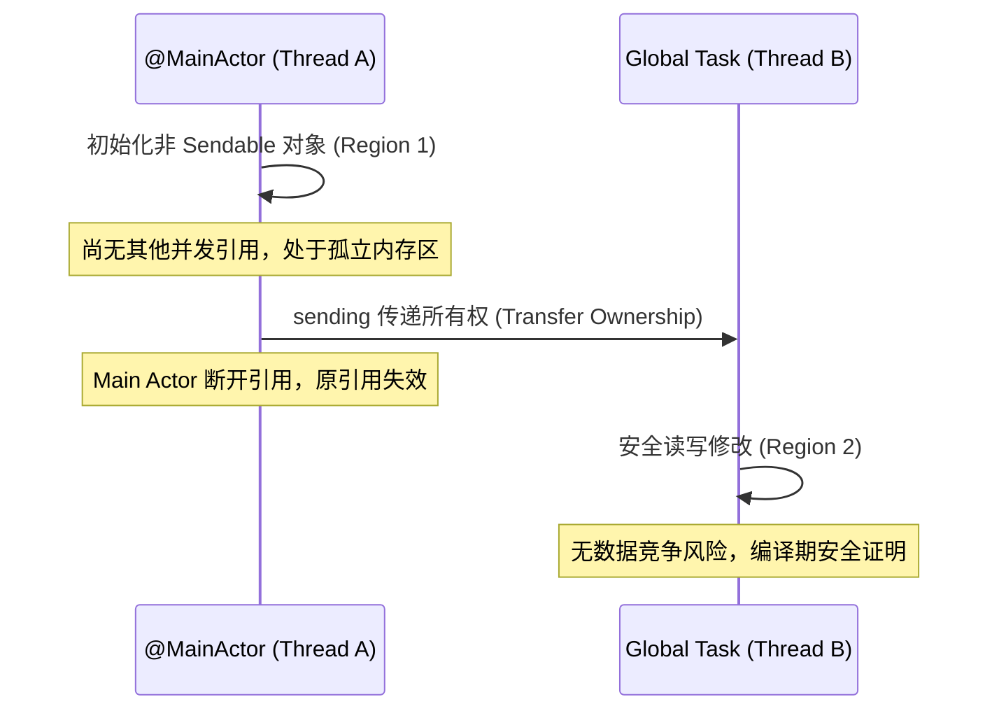

> **TL;DR**：Swift 6 最具颠覆性的变更，在于从默认的“运行时竞态检测”转向了“编译期完全数据隔离保证（Complete Concurrency Checking）”。许多团队在开启 Swift 6 语言模式后，遭遇数百个编译器错误，随之而来的最坏做法就是盲目添加 `@unchecked Sendable` 或无脑使用 `@MainActor`。本文结合真实生产代码重构案例，剖析跨 Actor 传递、非 Sendable 闭包逃逸、全局状态初始化的底层原理，并给出真正类型安全的现代 Swift 6 解法。

---

## 一、 经典现场：一个看似无害的异步调用

在 Swift 5 时代，以下代码完全可以正常编译通过，并在大部分测试中表现得“风平浪静”：

```swift
// ❌ Swift 5 遗留模式：潜在的数据竞态炸弹
class UserSession {
  var token: String
  var userInfo: [String: Any]

  init(token: String, userInfo: [String: Any]) {
    self.token = token
    self.userInfo = userInfo
  }
}

@MainActor
final class ProfileViewModel: ObservableObject {
  private let session: UserSession

  init(session: UserSession) {
    self.session = session
  }

  func syncProfile() {
    Task.detached {
      // 在后台线程异步更新 session 并持久化
      self.session.token = "new_refreshed_token"
      self.saveToDisk(self.session)
    }
  }

  private nonisolated func saveToDisk(_ session: UserSession) {
    // 磁盘 I/O 写入
  }
}
```

然而，当我们在 Xcode 中开启 **`SWIFT_STRICT_CONCURRENCY=complete`**（即 Swift 6 模式）后，编译器直接抛出无情红字：

```text
error: passing argument of non-sendable type 'UserSession' outside of main actor-isolated context may introduce data races
note: class 'UserSession' does not conform to the 'Sendable' protocol
error: mutation of captured var 'session' in concurrently-executing code
```

为什么？因为 `UserSession` 是一个引用类型（Class），拥有可变属性（`var token`），它在主线程被 `ProfileViewModel` 持有，同时被一个独立后台线程（`Task.detached`）捕获并修改。这是教科书级别的数据竞争，极易导致底层内存释放崩溃（EXC_BAD_ACCESS）或脏读。

---

## 二、 致命诱惑：为什么绝不能使用 `@unchecked Sendable`？

初学者乃至许多 AI 辅助生成的代码，此时为了“消除红字”，最常用的手段就是在 `UserSession` 上声明：

```swift
// ⚠️ 极其危险的做法：掩耳盗铃
final class UserSession: @unchecked Sendable {
  var token: String
  var userInfo: [String: Any]
  // ...
}
```

**这不仅没有解决并发安全问题，反而关掉了编译器的安全防线！**
`@unchecked Sendable` 的真正语义是：“开发者向编译器郑重起誓：我已经通过底层的互斥锁（如 `os_unfair_lock` 或 `Mutex`）在内部保证了绝对的线程安全性”。如果你没有在属性读写处加锁，多线程并发写入 `userInfo` 字典瞬间就会引发进程崩溃。

---

## 三、 现代 Swift 6 架构正解

针对上述问题，资深工程师有三种清晰的解构演进方案，取决于数据结构的生命周期语义。

### 方案 A：值类型（Struct）与不可变性演进（推荐）

如果该对象主要用于携带状态并在各层传递，最优雅的方式是将 Class 转换为遵循 `Sendable` 的不可变 Struct：

```swift
// ✅ 方案 A：纯粹的不可变数据载体
public struct UserSession: Sendable, Equatable {
  public let token: String
  public let userId: String
  public let permissions: Set<String>

  public init(token: String, userId: String, permissions: Set<String>) {
    self.token = token
    self.userId = userId
    self.permissions = permissions
  }

  // 状态变更通过拷贝返回新实例（Value Semantics）
  public func updatingToken(_ newToken: String) -> UserSession {
    UserSession(token: newToken, userId: self.userId, permissions: self.permissions)
  }
}
```

### 方案 B：使用 Actor 封装可变状态与串行化调度

如果数据必须以单例或共享服务的方式在多线程被读写，应当将其封装为独立的 `actor`：

```swift
// ✅ 方案 B：Actor 内部状态串行化隔离
public actor SessionStorage {
  private var currentSession: UserSession

  public init(initialSession: UserSession) {
    self.currentSession = initialSession
  }

  public func updateToken(_ newToken: String) {
    self.currentSession = self.currentSession.updatingToken(newToken)
  }

  public func snapshot() -> UserSession {
    return self.currentSession
  }
}
```

### 方案 C：利用 Swift 6.0 引入的 `Synchronization.Mutex`

对于极度性能敏感的底层基础设施（如高性能日志聚合器、内存缓存池），使用 Actor 的异步切换（`await`）会带来上下文调度开销。此时应当使用 Swift 6 原生引入的 `Mutex<T>`：

```swift
import Synchronization

public final class AtomicMetricsRegistry: Sendable {
  // 零堆分配、原语级安全的同步互斥锁
  private let state: Mutex<[String: Int]> = Mutex([:])

  public func recordHit(for key: String) {
    state.withLock { dict in
      dict[key, default: 0] += 1
    }
  }

  public func getCount(for key: String) -> Int {
    state.withLock { dict in
      dict[key] ?? 0
    }
  }
}
```

---

## 四、 SE-0414 基于区域的隔离（Region-based Isolation）与 `sending`

Swift 6 引入的另一个重量级特性是 **Region-based Isolation**。编译器现在足够智能，能够通过逃逸分析追踪一个对象的生命周期边界：



```swift
// 明确标记传递所有权，无需声明 Sendable
func processReport(_ report: sending NonSendableDocument) async {
  // 此时 report 的所有权已完全移交，原调用方不可再访问
  await backgroundArchiver.save(report)
}
```

---

## 五、 验证闭环：使用 Thread Sanitizer (TSan) 进行终极实证

静态检查并非万能，尤其是涉及 C / Objective-C 混编库时。生产级工程必须在 CI 中配置自动化 TSan 门禁：

```bash
# 使用 xcodebuild 激活 Thread Sanitizer 运行并发测试套件
xcodebuild test \
  -workspace MyApp.xcworkspace \
  -scheme MyAppTests \
  -destination 'platform=macOS' \
  -enableThreadSanitizer YES \
  | xcbeautify
```

如果代码中仍残存通过底层裸指针或 `@unchecked` 掩盖的竞态，TSan 将在几微秒内精准捕获内存冲突并输出详细的调用栈回溯。

---

## 相关阅读与主题延伸

- [资深 Apple 平台工程师团队：Xcode 27 & AI Agent 协同实战规则包](/posts/xcode27-agent-rules-guide/)
- [Swift Testing 深度实践：从 XCTest 迁移到现代化宏断言体系](/posts/swift-testing-macro-migration-guide/)
- [告别昂贵 macOS Runner：中小型团队的成本敏感型 Apple CI 架构](/posts/cost-aware-apple-ci-design/)
