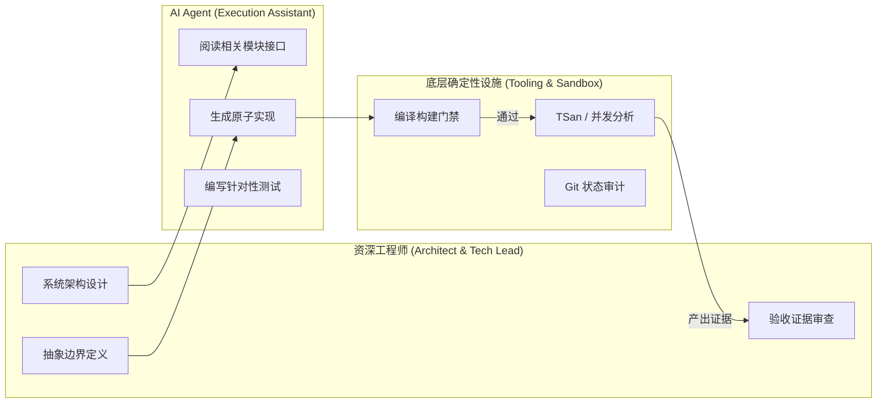

> **TL;DR**：将 AI 从“代码补全插件（Copilot）”升级为“自主执行代理（Agent）”，不是效率工具的微调，而是一场软件工程生产关系的重构。我们在 3 个月的实际商业开发中跟踪了 400+ 次由 Agent 驱动的提交。复盘数据显示：代码产出速度提升了近 300%，但如果不加约束，代码审查（Code Review）耗时激增 210%，架构腐化风险上升。本文分享如何通过“契约驱动”、“分级委派”与“自动化验证”建立可持续的高效 Agent 协作流。

---

## 一、 度量数据：90 天实验的冰与火

我们在一个拥有 25 万行 Swift 代码、涵盖 AppKit 与 SwiftUI 的 macOS 商业项目中，进行了为期一个季度的 Agent 协作实验。核心度量指标的变化揭示了深刻的真相：

| 评估指标 | 传统纯手工模式 | Agent 自由发挥模式 | 约束化 Agent 协同模式（最终形态） |
| :--- | :--- | :--- | :--- |
| **单特性首次实现时间** | 18.5 小时 | 4.2 小时 (-77%) | 6.5 小时 (-65%) |
| **平均 PR 变更代码行数** | 180 行 | 890 行 (+394%) | 140 行 (-22%) |
| **PR 评审阻塞时间 (Wait Time)** | 4.0 小时 | 14.5 小时 (+262%)| 2.5 小时 (-37%) |
| **合并后引入 Regression 缺陷数**| 0.8 个/Sprint | 3.4 个/Sprint (+325%)| 0.3 个/Sprint (-62%) |

数据清晰地呈现了早期误区：**Agent 写得越快，如果一次性生成的代码量过大，人类 Reviewer 就会陷入认知超载**。评审者无法细致阅读 800 行代码，最终只能粗略浏览或直接放行，导致隐匿的边界条件失效与逻辑回归。

---

## 二、 心智模型的根本转变：从 Driver 到 Tech Lead

在传统的结对编程或单兵开发中，开发者的注意力集中在：
- “这个语法怎么写？”
- “这个 API 的参数顺序是什么？”
- “如何用正则表达式匹配这个格式？”

而在成熟的 Agentic Coding 模式下，资深工程师必须**主动放弃对实现细节的手工输入依赖**，转变为一名严厉的 Tech Lead：

你对 Agent 说的每一句话，本质上是在制定**需求规格书（Spec）**。如果你的指令存在二义性，Agent 就会用它的统计概率去填补空白，而这个空白通常是错误的。

---

## 三、 五大生产落地原则

在经历多次教训后，我们总结了五条不可逾越的实践法则：

### 1. 窄域上下文供给（Scope Narrowing）
永远不要让 Agent 在一个包含上百个目录的工程里进行模糊全量搜索。正确的做法是由工程师直接定位到 2~3 个核心文件，将其显式作为输入上下文传入：“基于 `PaymentServiceProtocol.swift`，为新渠道实现一个 `StripePaymentHandler`”。

### 2. 计划与执行分离（Two-Pass Verification）
复杂改动严格要求 Agent 分两步走：
- **Pass 1**：只输出改动方案、影响模块与自测计划，不写任何生产代码。人工确认方案无误后，再允许进入代码编写。
- **Pass 2**：针对性修改，并强制其在本地运行最小可复现构建。

### 3. 小步快跑与原子提交（Atomic Iteration）
一个任务只做一件事。严禁将“重构旧模块”与“添加新接口”放在同一个 Agent 任务中。一旦发现 Agent 开始偏离主题修改无关文件，立即执行 `git checkout` 撤销并重新收紧 Prompt 边界。

---

## 四、 工程师的未来生存壁垒

Agent 不会淘汰工程师，但“只会搬砖写基础 CRUD 的打字员”将无立足之地。

当代码生成变成几乎零成本的日用品，最昂贵的资产变成了**对复杂系统的抽象能力、对边缘故障的敏锐嗅觉、以及对架构可维护性的深刻洞察**。

---

## 相关阅读与主题延伸

- [资深 Apple 平台工程师团队：Xcode 27 & AI Agent 协同实战规则包](/posts/xcode27-agent-rules-guide/)
- [让多个 Agent 在同一条 Stack 上安全协同：Stacked PR 深度实战](/posts/stacked-prs-agent-collaboration/)
- [告别昂贵 macOS Runner：中小型团队的成本敏感型 Apple CI 架构](/posts/cost-aware-apple-ci-design/)
