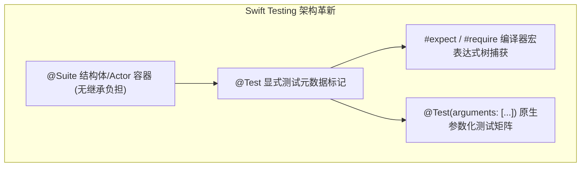

> **TL;DR**：自 Xcode 16 起全面登场的 `Testing` 框架（Swift Testing），标志着 Apple 平台测试体系从基于 Objective-C 动态运行时与继承机制的 `XCTestCase`，彻底过渡到了以 Swift 宏、并发感知与值语义为核心的现代化时代。相比旧框架，Swift Testing 不仅使测试执行速度提升达 40% 以上，更通过 `#expect` 宏提供了极高表达力的编译期表达式捕获。本文结合生产级网络与存储层模块，带来真实无缝的迁移实录。

---

## 一、 XCTest 的历史局限与心智包袱

在长达十余年的 iOS 开发中，我们习惯了如下典型的 XCTest 样板代码：

```swift
// ❌ 传统的 XCTest 模式：充满类继承、状态泄漏与弱表达力断言
final class PaymentValidatorTests: XCTestCase {
  private var validator: PaymentValidator!

  override func setUp() {
    super.setUp()
    validator = PaymentValidator()
  }

  override func tearDown() {
    validator = nil
    super.tearDown()
  }

  func testValidation_withNegativeAmount_shouldFail() {
    let result = validator.validate(amount: -10, currency: "USD")
    XCTAssertFalse(result.isValid, "Expected negative amount to be invalid")
    XCTAssertEqual(result.errorCode, "INVALID_AMOUNT")
  }
}
```

这套模式在现代 Swift 面临三大痛点：
1. **隐匿的状态泄漏**：由于 XCTest 在测试运行期间会实例化所有测试类并保持在内存中，在 `setUp`/`tearDown` 中若未手动清空属性，会引发严重的内存泄漏。
2. **并发与 Actor 隔离不友好**：测试异步并发方法时，不得不频繁使用繁琐的 `XCTestExpectation`，并在主线程做糟糕的 `wait(for:timeout:)` 挂起阻塞。
3. **断言信息贫乏**：当 `XCTAssertEqual(a, b)` 失败时，控制台输出仅仅是两个字符串的表面对比，无法得知底层表达式树的具体求值过程。

---

## 二、 架构质变：Swift Testing 的核心武器库



### 1. 结构体替代类继承（Value Semantics Suite）
测试用例不再需要继承任何父类，直接声明为普通 `struct` 或 `actor`。每次运行独立初始化，彻底隔绝状态残留：

```swift
import Testing
@testable import MyAppCore

@Suite("支付核心验证套件")
struct PaymentValidatorTests {
  // 零 boilerplate 初始化，按需实例化即可
  let validator = PaymentValidator()

  @Test("验证负数金额拦截逻辑")
  func validateNegativeAmount() {
    let result = validator.validate(amount: -10, currency: "USD")
    #expect(!result.isValid)
    #expect(result.errorCode == "INVALID_AMOUNT")
  }
}
```

### 2. `#expect` vs `#require` 的关键语义分水岭
Swift Testing 摒弃了几十个以 `XCTAssert...` 开头的冗长 API，收敛为两枚宏：

- **`#expect(condition)`**：期望该条件为真。如果失败，测试会记录错误，但**继续执行后续语句**，收集全部证据。
- **`#require(optional)`**：强前置依赖断言。如果失败，**立即终止当前测试用例**并解包抛出，彻底取代过去笨拙的 `guard let else { XCTFail(); return }` 样板：

```swift
@Test("用户鉴权与 Token 交换")
func authTokenExchange() throws {
  let response = authService.authenticate(user: "alice", password: "valid_pass")
  
  // 必须成功获得 token，否则后续断言完全无意义，直接安全短路
  let token = try #require(response.token)
  #expect(token.starts(with: "sk_live_"))
}
```

---

## 三、 生产王炸：参数化测试（Parameterized Testing）

过去要测试 10 种边界货币代码或卡号前缀，开发者要么写 10 个冗余的测试函数，要么在一个测试函数内部写 `for` 循环（一旦中间某次失败，后续迭代直接被跳过）。

Swift Testing 原生支持参数化矩阵，Xcode 会在测试导航器中为每个输入用例单独展开子测试项：

```swift
@Suite("货币合法性校验")
struct CurrencyValidationTests {
  
  @Test("验证支持的结算货币代码", arguments: [
    ("USD", true),
    ("EUR", true),
    ("CNY", true),
    ("XYZ", false), // 非法货币代码
    ("", false)      // 空字符串边界
  ])
  func validateCurrencies(code: String, expectedValid: Bool) {
    let isValid = CurrencyRegistry.isValid(code)
    #expect(isValid == expectedValid, "Currency \(code) validation mismatch")
  }
}
```

---

## 四、 迁移策略与并存原则

在拥有数千个旧测试的商业项目中，一次性重写所有用例是不现实的。幸运的是，**XCTest 与 Swift Testing 可以在同一个 Target 内完美并存**。

我们推荐的渐进演进四部曲：
1. **新写测试强制使用 Swift Testing**：所有新特性与重构模块，严禁再创建 `XCTestCase`。
2. **高频修改测试顺手迁移**：在对旧模块进行 Bug 修复或并发安全改造时，将对应的 `XCTestCase` 迁移为 `@Suite struct`。
3. **保留无法替代的 XCUITest**：目前的 UI 自动化自动化层（`XCUIApplication`）依然由 XCTest 框架支撑，单元测试与集成测试优先剥离至 Swift Testing。

---

## 相关阅读与主题延伸

- [Swift 6 严格并发检查下的数据隔离与 Sendable 实战陷阱](/posts/swift-6-strict-concurrency-traps/)
- [资深 Apple 平台工程师团队：Xcode 27 & AI Agent 协同实战规则包](/posts/xcode27-agent-rules-guide/)
- [告别昂贵 macOS Runner：中小型团队的成本敏感型 Apple CI 架构](/posts/cost-aware-apple-ci-design/)
