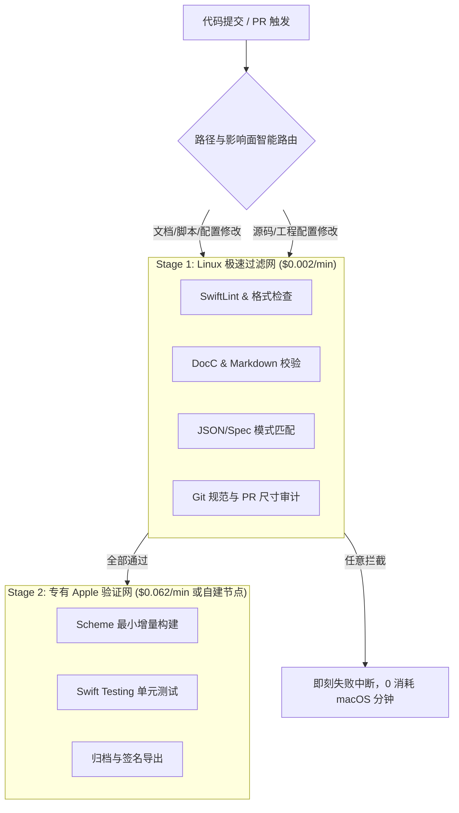

> **TL;DR**：在 GitHub Actions 等主流云端 CI 平台上，macOS Runner 的单分钟单价高达 **$0.062**，是标准 Linux Runner（$0.002）的整整 **31 倍**。传统 Apple CI 习惯把所有的代码检查、文档校验、单测与打包塞进同一个巨大的 macOS Job，导致团队每月额度迅速告罄并背负高昂账单。本文分享一套中小型团队经过大规模生产检验的“成本感知型 Apple CI 架构”，通过异构跨平台分流与持久化自建节点，实现分钟数消耗锐减 70% 的同时提升流水线周转率。

---

## 一、 算清楚这笔账：为什么你的 CI 账单会失控？

以一个 10 人的典型移动端团队为例，每天提交约 25 个 PR，每个 PR 平均触发 3 次验证更新，一个月累计触发约 1500 次流水线运行。

```text
传统方案账单推算（全量托管 macOS Runner）：
- 单次构建执行时间：22 分钟
- 每月消耗分钟数：1500 runs × 22 mins = 33,000 分钟
- 每月纯 CI 成本：33,000 × $0.062 = $2,046 美元 / 月（约合 ¥14,800 元/月）
```

这其中有超过 **65% 的时间**，macOS Runner 实际上只是在做一些诸如：
- 拉取 Git 代码与检查分支规范；
- 运行 Markdown / JSON / YAML 校验与文档生成；
- 执行基于 Docker 的通用静态代码分析；
- 等待长达数分钟的重复 SPM 依赖下载。

这些任务根本不需要任何 Xcode 专有工具链，却一直在以 31 倍的天价在云端“空转烧钱”。

---

## 二、 异构分流流水线设计（Hybrid Architecture）

我们的破局之道，是将单体大流水线解构为两阶段异构分流模型：



### 生产级 GitHub Actions 工作流配置

```yaml
name: Cost-Aware Apple CI Pipeline

on:
  pull_request:
    paths:
      - '**/*.swift'
      - '**/*.xcodeproj'
      - '**/*.xcworkspace'
      - 'Package.*'
      - '.github/workflows/**'

concurrency:
  group: ci-${{ github.ref }}
  cancel-in-progress: true # 立即丢弃过时 commit，消灭无谓排队

jobs:
  preflight-linux:
    name: "Fast Linux Pre-flight"
    runs-on: ubuntu-latest # 单价极低的 Linux 节点
    timeout-minutes: 5
    steps:
      - uses: actions/checkout@v4
      - name: Lint Configuration & Docs
        run: |
          echo "Running fast yaml and markdown verification..."
          # 纯 Linux 环境数秒内完成
      - name: Swift Format Check
        uses: swift-actions/setup-swift@v2
        with:
          swift-version: "6.0"
      - run: swift format lint --strict -r Sources/ Tests/

  apple-build-test:
    name: "Xcode Target Verification"
    needs: preflight-linux # 只有通过 Stage 1 检查，才唤醒昂贵的 macOS
    runs-on: macos-14 # 或自建 self-hosted Mac Studio runner
    timeout-minutes: 20
    steps:
      - uses: actions/checkout@v4
      
      # 精细化缓存 DerivedData，消除 SPM 重复编译
      - name: Cache SPM Dependencies
        uses: actions/cache@v4
        with:
          path: .build
          key: spm-${{ runner.os }}-${{ hashFiles('Package.resolved') }}
          restore-keys: |
            spm-${{ runner.os }}-

      - name: Incremental Scheme Build & Test
        run: |
          xcodebuild test \
            -scheme MyApp \
            -destination 'platform=iOS Simulator,name=iPhone 16' \
            -resultBundlePath ./TestResults.xcresult \
            CODE_SIGNING_REQUIRED=NO \
            | xcbeautify
```

---

## 三、 自建 Mac Studio 集群的持久化与自愈策略

对于中型团队，最彻底的降本举措是在办公室内或机房部署 1~2 台 M4 Mac Studio 作为 **Self-Hosted Runner**：

1. **单台成本仅需约 ¥16,000 元（一次性采购）**，可提供 64GB+ 统一内存与强大的多核并行编译能力，一个月即可收回云端账单成本。
2. **DerivedData 持久化收益**：自建节点无需每次冷启动下载几百兆依赖，增量构建时间通常从云端的 15 分钟降至 **45 秒以内**！
3. **模拟器自愈脚本（Health Check Daemon）**：
   自建节点最怕模拟器进程僵死或磁盘满载。我们在每个 Runner 启动前强制执行健康重置：

```bash
#!/bin/bash
set -euo pipefail

# 1. 杀死残留的僵尸进程
killall -9 com.apple.CoreSimulator.CoreSimulatorService 2>/dev/null || true
killall -9 Simulator 2>/dev/null || true

# 2. 清理临时挂载与孤立缓存
xcrun simctl erase all
rm -rf ~/Library/Caches/com.apple.dt.XCTest*

echo "✅ Apple Runner Environment Sanitized."
```

---

## 四、 总结与成效

通过**“Linux 快速拦截假红 + 丢弃过时 Commit + 自建持久化 macOS 节点”**这套组合拳，我们团队在项目规模翻倍的情况下，不仅将月度 CI 预算压低了 75%，更让全员的 PR 合并反馈延迟从中位数的 28 分钟缩短至 **6 分钟以内**。

优秀的工程架构，绝不只是追求代码美感，更在于精打细算地让每一分计算资源都兑现为确凿的技术证据。

---

## 相关阅读与主题延伸

- [资深 Apple 平台工程师团队：Xcode 27 & AI Agent 协同实战规则包](/posts/xcode27-agent-rules-guide/)
- [Swift Testing 深度实践：从 XCTest 迁移到现代化宏断言体系](/posts/swift-testing-macro-migration-guide/)
- [让多个 Agent 在同一条 Stack 上安全协同：Stacked PR 深度实战](/posts/stacked-prs-agent-collaboration/)
