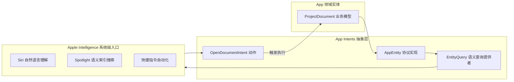

> **TL;DR**：随着 Apple Intelligence 在 iOS 18 及后续系统中的全面落地，Siri 与系统的语义入口发生了代际变革。过去基于 `.intentdefinition` 图形化文件的 SiriKit 时代彻底谢幕，取而代之的是纯 Swift 代码声明、强类型编译期校验的 **App Intents** 框架。App 不再只是一个等待用户手动点击打开的孤岛，而是通过暴露 `AppEntity` 与 `AppIntent`，成为系统级智能调度的分布式能力单元。本文分享如何对既有工程进行现代化改造，实现丝滑的 Spotlight 与自然语言意图直达。

---

## 一、 为什么旧版 SiriKit 无法支撑现代 AI 体验？

在旧版 SiriKit 架构下，开发者必须在 Xcode 里维护一个沉重的 `.intentdefinition` XML 配置文件，系统仅支持预设的十几个固定领域（如 VoIP 通话、打车、发消息）：

1. **类型安全性脆弱**：生成的 Objective-C/Swift 桥接代码充斥着隐式解包可选型（IUO），一旦模型参数不匹配容易崩溃。
2. **缺乏状态感知力**：系统无法获知 App 当前内部的数据实体（如文档、音频片段、订单列表）具体有哪些，无法支持诸如“打开上周二李工发我的那份采购合同”等上下文模糊查询。
3. **维护成本极高**：每次新增动作都要跨多层文件同步，与现代 Swift 并发及声明式架构格格不入。

---

## 二、 现代核心模型：AppEntity 与 EntityQuery

现代架构的核心基石是将 App 内部的业务模型，抽象投影为符合系统契约的 **`AppEntity`**：



### 实体声明实战代码

```swift
import AppIntents
import CoreSpotlight

// 1. 业务实体声明
public struct ProjectDocumentEntity: AppEntity {
  public static var defaultQuery = ProjectDocumentQuery()

  public static var typeDisplayRepresentation: TypeDisplayRepresentation = "工程设计文档"

  public var id: UUID
  
  @Property(title: "文档标题")
  public var title: String

  @Property(title: "最后修改时间")
  public var lastModifiedDate: Date

  public var displayRepresentation: DisplayRepresentation {
    DisplayRepresentation(
      title: "\(title)",
      subtitle: "修改于 \(lastModifiedDate.formatted(date: .abbreviated, time: .shortened))"
    )
  }
}

// 2. 实体查询检索器（支持系统高效检索）
public struct ProjectDocumentQuery: EntityQuery {
  public init() {}

  // 根据系统传入的 ID 批量获取实体
  public func entities(for identifiers: [UUID]) async throws -> [ProjectDocumentEntity] {
    let storage = await DocumentDatabase.shared
    return try await storage.fetchDocuments(with: identifiers).map { $0.toEntity() }
  }

  // 供 Spotlight 和 Siri 在用户输入模糊关键词时调用
  public func suggestedEntities() async throws -> [ProjectDocumentEntity] {
    let storage = await DocumentDatabase.shared
    return try await storage.fetchRecentDocuments(limit: 5).map { $0.toEntity() }
  }
}
```

---

## 三、 零样本动作：实现可组合的 AppIntent

定义好数据实体后，执行具体动作的 `AppIntent` 变得极其简洁而确定：

```swift
public struct ExportDocumentAsPDFIntent: AppIntent {
  public static var title: LocalizedStringResource = "将文档导出为 PDF"
  public static var description = IntentDescription("将选定的工程设计文档渲染并导出为高保真 PDF 文件")

  // 系统会自动通过 ProjectDocumentQuery 解析用户提及的实体
  @Parameter(title: "目标文档")
  public var targetDocument: ProjectDocumentEntity

  @Parameter(title: "包含附件批注", default: true)
  public var includeAnnotations: Bool

  public init() {}

  @MainActor
  public func perform() async throws -> some ReturnsValue<URL> & ShowsSnippetView {
    // 1. 获取底层真实数据
    let doc = try await DocumentDatabase.shared.find(targetDocument.id)
    
    // 2. 执行核心渲染导出
    let pdfUrl = try await PDFExportEngine.render(document: doc, includeAnnotations: includeAnnotations)
    
    // 3. 返回执行结果并展示原生交互卡片
    return .result(
      value: pdfUrl,
      view: DocumentExportPreviewCard(document: doc, pdfUrl: pdfUrl)
    )
  }
}
```

---

## 四、 性能门禁与内存纪律

Apple Intelligence 对 Intent 的执行有着极其严苛的物理限制：

1. **响应时间门禁（$\le 500	ext{ ms}$）**：如果 `perform()` 方法在 500ms 内没有完成初始化或返回异步句柄，系统会判定 App 无响应并向用户报出超时错误。因此耗时的重型计算必须立即将任务移交至后台 Worker。
2. **内存上限（$30	ext{ MB}$ 约束）**：当 Intent 作为独立的 App Extension 进程拉起时，系统为其分配的 Jetsam 内存上限极低，严禁在 Extension 内一次性解码超大原始图像。

---

## 五、 架构演进总结

App Intents 不仅是 Siri 的外挂，更是**现代 iOS 应用模块化解耦的终极推手**。将核心业务逻辑收敛为一个个纯粹、独立的 Intent 和 Entity，不仅让应用在系统级智能交互中占据先机，更让工程本身的单元测试与架构边界获得了前所未有的清晰度。

---

## 相关阅读与主题延伸

- [Apple 正式拥抱 Agent 生态：从协议分层到端侧架构演进](/posts/apple-agent-protocol-architecture/)
- [Swift 6 严格并发检查下的数据隔离与 Sendable 实战陷阱](/posts/swift-6-strict-concurrency-traps/)
- [Swift Testing 深度实践：从 XCTest 迁移到现代化宏断言体系](/posts/swift-testing-macro-migration-guide/)
