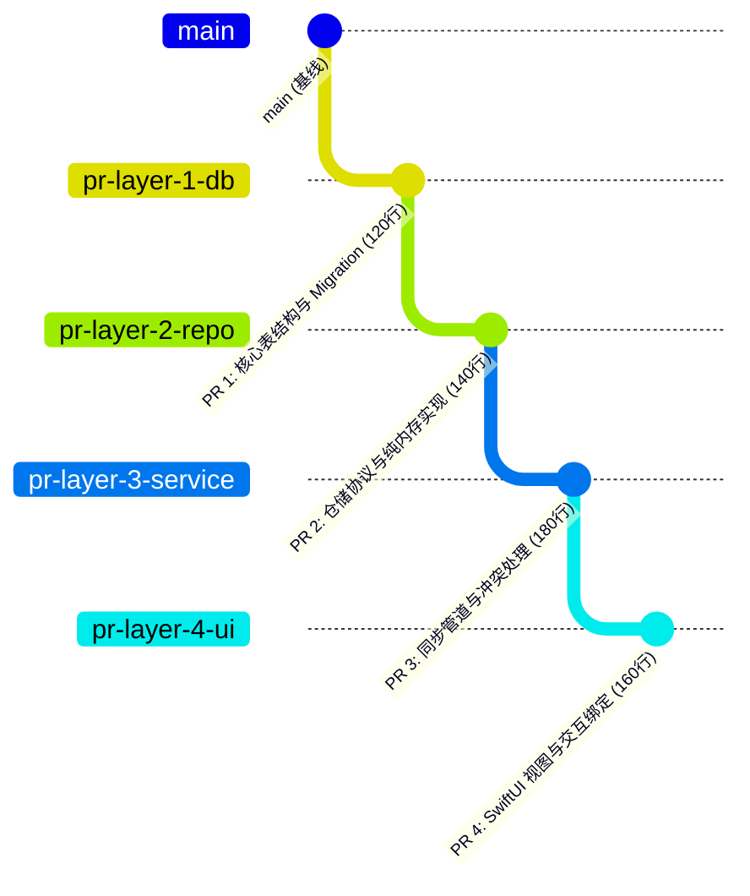

> **TL;DR**：引入自主编码 Agent 之后，团队通常面临的不是“代码写不出来”，而是**“代码积压严重、评审严重滞后”**。单次提交 800 行以上的大单体 PR 成为常态，审查者要么望而却步形成流水线塞车，要么闭眼放行埋下灾难隐患。解决这个吞吐瓶颈的唯一工程正解，就是推行 **Stacked PRs（堆叠式 PR）**。本文剖析如何将大特性垂直切片为严格单向依赖的分层分支链条，以及在 Agent 介入修改底层缺陷时，如何保障级联变基（Cascade Rebase）的安全无损。

---

## 一、 核心痛点：Agent 时代的“单体 PR 阻塞”

一个标准的现代功能开发（例如：引入本地 SQLite 离线缓存与多账户切换），往往横跨四个层次：
1. 底层存储与 Schema 迁移（Database Layer）；
2. 领域模型与仓库协议抽象（Repository Layer）；
3. 业务用例与网络同步管道（Service Layer）；
4. UI 视图与 ViewModel 绑定（Presentation Layer）。

如果让一个 Agent 顺着思路把这四层全部写完并提一个单一 PR，其变更往往包含 **18 个文件、1200 行改动**。这种 PR 对人类审查者而言无异于一场灾难：
- 审查者如果对第 1 层的表结构有异议，第 2~4 层几乎必须全盘重构；
- 这个 PR 会在审查队列中滞留数天，期间其他同事的代码不断合入 `main`，导致该分支反复陷入变基冲突的泥潭。

---

## 二、 堆叠式 PR（Stacked PR）的架构分层模型

Stacked PR 的核心思想是：**“大特性拆分为原子微增量，上层分支永远建立在未合并的下层分支之上”**。



每个 PR 的规模被严格压制在 **100~200 行以内**，只解决单一上下文的问题：
- PR 1 仅仅包含 Migration 逻辑与 SQL 完整性单元测试；
- PR 2 仅仅依赖 PR 1 导出的只读接口，审查者可以独立并行 Review；
- 一旦底层被 Approve，依次按顺序快进合入 `main`。

---

## 三、 致命陷阱与黄金法则：Owning Branch 唯一职责准则

堆叠式 PR 最常见的灾难场景，发生在**“越层提交（Layer Pollution）”**：

> *当审查者在审查 PR 3 时，指出 PR 1 中的一个字段命名有歧义。此时开发者如果直接在 `pr-layer-3-service` 分支上顺手修改了底层模型，整个 Stack 的边界就彻底崩塌了！PR 1 无法独立合入，PR 3 包含了不相干的脏提交。*

为了让 Agent 在 Stack 上安全协作，我们制定了团队必须无条件执行的**黄金法则**：

```markdown
# STACK PR OWNING BRANCH CONSTRAINTS

1. 独立所有权原则：
   每个 PR 必须有且仅有一个清晰的 Owning Branch。所有针对该层抽象的修改，
   必须切回到该层的 Owning Branch 执行提交，严禁在上层分支越权修正！

2. 严格级联变基（Cascade Rebase）：
   当下层分支产生新的修订提交后，必须通过从底向上的自动化变基，
   将变更依次传递给所有上层分支。
```

---

## 四、 级联变基实战：一条命令解除冲突地狱

假设我们在底层 `pr-layer-1-db` 分支修复了一个类型声明缺陷，如何干净地将上层 3 个分支全部同步更新？

传统的使用 `git merge` 会产生无数混杂的 Merge Commit，使 Git 历史变成无法维护的毛线团。我们使用精细控制的 `git rebase --onto` 流程：

```bash
# 步骤 1：切回底层拥有者分支，追加修正提交
git checkout pr-layer-1-db
git commit -am "fix(db): ensure account_id has unique index"

# 步骤 2：记录变更前后的 commit hash
OLD_L1_HEAD="a1b2c3d"
NEW_L1_HEAD=$(git rev-parse HEAD)

# 步骤 3：将 Layer 2 分支平移至新的 Layer 1 顶部
git checkout pr-layer-2-repo
git rebase --onto "$NEW_L1_HEAD" "$OLD_L1_HEAD" pr-layer-2-repo

# 步骤 4：同理，将 Layer 3 平移至 Layer 2 顶部
OLD_L2_HEAD="e4f5g6h"
NEW_L2_HEAD=$(git rev-parse HEAD)
git checkout pr-layer-3-service
git rebase --onto "$NEW_L2_HEAD" "$OLD_L2_HEAD" pr-layer-3-service

echo "✅ Entire stack cascading rebase completed cleanly without history pollution."
```

---

## 五、 总结

Stacked PR 不仅仅是一种 Git 分支管理技术，更是**对抗软件工程熵增的组织防御术**。

在 Agent 大规模普及的今天，能够将一个复杂庞大的系统需求，干净利落地切分为高内聚、低耦合、层层递进的微型 PR 链条，是一名资深架构师最不可替代的核心工程价值。

---

## 相关阅读与主题延伸

- [资深 Apple 平台工程师团队：Xcode 27 & AI Agent 协同实战规则包](/posts/xcode27-agent-rules-guide/)
- [从“手动写代码”到“委派给 Agent”：Xcode 生产环境真实工作流复盘](/posts/agentic-coding-workflow-retrospective/)
- [告别昂贵 macOS Runner：中小型团队的成本敏感型 Apple CI 架构](/posts/cost-aware-apple-ci-design/)
