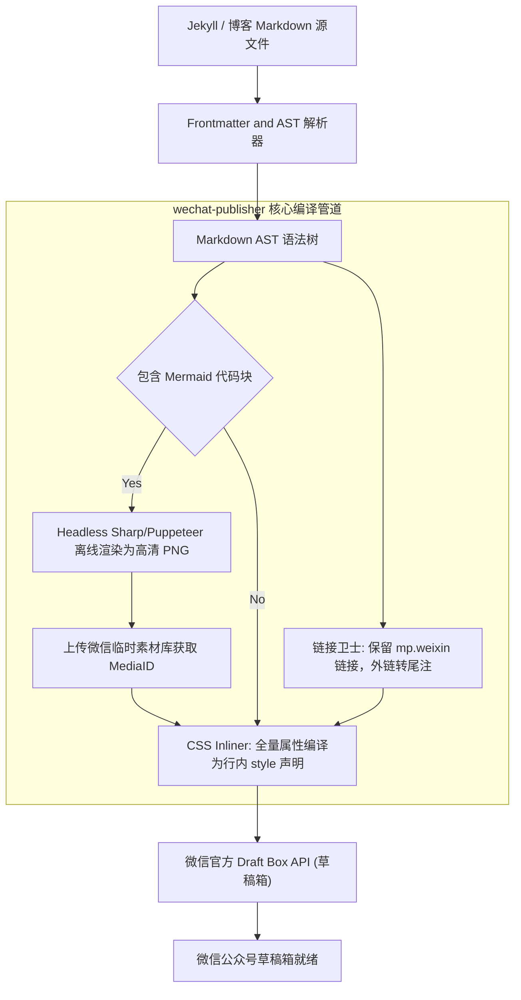

> **TL;DR**：微信公众平台的内容编辑器，堪称现代 Web 前端工程师的“兼容性噩梦”。它无情地剥离全部外部 `<style>` 标签、屏蔽主流 CSS 属性（如 CSS Variables、现代 Flex 弹性伸缩、Grid 布局）、篡改外部超链接，并对 SVG 矢量图做视口截断。为了让个人技术博客的 Markdown 内容一键无损同步至微信草稿箱，我们用 TypeScript 从零构建了名为 `wechat-publisher` 的自动化管道。本文首度公开其 AST 变换流水线、离线 Mermaid 图表光栅化、微信内部链接保活与防封禁安全架构。

---

## 一、 为什么常规转换工具在微信后台全面溃败？

如果你尝试将标准的 Markdown 渲染为普通 HTML（例如通过 `marked` 或 `markdown-it`）并直接粘贴到微信编辑器，你通常会看到以下惨状：

1. **样式全失**：由于微信完全过滤 `<style>` 块，任何通过 Class 定义的排版全部失效，退化为浏览器最丑陋的原生无格式白底黑字。
2. **代码块溢出折行**：移动端屏幕宽度有限，未加特殊处理的代码块会被强行折行，导致代码缩进全毁，关键字断开，完全失去可读性。
3. **外部超链接被粗暴降级**：微信严格限制公众号图文内的外部外链。如果你写了一个指向 GitHub 的 `[Repo](https://github.com/...)`，微信编辑器会直接剥离链接标签，留下无法点击的普通纯文本。
4. **Mermaid 流程图变成乱码源码**：标准 Markdown 的 ```mermaid 代码块，微信不仅无法识别，还会将其作为普通文本暴露给读者。

要战胜这些限制，唯一的工程方案是**打造一条确定性的离线编译流水线**。

---

## 二、 wechat-publisher 架构总线全景



---

## 三、 核心技术解密

### 1. 链接防降级：精准识别微信生态内链

微信只允许白名单域名（主要是 `mp.weixin.qq.com`）保留真实的 `<a>` 标签交互。我们重构了 AST 阶段的链接处理核心：

```typescript
export function isWeChatInternalLink(href: string): boolean {
  try {
    const url = new URL(href);
    return (
      url.protocol === 'https:' &&
      (url.hostname === 'mp.weixin.qq.com' || url.hostname.endsWith('.mp.weixin.qq.com'))
    );
  } catch {
    return false;
  }
}

// 转换器核心逻辑：内链保持原生高亮可点击，外链优雅降级为尾注引用
export function transformMarkdownLinks(node: ASTLinkNode): HTMLSpanElement {
  if (isWeChatInternalLink(node.href)) {
    return `<a href="${node.href}" style="color: #576b95; text-decoration: none; border-bottom: 1px dashed #576b95;">${node.text}</a>`;
  } else {
    // 降级为移动端友好的高亮指示文本
    return `<span style="color: #3b82f6; font-weight: 500;">${node.text}</span><span style="font-size: 11px; color: #94a3b8;"> (详见文末参考)</span>`;
  }
}
```

### 2. 离线 Mermaid 光栅化与素材上传闭环
针对技术文章必不可少的流程图与时序图，`wechat-publisher` 会在编译期自动捕获 Mermaid 代码，调用底层的 headless 渲染管线将其离线光栅化为 **3× 高清 Retain 级别的 PNG 图像**。

接着，管线自动调用微信 `/cgi-bin/material/add_material` API，将本地二进制图表上传到该公众号的图文素材库，拿到永久 `media_id` 与专属 CDN URL，并将原始代码块无缝替换为微信规范的 `` 标签：

```typescript
const cdnUrl = await wechatClient.uploadNewsImage(renderedBuffer);
// 替换为微信原生排版容器
return `
<section style="margin: 24px 0; text-align: center;">
  
</section>
`;
```

---

## 四、 微信发布安全与容灾策略

在生产环境中与微信 API 对接，必须直面微信平台苛刻的调用频率限制：

1. **Token 内存缓存与原子刷新**：`access_token` 拥有 2 小时有效期，且获取频率受严格配额约束。我们的架构采用了带互斥锁的自愈刷新单例，杜绝并发调用击穿配额。
2. **本地 Dry-Run 安全演练**：在真正请求微信服务器前，提供 `--dry-run` 参数，在本地渲染出 100% 还原的 HTML 并在临时目录生成预览文件，消除对草稿箱的垃圾写入。
3. **重复草稿检测与幂等覆盖**：通过 `--force` 参数与标题哈希比对，自动查询现有未发布的同名草稿，实现增量原地覆盖，避免运营后台草稿箱被海量重复文章淹没。

---

## 五、 总结与开源演进

`wechat-publisher` 的诞生，证明了**当平台限制成为创作生产力的绊脚石时，工程师可以用扎实的编译原理与架构设计将其彻底征服**。

通过将复杂的排版与清洗逻辑沉淀到底层工具中，创作者只需要专注于用 Markdown 书写最高质量的专业技术思考，剩下的跨平台高保真分发，交给代码即可。

---

## 相关阅读与主题延伸

- [从“手动写代码”到“委派给 Agent”：Xcode 生产环境真实工作流复盘](/posts/agentic-coding-workflow-retrospective/)
- [资深 Apple 平台工程师团队：Xcode 27 & AI Agent 协同实战规则包](/posts/xcode27-agent-rules-guide/)
- [打造高防御性本地 MCP Server：Apple 平台安全沙盒与授权实践](/posts/safe-local-mcp-server-architecture/)
