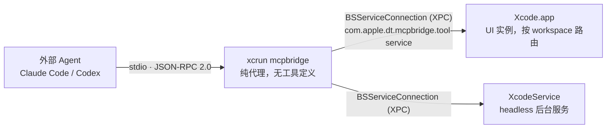
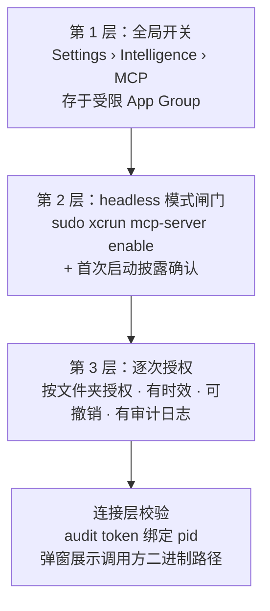

> **TL;DR**：给自己的 App 加 MCP 服务之前，值得先看看 Apple 是怎么做的。我把 Xcode 27.0（27A266a）里的 `mcpbridge`、`mcp-server` 和相关私有框架的符号表全部导出来核对了一遍，结论很确定：**Apple 完全没有使用 `modelcontextprotocol/swift-sdk`，JSON-RPC 与 MCP 语义层是从零自研的**，连命令行参数解析都用的自研 `IDEIFLightweightArgParser`。真正值得借鉴的不是"用了什么库"，而是它的三进程拓扑、纯代理式的工具解耦、以及分成三层的权限闸门。

---

## 一、先说验证方法：不猜，直接拆二进制

网上关于 `xcrun mcpbridge` 的文章基本都停留在"它把 MCP 翻译成 XPC 调用"这一句话，再往下就是推测。既然本机就装着 Xcode，直接看二进制更可靠。

验证环境与对象：

```text
Xcode 27.0 (27A266a) / IDEApplication 25183.107.5

Contents/Developer/usr/bin/mcpbridge                        825,888 B  Mach-O arm64
Contents/Developer/usr/bin/mcp-server                       515,984 B  Mach-O arm64
Contents/PlugIns/IDEIntelligenceMessaging.framework/...   1,163,216 B
Contents/PlugIns/IDEIntelligenceProtocol.framework/...    3,357,968 B
```

方法很简单：用 LIEF 解析 Mach-O，导出 `LC_LOAD_DYLIB` 依赖列表和完整符号表，再按 Swift 名字改写（name mangling）规则把符号还原成模块名与类型名。Swift 的符号以 `$s` 开头，后面紧跟"长度 + 模块名"，所以统计模块分布只需要一条正则就能得到高可信度的结果。

```python
import lief, re, collections

binary = lief.MachO.parse("mcpbridge").at(0)
modules = collections.Counter()
for symbol in binary.symbols:
    match = re.match(r"^_?\$s(\d+)(\w+)", symbol.name)
    if match:
        length = int(match.group(1))
        modules[match.group(2)[:length]] += 1
print(modules.most_common(10))
```

---

## 二、结论：全自研，没有第三方依赖

`mcpbridge` 的模块分布是这样的：

```text
mcpbridge                 1297
IDEIntelligenceMessaging   193
os                         138
IDEIntelligenceFoundation  107
Foundation                  70
IDEIFLightweightArgParser   22
AppSandbox                   9
Darwin                       3
```

关键在于**没有出现 `MCP` 这个模块** —— 而 `modelcontextprotocol/swift-sdk` 的 module name 恰好就是 `MCP`。同样缺席的还有 swift-argument-parser、swift-nio、swift-log。Apple 连命令行解析都自己写了一个 `IDEIFLightweightArgParser`，态度非常明确：Xcode 内部工具链不引入任何第三方 SwiftPM 依赖。

JSON-RPC 那一层的类型全部躺在 `mcpbridge` 自己的模块里：

```text
JSONRPCMessage  JSONRPCID  JSONRPCResponse  JSONRPCErrorResponse
JSONRPCEncoder  JSONRPCDecoder  JSONValue  ProtocolVersion
```

二进制里还漏出了未被清理的源码路径，可以反推出工程结构：

```text
Sources/CodeIntelligence/mcpbridge/ToolSession.swift
Sources/CodeIntelligence/mcpbridge/ToolConnection.swift
Sources/CodeIntelligence/mcpbridge/ToolServiceConnector.swift
```

另外，字符串常量里能读到它同时支持三个 MCP 协议版本：`2024-11-05`、`2025-03-26`、`2025-06-18`。注意这比 swift-sdk 当前实现的 `2025-11-25` 要保守 —— 官方 SDK 反而跑得更靠前。

---

## 三、整体架构：三进程 + 双通道



外侧是 Agent 熟悉的 stdio JSON-RPC；内侧是 Apple 自家的 `BSServiceConnection`（BoardServices 对 XPC 的封装），配 `BSServiceConnectionEndpoint` 与 `BSServiceConnectionEndpointMonitor`，再加一个 `@objc` 的 `MCPBridgeConnectionProtocol` 作为接口。

`mcpbridge` 的 entitlements 也印证了这个拓扑：

```text
BSServiceDomains:
  com.apple.dt.mcpbridge.services
  com.apple.dt.mcpbridge.tool-service
  com.apple.dt.mcpbridge.endpoint-injection

com.apple.priv.runningboard.dt.mcpbridge
com.apple.private.security.restricted-application-groups:
  group.com.apple.dt.Xcode.SecureSettingsContainer
```

最后那个受限 App Group 很关键 —— MCP 的开关状态存在一个沙盒保护的共享容器里，普通进程改不了。

---

## 四、最值得学的一点：mcpbridge 里没有任何工具定义

我在 `mcpbridge` 的符号表和字符串常量里搜遍了 `XcodeRead`、`BuildProject`、`RunAllTests` 这类工具名，**一个都没有**。它只缓存了一份 `workspaceScopedToolNames` 集合，用途是判断"这次调用要不要绑定到某个 workspace"。

也就是说 `tools/list` 的返回内容完全来自 Xcode 那一侧，bridge 只做转发与路由。这是个刻意的版本解耦：

| 组件 | 随谁发布 | 变更频率 |
| :--- | :--- | :--- |
| `mcpbridge` | toolchain（`xcode-select`） | 低，协议稳定后基本不动 |
| 工具 schema | Xcode.app 本体 | 高，每个版本都在加工具 |

如果把工具定义写进 bridge，那每加一个工具都要同步发一版 CLI。这个决策对自研 App 同样适用：**桥接层只管协议，能力定义留在业务进程里**。

---

## 五、消息层：`BridgeInterface` 与四向 Codable 枚举

`IDEIntelligenceMessaging.framework` 是整套设计里我最欣赏的部分。它定义了一个带两个 associatedtype 的协议，把"通知"和"请求-响应"在类型层面分开：

```swift
// 还原自符号表的接口形状（示意骨架）
protocol BridgeInterface {
    associatedtype OneWayMessage: Codable & Sendable   // 通知，不等回复
    associatedtype TwoWayMessage: Codable & Sendable   // 请求，等回复
}
```

然后四个通信方向各自实现一份，全部是手写 CodingKeys 的 Codable 枚举：

```text
BridgeToToolService / ToolServiceToBridge    ← bridge ↔ Xcode
CLIToServiceBus     / ServiceBusToCLI        ← 权限 CLI ↔ 服务总线
```

载荷类型则覆盖了 MCP 语义的投影：

```text
ToolSchema / ObjectSchema / PropertySchema   工具 schema 三件套
ToolListOutput                                tools/list 结果
ToolCallOutput                                含 structuredContent
ToolRouting / WorkspaceEntry                  workspace 路由信息
ToolSessionContext / MCPClientInfo            会话与客户端身份
ProgressUpdate                                进度回传
```

一个容易被忽略的细节：`progressToken` 被一路透传到了 XPC 层。这意味着业务进程执行长任务时可以主动往回发 `notifications/progress`，而不必等整个调用结束。**如果你要做同类设计，这个口子一开始就要留出来，后补会很痛。**

---

## 六、会话生命周期与容错

从日志字符串可以完整复原出启动流程：

1. **定位目标进程**：优先读 `MCP_XCODE_PID` 环境变量；否则用 `NSWorkspace` 枚举运行中的 Xcode，再与 `xcode-select` 的 developer dir 比对。不匹配时打印 `which is not this toolchain's Xcode; honoring it anyway` 并继续 —— 提示但不阻断。
2. **先连 daemon，不碰 UI**：启动后只建立到 headless `XcodeService` 的连接。
3. **握手后才 attach UI**：日志里写得很直白 —— `Received initialized notification: connecting daemon`，以及 `UI attach requested before handshake; staying daemon-only`。也就是说在收到 `notifications/initialized` 之前，bridge 绝不碰用户正在使用的 Xcode 进程。
4. **建立 workspace 路由表**：通过 `listWorkspaces` 拿到 `(origin, nativeId, path)` 三元组建 map，后续按标识分流。找不到时 `re-scanning UI and rebuilding map` 重试一次；UI 退出后 `Purged %ld UI workspace-map entries`。
5. **单连接隔离容错**：某一侧输出解析失败时的处理是 `Quarantining this connection; the other connection still serves` —— 隔离出问题的那条连接，而不是整个进程退出。
6. **退出条件**：primary 连接 invalidate 后结束 outgoing stream，进程自然退出。

第 3 步和第 5 步是我认为最值得抄的两条工程纪律：**握手完成前不产生副作用**，以及**故障隔离到连接粒度**。

---

## 七、权限模型：三层闸门 + 逐次授权

`mcp-server` 这个二进制本身就是一个专门的权限管理 CLI，符号表几乎全是这个主题：

```text
HeadlessPermissionCommand   HeadlessPermissionActor
ApprovalRequest             PendingApprovals
ApproveReport / DenyReport  AllowFolderReport
ClearPermissionsReport      ResetAllReport
PermissionActivityLog       PermissionsTimeframe
```

把这些拼起来，整个授权体系是三层：



日志里对应的拒绝信息也很清楚：

```text
Agent connection refused: headless MCP access is disabled and no UI Xcode is running.
Headless XcodeService not launched: the user has not yet completed the Xcode
  first-launch experience that decides whether background MCP access is on.
Received connection from unexpected pid %d - no matching request.
```

注意最后一条 —— 连接是**先有 request 再有 connection** 的配对模型，没有匹配请求的连接直接拒绝，这挡掉了一整类抢连接的攻击。

---

## 八、另一半：Xcode 作为 MCP 客户端也是自研

`IDEIntelligenceProtocol.framework`（3.3 MB）是 Xcode 连接第三方 MCP Server 的那一侧，同样零第三方依赖。它的类型设计比 bridge 更完整：

```text
JSONRPCTransport          传输层协议抽象
JSONRPCProcess            stdio 子进程传输实现
JSONRPCRequest<T> / JSONRPCResponse<T> / JSONRPCNotification<T>   泛型消息
JSONRPCJournal / JSONRPCStreamArchiver / JSONRPCStreamToDisk      RPC 流落盘
StdioMCPServer / HTTPMCPServer(serverSentEvents)                  两种服务端形态
MCPCapabilities / MCPBridgeLocator
```

`JSONRPCStreamToDisk` 这一组特别值得拿走：把整条 RPC 流归档到磁盘做回放调试。MCP 调试最痛苦的就是"现场不可复现"，有了落盘回放能省掉大量猜测。自己实现时把它当成一等公民加进去，成本很低，收益很高。

顺带一提，同目录下还躺着 `IDEIntelligenceACP.framework`（Agent Client Protocol）和 `IDEIntelligenceAntigravity.framework`，说明 Apple 在同时押多个 agent 协议，MCP 不是唯一赌注。

---

## 九、为什么不用 swift-sdk（分析，非官方说明）

以下是基于上述证据的推断，Apple 没有公开说明过原因：

**依赖策略是硬约束。** Xcode 内部框架不引第三方 SwiftPM 包，这从"连 argument parser 都自研"就能看出来。swift-sdk 会带来传递依赖，还要跟 Xcode 自己的 Swift 运行时部署版本对齐，对一个随 toolchain 分发的二进制来说是额外风险。

**需求形状不匹配。** swift-sdk 的核心价值在于"你注册 handler，它帮你跑 server loop"。但 `mcpbridge` 是纯代理，工具定义不在它这里，那套注册式 API 基本用不上。它真正要做的是把 MCP 语义映射到既有的 BoardServices 消息总线上，套一层 SDK 的 Transport 抽象反而多一层转换。

**要同时兼容三个协议版本，还要塞自定义扩展。** workspace 路由、`tabIdentifier` 这类概念不在 MCP 规范里，`progressToken` 又要一路透传到 XPC。自己控制编解码更自由。

---

## 十、搬到自己的 App：一套可落地的方案

### 10.1 先认清一个硬约束

**MCP Server 不能直接跑在你的 GUI App 进程里给外部 Agent 用。**

外部 Agent 只会做两件事：spawn 一个子进程讲 stdio，或者连一个 HTTP endpoint。你的 `.app` 是用户双击启动的，没有 stdin/stdout 可以交给它，也没法被 Agent 拉起。这正是 Apple 必须造 `mcpbridge` 的根本原因，不是为了架构好看。

所以照抄三件套：

| 组件 | 位置 | 职责 |
| :--- | :--- | :--- |
| CLI helper | `YourApp.app/Contents/MacOS/` 或 `Helpers/` | SPM executable target，只管 stdio JSON-RPC |
| App 内 tool service | 主 App 进程 | 真正执行工具，持有业务状态与 UI 上下文 |
| IPC 通道 | 两者之间 | 带身份校验的进程间调用 |

### 10.2 IPC 选型

Apple 用的 `BSServiceConnection` 是私有 API，我们用不了。对应的公开方案：

- **沙盒 App**：`NSXPCConnection(machServiceName:)` 配 App Group，或 macOS 14+ 的 Swift libxpc API（`XPCListener` / `XPCSession`）。后者与 Swift Concurrency 配合更顺，新项目优先考虑。
- **非沙盒**：用 `SMAppService.daemon` / `.agent` 注册 launchd 服务，再走 `NSXPCConnection`。
- **原型阶段**：App Group container 里开个 Unix domain socket 也能跑通，但别上生产 —— 只有 XPC 能拿到 audit token 做签名校验。

### 10.3 消息协议骨架

直接复制 Apple 的形状，让编译器帮你保证两个方向的消息对称：

```swift
import Foundation

protocol BridgeInterface {
    associatedtype OneWayMessage: Codable & Sendable
    associatedtype TwoWayMessage: Codable & Sendable
}

enum HelperToApp: BridgeInterface {
    enum OneWayMessage: Codable, Sendable {
        case cancel(requestID: UUID)
    }

    enum TwoWayMessage: Codable, Sendable {
        case listTools
        case callTool(name: String, arguments: Data?, progressToken: String?)
        case ping
    }
}

enum AppToHelper: BridgeInterface {
    enum OneWayMessage: Codable, Sendable {
        case progress(requestID: UUID, completed: Double, total: Double?)
        case toolListChanged
    }

    enum TwoWayMessage: Codable, Sendable {
        case requestApproval(scope: String)
    }
}
```

`arguments` 用 `Data` 承载原始 JSON 而不是提前解码，是为了让 helper 保持纯代理 —— 它不需要理解任何一个工具的参数结构。

### 10.4 安全清单

按 Apple 的层次从外到内排，每一条都有对应的公开 API：

1. **对端校验**：连接建立时取 `NSXPCConnection.auditToken`，经 `SecCodeCopyGuestWithAttributes` + `SecCodeCheckValidity` 验证签名，确认调用方是预期的二进制。
2. **首次连接披露**：弹窗展示调用方的路径与 pid，让用户看清楚"谁在连"。
3. **默认关闭的总开关**：放在 App 设置里，状态存 App Group 容器。
4. **按资源逐次授权**：按文件夹 / 项目 / 账号粒度，带时效、可撤销、有活动日志。
5. **App 侧二次鉴权**：不要信任 helper 传上来的任何路径。路径围栏、符号链接解引用检查这些仍要在业务进程里再做一遍 —— 这部分可以参考[打造高防御性本地 MCP Server：Apple 平台安全沙盒与授权实践](/posts/safe-local-mcp-server-architecture/)里的 Path Jail 实现。

### 10.5 到底用不用 swift-sdk

我的建议分两种情况：

**helper 是纯代理（工具定义在 App 里）—— 不用。** 处境和 Apple 一样：你要写的只是把 stdin 的 JSON-RPC 换个信封转发出去，自己实现几个 Codable 类型两百行就够，还省掉往 App bundle 里塞 SwiftPM 依赖和随之而来的签名、公证琐事。

**helper 自己就是完整 server（工具逻辑不依赖 App 运行时状态）—— 用。** swift-sdk 从 0.11.0 起提供 `Client` / `Server`，传输层覆盖 `StdioTransport`、`HTTPClientTransport`、`StatefulHTTPServerTransport`、`StatelessHTTPServerTransport`、`InMemoryTransport` 和基于 Network 框架的 `NetworkTransport`，tools / resources / prompts / sampling / elicitation 都齐了，要求 Swift 6.0+、macOS 13+ / iOS 16+。写单测时 `InMemoryTransport` 特别顺手。

最后提醒一个平台差异：**iOS 上外部 Agent 根本没法 spawn 你的进程**，所以 iOS App 要暴露 MCP 只有 HTTP transport 一条路（局域网或自建后端中转），与 macOS 的方案不通用，架构上要提前分叉。

---

## 十一、小结

Apple 这次给出的不是一个"MCP 库的用法示范"，而是一份**把不可信外部 Agent 接入强状态 GUI 应用**的完整答卷。抽掉私有 API 之后，剩下的设计原则完全可以照搬：

- 桥接层只管协议，工具定义留在业务进程，两边各自演进；
- 握手完成前不产生任何副作用；
- 故障隔离到单条连接，而不是整进程退出；
- 权限分层，逐次授权，全程审计；
- RPC 流落盘可回放，把调试成本前置到设计阶段。

至于用不用官方 SDK —— 看你的 helper 是代理还是服务端，这才是真正的分水岭。

---

## 相关阅读与主题延伸

- [打造高防御性本地 MCP Server：Apple 平台安全沙盒与授权实践](/posts/safe-local-mcp-server-architecture/)
- [Apple 正式拥抱 Agent 生态：从协议分层到端侧架构演进](/posts/apple-agent-protocol-architecture/)
- [资深 Apple 平台工程师团队：Xcode 27 & AI Agent 协同实战规则包](/posts/xcode27-agent-rules-guide/)
